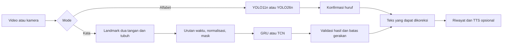

# Riset Pengembangan Signify AI untuk Tugas Akhir

Tanggal kajian: 7 September 2026. Status: evaluasi dua arah penelitian, belum penetapan judul atau arsitektur final.

Dokumen ini menggabungkan pemeriksaan kode, audit dataset lokal, inspeksi urutan frame dari enam video, dan penelusuran sumber primer. Temuan audit dibedakan dari dugaan penyebab dan usulan eksperimen. Belum dilakukan retraining, benchmark model kata, pengukuran landmark, atau pengujian pengguna.

## 1. Hasil utama dan keputusan sementara

Signify AI mempunyai dua arah TA yang masuk akal:

1. **Alfabet:** memperbaiki validitas evaluasi dan ketahanan pengenalan alfabet pada pengguna serta kondisi kamera baru, kemudian membandingkan YOLO11n dengan YOLO26n.
2. **Kata:** mengembangkan pengenalan 40 kelas kata/ungkapan dari video menggunakan model temporal, dengan evaluasi generalisasi dan kelayakan inferensi di browser.

Arah alfabet memiliki masalah yang sudah terbukti pada snapshot dataset: gambar identik tersebar di train dan validation. Arah kata memiliki dukungan data nyata berupa 2.000 video pendek dan perubahan gerakan antarframe. Keduanya dapat menjadi penelitian, tetapi pertanyaan penelitian dan evaluasinya berbeda.

**Rekomendasi saat ini adalah menjalankan pilot terbatas untuk kedua arah, lalu memilih satu kontribusi utama.** Jika pengenalan kata menjadi fokus, alfabet tetap berguna sebagai fitur ejaan dan pembanding sistem semester 4. Jika alfabet menjadi fokus, kualitas evaluasi dan perilaku aplikasi harus menjadi hasil utama; pergantian versi YOLO hanya salah satu variabel.

Penambahan kosakata sebaiknya dilakukan setelah pipeline 40 kelas mempunyai hasil yang dapat dipercaya. Menambah variasi pengguna dan sesi pada kelas yang ada dapat lebih bernilai daripada langsung menambah jumlah kelas; ini perlu diputuskan dari pola kesalahan baseline.

## 2. Apa yang sebenarnya dikerjakan sistem saat ini?

Jalur produksi adalah webcam → gambar 640 × 640 → YOLO11n ONNX di browser → label alfabet dan bounding box → aturan konfirmasi huruf → teks. Backend FastAPI merupakan layanan lokal untuk eksperimen/parity, bukan jalur inferensi produksi. Bukti: [README](README.md), [manifest model](apps/frontend/lib/yoloModel.ts), [runtime](apps/frontend/lib/yoloSession.ts), dan [batas backend](apps/backend/README.md).

| Fitur | Fungsi yang dapat dipertanggungjawabkan | Mengapa berguna | Pengembangan yang relevan |
| --- | --- | --- | --- |
| Pengenalan alfabet | Mengenali kelas A–Z dari tampilan kamera | Latihan alfabet dan ejaan, termasuk nama atau istilah di luar kamus kata | Evaluasi pada pengguna baru; kurangi huruf salah yang terkonfirmasi |
| Penyusunan teks | Menggabungkan huruf yang dikonfirmasi | Membuat keluaran yang dapat dibaca dan diedit | Uji huruf berulang, jeda, penghapusan, dan waktu menyusun pesan |
| Pengenalan kata, usulan | Mengklasifikasikan satu klip gerakan menjadi satu label dari kamus terbatas | Menyampaikan kosakata yang didukung tanpa mengeja setiap huruf | Model temporal dan penentuan batas gerakan |
| Practice | Mencocokkan hasil pengenalan dengan target latihan | Latihan mandiri dengan hasil yang segera terlihat | Video referensi dan umpan balik yang sesuai kemampuan pengukuran |
| Reference | Menyediakan contoh isyarat | Pengguna mengetahui gerakan yang diharapkan sistem | Contoh video, penjelasan varian, dan validasi oleh pengguna BISINDO yang kompeten |
| Riwayat | Menyimpan hasil sesi | Meninjau hasil dan kemajuan | Catat jenis task, versi model, serta koreksi pengguna; koreksi belum otomatis menjadi ground truth |
| Text-to-speech | Membacakan teks yang sudah terbentuk | Keluaran tambahan untuk lawan komunikasi yang menggunakan suara | Ukur setelah teks dikonfirmasi, agar kesalahan prediksi tidak langsung dibacakan |
| Inferensi browser | Memproses kamera pada perangkat pengguna | Mengurangi kebutuhan server inferensi dan pengiriman video | Uji waktu muat, latensi keseluruhan, dan perangkat dengan kemampuan berbeda |

Pengenalan alfabet, pengenalan kata terisolasi, pengenalan isyarat berkesinambungan, dan penerjemahan bahasa merupakan task berbeda. Menggabungkan label kata menjadi teks belum membuktikan penerjemahan struktur bahasa atau pemahaman percakapan. Untuk TA kata, batas awal yang terukur adalah **satu gerakan/ungkapan per klip dengan kosakata terbatas**.

Manfaat komunikasi dan pembelajaran di atas merupakan tujuan produk yang perlu divalidasi melalui tugas pengguna. Akurasi klasifikasi saja belum membuktikan bahwa pengguna belajar lebih cepat atau komunikasi menjadi lebih efektif.

## 3. Audit kode dan celah penelitian

Prioritas P0 berarti perlu dibereskan sebelum menarik kesimpulan utama penelitian. P1 berarti relevan untuk implementasi dan pengukuran hasil.

| Prioritas | Bukti yang ditemukan | Makna temuan | Enhancement atau eksperimen |
| --- | --- | --- | --- |
| P0 | Audit SHA256 menemukan 75 kelompok gambar identik lintas train/validation: 1.201 file train dan 338 file validation | Terjadi overlap isi file pada split lokal; 338/2.301 atau sekitar 14,69% gambar validation memiliki salinan identik di train | Deduplicasi, penelusuran asal augmentasi, dan pembagian ulang berdasarkan sumber/pengguna/sesi |
| P0 | [Konfigurasi data](data/bisindo/data.yml) hanya memuat train dan val; tidak ditemukan folder test | Belum tersedia bukti test independen pada dataset lokal yang diperiksa | Buat test yang tidak dipakai memilih model maupun threshold; rekam test baru untuk checkpoint lama |
| P0 | [Log training](runs/detect/runs/train/bisindo_v1/results.csv) menunjukkan mAP50 sekitar 0,995 | Nilai ini metrik deteksi pada validation, bukan persentase keberhasilan komunikasi live | Laporkan mAP, metrik huruf terkonfirmasi, dan latensi secara terpisah |
| P1 | Satu gambar train tidak memiliki pasangan label: `B/flip077 - Copy.jpg` | Gambar tersebut perlu ditinjau agar tidak dianggap background secara tidak sengaja | Periksa asal file dan anotasinya sebelum training; audit ini tidak mengubah dataset |
| P1 | [Capture gambar](apps/frontend/lib/imagePreprocess.ts) langsung menggambar video ke kanvas persegi | Video nonpersegi mengalami perubahan rasio aspek; dampaknya pada prediksi belum diukur | Bandingkan preprocessing konsisten, termasuk letterbox dan pemetaan ulang bounding box |
| P1 | [Accumulator](apps/frontend/lib/translateState.ts) memiliki jalur fast commit; [halaman translate](apps/frontend/app/%5Blocale%5D/%28workspace%29/translate/_content.tsx) menetapkan threshold 0,92 | Prediksi berconfidence tinggi dapat terkonfirmasi dari satu observasi; ini fakta perilaku kode, belum bukti tingkat kesalahannya | Ablation fast commit versus konfirmasi berbasis durasi; ukur false commit dan waktu respons |
| P1 | Loop translate/practice dijadwalkan setiap 200 ms desktop atau 300 ms mobile | Laju permintaan sekitar 5 atau 3,33 kali/detik, dan bisa lebih rendah ketika inferensi sibuk | Pisahkan FPS kamera, frekuensi sampling, frekuensi inferensi, dan waktu konfirmasi; jangan menyalin loop ini begitu saja untuk gerakan kata |
| P1 | [Timer runtime](apps/frontend/lib/yoloSession.ts) mengukur `session.run()` | `inference_ms` belum mencakup capture, preprocessing, decoding, antrean, dan konfirmasi teks | Tambahkan pengukuran latensi keseluruhan p50/p95 serta waktu muat model |
| P0 untuk kata | [Normalisasi label](apps/frontend/lib/translateState.ts) menerima satu huruf A–Z; [tipe data](apps/frontend/lib/userData.ts) juga alfabet | Mengganti model menjadi 40 kelas tidak cukup untuk membuat kata bisa mengalir ke UI | Kontrak prediksi dan state machine khusus kata |
| P1 untuk kata | [Migrasi database](supabase/migrations/20260422090000_init_signify_erd.sql) menggunakan `letter_code char(1)` dan referensi tabel letters | Penyimpanan saat ini dibangun untuk alfabet | Tambahkan entitas vocabulary/sign dan entri kata, dengan migrasi yang menjaga data alfabet |
| P1 | [GhostSkeleton](apps/frontend/components/features/practice/GhostSkeleton.tsx) mempunyai `LETTER_SVGS = {}` dan fallback gambar tangan generik | Overlay belum merupakan panduan bentuk khusus masing-masing huruf | Sediakan referensi yang benar; jangan menyebut overlay generik sebagai koreksi bentuk jari |
| P1 | Practice menggunakan kecocokan kelas dan confidence ≥0,78 selama akumulasi hold; microfeedback memiliki jalur WebSocket opsional | Keberhasilan pengenalan target belum sama dengan diagnosis kesalahan gerak atau validasi kebahasaan | Tentukan apakah fitur dinilai sebagai latihan pengenalan, bantuan posisi kamera, atau koreksi gerakan; masing-masing perlu ground truth berbeda |
| P1 | [Skrip evaluasi lama](scripts/evaluate_test_set.py) masih mengacu TensorFlow, `.keras`, dan `packages/ml`; [validasi preprocessing lama](scripts/validate_preprocessing.py) mengimpor `MLService`, sedangkan backend memakai `YOLOService` | Skrip tersebut tidak merepresentasikan pipeline YOLO produksi sekarang | Buat pipeline evaluasi yang memakai artifact, preprocessing, dan label aktual |
| P1 | [Tes parity](apps/backend/tests/test_model_parity.py) bersifat opsional, memakai satu gambar dan wrapper Ultralytics untuk kedua artifact | Tes ini bermanfaat sebagai smoke test, tetapi tidak menguji keseluruhan capture dan decoder JavaScript | Evaluasi batch pada jalur browser sesungguhnya dengan referensi prediksi yang sama |

### Interpretasi yang harus dijaga

Overlap file adalah temuan nyata pada **snapshot saat audit**. Besarnya pengaruh terhadap mAP belum diukur. Karena dataset tidak memiliki manifest historis yang mengikatnya ke run training, belum dapat dipastikan seluruh isi snapshot ini persis sama dengan data saat checkpoint dilatih. Skor lama perlu diverifikasi ulang, bukan langsung diklaim palsu atau diberi estimasi penurunan tertentu.

Nama seperti `flip`, `rotate`, dan `augmented_image` muncul di kedua split. Ini alasan untuk memeriksa hubungan turunan augmentasi, tetapi kesamaan pola nama saja tidak membuktikan asal gambar. Pemeriksaan SHA256 juga belum menemukan seluruh duplikat yang berbeda encoding, hasil crop, flip, atau rotasi.

Contoh overlap yang dapat diperiksa langsung:

- `data/bisindo/images/train/A/augmented_image_12.jpg`
- `data/bisindo/images/val/A/augmented_image_92.jpg`

Keduanya mempunyai isi file identik dan juga telah dilihat secara visual. Pada sampel alfabet terlihat penggunaan dua tangan. Karena itu, item roadmap “support two-hand BISINDO signs” perlu diperjelas: mendeteksi satu bentuk gabungan dua tangan berbeda dari melacak dua tangan beserta hubungan temporalnya.

## 4. Kondisi dataset yang tersedia

Ringkasan lengkap: [hasil audit JSON](docs/research/2026-09-07-data-audit.json). Audit membaca file asli tanpa memindahkan, menghapus, atau mengubahnya.

### 4.1 Alfabet

| Komponen | Hasil |
| --- | --- |
| Kelas | 26, A–Z |
| Train | 9.169 gambar, 9.168 file label |
| Validation | 2.301 gambar, 2.301 file label |
| Test lokal | Tidak ditemukan |
| Overlap byte-identik lintas split | 75 kelompok, 1.539 file terlibat |
| File validation yang overlap | 338, sekitar 14,69% validation |
| Overlap lintas kelas dalam kelompok tersebut | Tidak ditemukan |
| Log training | 84 epoch; mAP50–95 tertinggi dalam CSV pada epoch 64, sebesar 0,92631; mAP50 pada epoch tersebut 0,99493 |

Epoch terbaik di atas berasal dari CSV dan tidak dengan sendirinya membuktikan bahwa setiap salinan `best.pt`/`best.onnx` di repo berasal dari epoch itu. Perlu hash artifact dan catatan ekspor untuk keterlacakan penuh.

### 4.2 Kata dan ungkapan

| Komponen | Hasil pengukuran |
| --- | --- |
| Lokasi | `data/bisindo_kata/raw_video/<label>/*.mp4` |
| Kelas | 40 |
| Klip per kelas | 50 untuk setiap kelas |
| Total klip | 2.000 |
| Ukuran file total | 957.408.451 byte, sekitar 957 MB desimal |
| Resolusi | 400 × 300 pada seluruh klip |
| Frame rate dari metadata | Sekitar 29,97003 fps pada seluruh klip |
| Durasi | Minimum 1,468 detik; median 2,302 detik; maksimum 3,804 detik |
| Frame per klip | Minimum 44; median 69; maksimum 114 |
| Jumlah frame berdasarkan metadata | 142.023 |
| Kegagalan metadata/decode frame pertama | Tidak ditemukan pada 2.000 klip |
| Duplikat file video identik | Tidak ditemukan dengan SHA256 |
| Metadata signer, sesi, varian bahasa, asal rekaman, lisensi | Belum ditemukan di folder data yang diperiksa |

Pemeriksaan video di atas **bukan decode penuh seluruh frame**, bukan pemeriksaan kemiripan antarrekaman, dan bukan validasi label isyarat. Jumlah orang yang memperagakan belum dapat dipastikan dari penamaan file. Identitas orang tidak ditentukan dari penampilan dalam cuplikan.

Daftar label: Apa, Apa Kabar, Bagaimana, Baik, Belajar, Berapa, Berdiri, Bingung, Dia, Dimana, Duduk, Halo, Kalian, Kami, Kamu, Kapan, Kemana, Kita, Makan, Mandi, Marah, Melihat, Membaca, Menulis, Mereka, Minum, Pendek, Ramah, Sabar, Saya, Sedih, Selamat Malam, Selamat Pagi, Selamat Siang, Selamat Sore, Senang, Siapa, Terima Kasih, Tidur, dan Tinggi.

Secara operasional lebih tepat menyebutnya **40 kelas kata/ungkapan**. “Apa Kabar” dan “Selamat Pagi” terdiri atas lebih dari satu kata tertulis, tetapi masing-masing tetap satu kelas dalam dataset ini.

### 4.3 Hasil melihat urutan video

Enam frame pada posisi 5%, 23%, 41%, 59%, 77%, dan 95% durasi telah diperiksa pada masing-masing klip berikut. Pengamatan ini menilai karakter visual; ketepatan makna label masih perlu validator BISINDO.

| Klip | Durasi | Pengamatan | Implikasi arsitektur |
| --- | --- | --- | --- |
| `Apa/BISINDO_Apa_001.mp4` | 2,236 detik | Awal/akhir tangan di bawah, bagian tengah melibatkan kedua tangan | Frame awal/akhir saja tidak mewakili target gerakan |
| `Makan/BISINDO_Makan_001.mp4` | 2,369 detik | Tangan bergerak menuju area mulut | Posisi tangan relatif terhadap wajah perlu dipertahankan |
| `Terima Kasih/BISINDO_Terima Kasih_001.mp4` | 2,436 detik | Kedua tangan berada dekat/bertumpuk di depan tubuh selama gerakan | Potensi oklusi perlu masuk pengujian landmark |
| `Bingung/BISINDO_Bingung_001.mp4` | 2,903 detik | Gerakan kedua tangan di sekitar kepala | Crop tangan yang terlalu sempit dapat membuang konteks |
| `Selamat Pagi/BISINDO_Selamat Pagi_001.mp4` | 2,503 detik | Perubahan posisi tangan sepanjang klip, dengan latar hijau pada sampel | Model perlu diuji agar tidak mengandalkan latar |
| `Kamu/BISINDO_Kamu_001.mp4` | 2,135 detik | Perubahan arah/posisi tangan pada bagian tengah klip | Urutan dan lintasan layak dibandingkan dengan fitur statis |

Kesimpulan arsitektur dari sampel: model temporal merupakan kandidat yang beralasan, tetapi belum terbukti seluruh 40 kelas memerlukan temporalitas untuk dibedakan. Baseline tanpa urutan dan ablation temporal diperlukan untuk menguji kontribusi gerakan.

## 5. Penelitian terkait dan ruang pembeda

Penelusuran ini terarah, belum systematic literature review dan belum membuktikan klaim “pertama”. Angka antarpenelitian tidak boleh dibandingkan langsung tanpa menyamakan dataset, split, task, dan metrik.

| Sumber primer | Hal yang relevan | Implikasi untuk Signify AI |
| --- | --- | --- |
| [Kindy, Leonali, dan Lucky — WL-BISINDO, 2025](https://github.com/AceKinnn/WL-BISINDO), DOI 10.1016/j.procs.2025.08.277 | Dataset 1.600 video, 32 isyarat, lima signer, varian Banten; menyediakan eksperimen signer-dependent dan signer-independent | Evaluasi kata serta pengujian pengguna baru sudah memiliki preseden; 40 kelas saja belum menjadi pembeda |
| [Boháček dan Hrúz — SPOTER, WACV Workshops 2022](https://openaccess.thecvf.com/content/WACV2022W/HADCV/papers/Bohacek_Sign_Pose-Based_Transformer_for_Word-Level_Sign_Language_Recognition_WACVW_2022_paper.pdf) | Mengklasifikasikan urutan pose tubuh/tangan menjadi label isyarat | Memberikan dasar ilmiah untuk representasi landmark dan normalisasi; bukan bukti model tersebut pasti terbaik pada data lokal |
| [Bai, Kolter, dan Koltun — TCN, 2018](https://arxiv.org/abs/1803.01271) | Membandingkan convolutional dan recurrent networks untuk pemodelan urutan | TCN layak menjadi pembanding GRU/LSTM; paper ini bukan benchmark BISINDO |
| [Rimanda — TA Polbeng, 2026](https://eprints.polbeng.ac.id/id/eprint/7055/) | Abstrak repositori menjelaskan YOLOv8, MediaPipe Holistic, LSTM/BiLSTM, 40 kelas, serta 2.000 video publik ditambah 3.000 rekaman mandiri; disimpan 30 Agustus 2026 | Sangat dekat dengan usulan kata. Pembeda perlu pada metode/evaluasi tertentu. Full text dibatasi, sehingga protokol rinci belum dapat diaudit |
| [Putri, Salamah, dan Hesti — DECODE, 2025](https://journal.umkendari.ac.id/decode/article/download/1226/618), DOI 10.51454/decode.v5i2.1226 | Bagian dataset yang terindeks menyebut 40 kelas × 50 video beresolusi 400 × 300 serta aplikasi Android berbasis CNN | Spesifikasi mirip data lokal, tetapi kesamaan asal belum terverifikasi. Sumber dataset lokal harus dilacak; isi penuh tidak berhasil diakses saat kajian |
| [Raihan dkk. — TUD-BISINDO, 2026](https://www.ijain.org/index.php/IJAIN/article/view/2329/0), DOI 10.26555/ijain.v12i1.2329 | Studi alfabet dengan YOLO menekankan variasi data dan kondisi pengambilan gambar | Pembandingan YOLO perlu ditautkan pada kelemahan data dan skenario nyata |
| [Jocher dkk. — paper resmi YOLO26, 2026](https://arxiv.org/abs/2606.03748) dan [dokumentasi model](https://docs.ultralytics.com/models/yolo26/) | YOLO26 tersedia sebagai keluarga model dengan pilihan jalur deteksi dan ekspor | Dapat menjadi kandidat alfabet, tetapi benchmark umum tidak menjamin peningkatan BISINDO |

Ruang pembeda yang lebih kuat untuk diajukan kepada pembimbing:

- **Alfabet:** validitas split dan generalisasi, disertai pengukuran kesalahan teks pada inferensi browser.
- **Kata:** pengaruh representasi tangan serta konteks tubuh, model temporal ringan, dan evaluasi pada signer/sesi yang tidak digunakan saat training.
- **Interaksi pengenalan:** pengurangan keluaran salah saat jeda/transisi dengan biaya latensi yang terukur.

Pilih satu sebagai kontribusi utama. Fitur riwayat, login, TTS, dan pergantian framework merupakan dukungan rekayasa, kecuali penggunaannya sendiri menjadi objek eksperimen yang jelas.

## 6. Opsi A — Enhancement alfabet dengan YOLO26

### 6.1 Rumusan masalah yang disarankan

“Bagaimana pengaruh kualitas pembagian data dan pilihan model deteksi terhadap ketepatan pengenalan alfabet BISINDO serta kesalahan konfirmasi huruf pada aplikasi browser dalam kondisi pengguna dan kamera yang berbeda?”

Pertanyaan yang bisa dipilih:

1. Pada split yang terpisah berdasarkan sumber/pengguna/sesi, bagaimana perbandingan YOLO11n dan YOLO26n dalam mAP, F1 per huruf, dan latensi browser?
2. Pada model yang sama, apakah konfirmasi berbasis durasi menurunkan false commit dibanding aturan saat ini, dan berapa tambahan latensinya?

Mengambil kedua pertanyaan masih mungkin, tetapi batasi pencarian model pada dua arsitektur dan satu ablation konfirmasi agar penelitian tetap terkelola.

### 6.2 Urutan eksperimen

1. Simpan manifest hash file, label, asal rekaman, dan hubungan augmentasi. Pisahkan sumber yang sama dalam satu group.
2. Bentuk train/validation/test yang terpisah menurut group. Augmentasi baru hanya dibuat pada train.
3. Rekam data test baru untuk menilai checkpoint semester 4. Jangan menilai checkpoint lama pada “test baru” yang sebenarnya pernah menjadi train/validation model tersebut.
4. Untuk pembandingan arsitektur pada split baru, latih ulang YOLO11n dan YOLO26n dari checkpoint pretrained umum masing-masing. Jangan hanya melanjutkan checkpoint Signify lama yang sudah melihat data split lama.
5. Samakan data, ukuran input, anggaran tuning, kriteria pemilihan checkpoint, serta perangkat benchmark. Catat perbedaan recipe bawaan; jika recipe berbeda, kesimpulan berlaku untuk pipeline model+recipe, bukan arsitektur murni.
6. Gunakan beberapa seed, misalnya tiga bila anggaran memadai. Pilih threshold hanya dengan validation.
7. Nilai model pada test terkunci; uji aplikasi memakai klip/jadwal isyarat dengan label dan waktu referensi, termasuk jeda serta huruf berulang.

Pemisahan kelompok untuk observasi yang berasal dari orang/sesi yang sama mengikuti prinsip evaluasi data bergantung. `GroupKFold` atau `StratifiedGroupKFold` dapat membantu implementasi; distribusi kelas dan jumlah signer tetap harus diperiksa. [Dokumentasi cross-validation scikit-learn](https://scikit-learn.org/stable/modules/cross_validation.html).

### 6.3 Mengapa YOLO26 masuk akal, dan apa syarat integrasinya?

Dokumentasi resmi yang dibaca pada tanggal kajian menyebut YOLO26 mendukung deteksi dengan jalur one-to-many dan one-to-one. Performa pada benchmark umum memberi alasan untuk mengujinya, bukan jaminan kenaikan akurasi alfabet. [Dokumentasi YOLO26](https://docs.ultralytics.com/models/yolo26/).

Kontrak output harus diperiksa pada artifact hasil ekspor:

| Jalur | Bentuk output deteksi yang didokumentasikan pada input 640 | Penanganan browser |
| --- | --- | --- |
| Raw one-to-many | `(N, nc + 4, 8400)`; untuk 26 kelas menjadi `(N, 30, 8400)` | Decode koordinat dan skor per kelas, lalu NMS |
| One-to-one/NMS-free | Umumnya `(N, 300, 6)`, berisi koordinat `xyxy`, confidence, class ID | Decoder khusus; tanpa NMS tambahan |

Dokumentasi saat kajian memilih one-to-many secara default dan menggunakan `nms=False` untuk jalur NMS-free. Output enam atribut juga dapat berasal dari ekspor dengan NMS tertanam, sehingga shape saja tidak cukup mengidentifikasi jalurnya. Pin versi Ultralytics, simpan opsi ekspor, dan inspeksi metadata/graph aktual. [Panduan end-to-end detection resmi](https://docs.ultralytics.com/guides/end2end-detection/).

Decoder saat ini di `yoloPostprocess.ts` mengharapkan `jumlah_label + 4`. Karena itu, mengganti `best.onnx` tanpa memeriksa format dapat gagal. Manifest, cache key, label map, decoder, dan catatan versi model perlu diperbarui sebagai satu paket.

### 6.4 Metrik dan batas klaim

- Deteksi: mAP50, mAP50–95, precision/recall/F1 per kelas.
- Klasifikasi gestur terisolasi: akurasi top-1 dan macro-F1 dengan aturan menangani “tidak terdeteksi”.
- Keluaran ejaan: character error rate terhadap string referensi, false commit per menit, missed/repeated letters.
- Kinerja aplikasi: p50/p95 waktu frame→hasil, waktu gestur→huruf terkonfirmasi, model load, ukuran artifact, dan perilaku WebGPU/WASM.

Penurunan skor setelah split dibersihkan dapat menjadi hasil metodologis yang penting. Keberhasilan penelitian tidak harus berarti semua angka lebih tinggi daripada skor validasi lama.

## 7. Opsi B — Development pengenalan 40 kata/ungkapan

### 7.1 Rumusan masalah yang disarankan

“Bagaimana pengaruh representasi landmark tangan dan konteks tubuh terhadap pengenalan 40 kelas kata/ungkapan BISINDO menggunakan model temporal ringan, ditinjau dari generalisasi dan latensi inferensi browser?”

Hipotesis untuk diuji: mempertahankan lintasan serta posisi tangan relatif terhadap tubuh membantu membedakan gerakan, sedangkan representasi landmark dapat mengurangi ketergantungan langsung pada warna pakaian/latar. Landmark tetap dapat gagal ketika tangan kecil, bertumpuk, atau tidak terlihat; representasi ini tidak otomatis kebal perubahan domain.

### 7.2 Cara mengolah video yang ada

1. **Satu video adalah satu sampel berlabel.** Simpan label dari folder. Jangan menjadikan seluruh frame sebagai sampel independen lalu membaginya secara acak ke train/test.
2. **Bangun metadata.** Minimal `clip_id`, `label_id`, `source_id`, `signer_id` bila tersedia dari sumber yang sah, `session_id`, `variant`, durasi, resolusi, dan hash. Gunakan nilai unknown untuk metadata yang belum diketahui.
3. **Tentukan split berdasarkan kelompok.** Bila signer diketahui, uji signer yang tidak muncul saat training. Bila hanya satu signer, gunakan sesi terpisah dan laporkan keterbatasannya; uji signer-independent memerlukan rekaman orang baru.
4. **Decode menurut timestamp.** Pertahankan rasio aspek dan konteks kepala/bahu/tangan. Audio tidak diperlukan untuk eksperimen visual ini.
5. **Ekstrak landmark kedua tangan dan tubuh.** MediaPipe Hand Landmarker menyediakan konfigurasi dua tangan; Pose Landmarker menyediakan 33 titik tubuh. Ekstraktor berfungsi memperoleh koordinat, bukan langsung mengenali 40 kata. [Hand Landmarker Web](https://developers.google.com/edge/mediapipe/solutions/vision/hand_landmarker/web_js), [Pose Landmarker](https://developers.google.com/edge/mediapipe/solutions/vision/pose_landmarker).
6. **Audit kualitas ekstraksi.** Tinjau apakah tangan yang seharusnya terlihat terdeteksi pada bagian aktif gerakan. Posisi netral dengan tangan di luar frame perlu dibedakan dari kegagalan detektor.
7. **Normalisasi koordinat.** Pertahankan posisi tangan relatif terhadap bahu/kepala, misalnya dengan pusat kedua bahu dan skala lebar bahu. Samakan satuan x/y atau koreksi rasio aspek sebelum menghitung jarak. Representasi bentuk jari lokal boleh ditambahkan, tetapi jangan menghilangkan informasi lokasi global tangan.
8. **Tangani data hilang.** Gunakan mask keberadaan landmark. Interpolasi hanya pada gap pendek dengan aturan yang tetap; jangan merekayasa lintasan panjang ketika tangan tertutup. Handedness dan mirror harus konsisten antara training dan browser.
9. **Bentuk urutan.** Uji panjang 32 atau 48 langkah sebagai kandidat awal, dipilih dengan validation. Resampling mengikuti waktu klip; simpan durasi asli. Jika memakai kecepatan, hitung dengan selang waktu nyata agar perubahan durasi tidak salah diartikan.
10. **Latih classifier urutan.** Keluaran utamanya satu distribusi kelas untuk satu klip. Standardisasi yang belajar dari data hanya di-fit pada train. Temporal crop, perubahan kecepatan, dan jitter ringan hanya diterapkan pada train; transformasi harus menjaga makna isyarat.

Angka 32/48, subset landmark, dan normalisasi adalah rancangan eksperimen awal, bukan konfigurasi yang sudah terbukti optimal. Karena resolusi hanya 400 × 300, pilot kualitas landmark merupakan syarat penting sebelum mengolah seluruh dataset dengan asumsi tertentu.

### 7.3 Kandidat arsitektur dan alasan pembanding

| Kandidat | Alur | Peran eksperimen | Keterbatasan |
| --- | --- | --- | --- |
| Baseline tanpa urutan | Landmark → pooling temporal tanpa urutan → MLP | Menguji seberapa jauh kelas dapat dikenali tanpa lintasan berurutan | Tidak memodelkan urutan gerakan |
| GRU atau LSTM kecil | Urutan landmark → GRU/LSTM → classifier 40 kelas | Baseline temporal yang mudah ditafsirkan dan dibandingkan | Performa runtime/dukungan operator perlu diukur |
| TCN kecil | Urutan landmark → blok Conv1D temporal → pooling → classifier | Kandidat temporal dengan komputasi yang dapat diparalelkan | Receptive field, padding, dan sifat kausal harus dijelaskan |
| RGB CNN + GRU, bersyarat | Frame/crop kontekstual → encoder pretrained → GRU | Pembanding jika detail jari tidak tertangkap landmark atau ekstraksi sering gagal | Lebih berat dan dapat menggunakan petunjuk latar/pakaian |
| SPOTER/Transformer pose, lanjutan | Urutan pose → attention → classifier | Tambahan bila baseline dan sumber daya mendukung | Tidak wajib untuk 2.000 klip; menambah tuning dan kompleksitas |

TCN mempunyai dasar sebagai model urutan dari [Bai dkk.](https://arxiv.org/abs/1803.01271); penerapannya untuk dataset ini adalah usulan. Untuk pendekatan pose pada sign recognition, rujuk [SPOTER](https://github.com/maty-bohacek/spoter).

**Paket eksperimen awal yang disarankan:** baseline pooling, satu GRU, dan satu TCN. Jangan sekaligus melakukan pencarian besar atas LSTM, BiLSTM, GRU, TCN, Transformer, dan GCN. Pilih arsitektur berdasarkan validation, kualitas ekstraksi, dan latensi keseluruhan.

YOLO alfabet yang ada memprediksi huruf, bukan landmark tangan dan bukan identitas kata. Menambah kelas kata ke deteksi per-frame tidak membuatnya memahami urutan. Jika YOLO dipakai sebagai detektor ROI sebelum ekstraksi, harus ada alasan dari kesalahan yang terukur dan ablation dengan/tanpa ROI. Detektor tambahan juga membutuhkan label ROI serta menambah latensi; bukan komponen wajib pipeline kata.

### 7.4 Contoh kontrak data eksperimen

Untuk baseline 2D dapat digunakan 42 titik tangan dan subset 11 titik pose atas, misalnya indeks pose `0, 7–16`. Totalnya 53 titik dengan koordinat x/y dan mask keberadaan: 159 fitur per langkah, sehingga kandidat input berukuran `[batch, 32, 159]`. Ini contoh rancangan, bukan kontrak final.

Mask bukan confidence detektor. Nilai z dari ekstraktor berbeda tidak boleh langsung digabung seolah berada pada sistem koordinat identik. Fitur kecepatan dan landmark wajah terpilih menjadi ablation tambahan setelah baseline; titik pose di sekitar kepala belum merepresentasikan seluruh ekspresi wajah.



### 7.5 Dari video terpotong ke webcam

Training pada satu gerakan per klip belum otomatis menghasilkan pengenalan webcam yang benar. Kamera live mengandung persiapan, jeda, gerakan lain, dan pengulangan.

Tahapan yang disarankan:

1. **MVP terukur:** pengguna menekan rekam, memperagakan satu kelas, lalu selesai; sistem menghasilkan satu prediksi atau “belum yakin”.
2. **Pengembangan berikutnya:** kumpulkan data batas awal/akhir untuk menguji deteksi gerakan. Gunakan timestamp, buffer, dan aturan satu keluaran per gerakan; izinkan kata yang sama diulangi setelah pelepasan.
3. **Streaming otomatis:** hanya setelah tersedia evaluasi batas gerakan, jeda, dan transisi. Ukur latensi setelah akhir gestur, bukan hanya waktu eksekusi classifier.

Untuk prediksi yang menunggu seluruh klip, BiLSTM/noncausal TCN masih sah digunakan dengan penundaan tersebut dinyatakan. Untuk klaim prediksi online tanpa melihat masa depan, gunakan model kausal atau jelaskan look-ahead-nya. Evaluasi klip utuh dan sliding window perlu dibedakan.

Tambahkan rekaman **no-sign**: tangan diam, persiapan, serta gerakan nonbahasa. Siapkan juga **isyarat di luar kosakata** sebagai uji unknown. Keduanya berbeda. Threshold softmax dapat menjadi baseline abstention, tetapi bukan bukti sistem mampu mengenali semua isyarat asing. Tentukan threshold memakai validation unknown, kemudian evaluasi pada contoh/kelas unknown yang terpisah.

### 7.6 Ablation dan metrik

| Eksperimen | Perbandingan | Pertanyaan yang dijawab |
| --- | --- | --- |
| Temporalitas | Pooling tanpa urutan vs GRU/TCN pada fitur dan split sama | Apakah urutan membantu? |
| Konteks spasial | Tangan saja vs tangan + pose atas pada satu model terpilih | Apakah lokasi relatif terhadap tubuh membantu? |
| Generalisasi | Sesi/pengguna yang pernah dilihat vs kelompok baru, dengan protokol terpisah | Seberapa besar perubahan performa? |
| Penolakan hasil | Argmax selalu keluar vs threshold + aturan no-sign | Berapa keluaran salah yang berkurang, dan berapa gestur benar yang ditolak? |

Metrik utama: macro-F1 dan top-1 accuracy per klip, recall per kelas, serta confusion matrix. Laporkan mean/rentang per signer jika memungkinkan, bukan hanya rerata semua video. Interval ketidakpastian sebaiknya menghormati pengelompokan signer/sesi; ribuan frame bukan ribuan sampel independen.

Untuk penolakan: laporkan proporsi keluaran yang diterima beserta kesalahan di antaranya, false acceptance unknown, dan false rejection known. Untuk aplikasi: waktu muat model, latensi ekstraksi+classifier+konfirmasi p50/p95, false commit per menit, missed/duplicate words, dan waktu menyelesaikan tugas pengguna. Jangan memakai mAP sebagai metrik utama classifier kata.

Ekspor ONNX perlu diuji pada runtime browser aktual. ONNX Runtime Web menyediakan backend WASM dan GPU, tetapi dukungan operator berbeda; model temporal yang ringan di Python belum tentu ringan di WebGPU. Ekstraksi Hand Landmarker juga dapat memblokir main thread sehingga worker perlu dipertimbangkan. [ONNX Runtime Web](https://onnxruntime.ai/docs/tutorials/web/), [panduan Hand Landmarker Web](https://developers.google.com/edge/mediapipe/solutions/vision/hand_landmarker/web_js).

## 8. Penambahan kosakata: mungkin, dengan syarat terukur

Penambahan kelas layak jika kelas awal telah mempunyai label yang tervalidasi, metadata sumber, baseline, dan prosedur evaluasi. Setiap kelas tambahan menambah kebutuhan variasi data dan evaluasi, bukan hanya menambah nama ke dropdown.

Langkah praktis:

1. Pilih domain penggunaan bersama calon pengguna, misalnya latihan kosakata dasar atau interaksi sederhana di kampus.
2. Buat kandidat 5–10 kelas baru berdasarkan kebutuhan. Contoh untuk divalidasi: Maaf, Tolong, Air, Rumah, Teman, Keluarga. Daftar ini merupakan usulan label, bukan instruksi bentuk isyarat.
3. Pastikan makna, bentuk gerakan, dan varian sesuai dengan data lama. BISINDO merupakan bahasa alamiah yang tumbuh dari komunitas; libatkan pengguna/validator yang kompeten. [Pusbisindo — tentang kami](https://www.pusbisindo.org/tentang-kami).
4. Rekam beberapa signer dan sesi. Rancangan awal, bukan syarat ilmiah universal: 5 signer × 2 sesi × 5 pengulangan menghasilkan 50 klip per kelas. Untuk klaim generalisasi lebih luas, lebih banyak signer independen diperlukan; jangan mengganti keragaman orang dengan banyak pengulangan orang yang sama.
5. Jika menambah signer, usahakan mereka juga memperagakan kelas lama. Jika semua kelas baru berasal dari lokasi/orang baru dan semua kelas lama dari sumber lama, model dapat belajar membedakan sumber dataset.
6. Latih ulang 40+k kelas dan evaluasi kelas lama serta baru secara terpisah. Pastikan peningkatan cakupan tidak menyebabkan penurunan kelas lama yang tidak terdeteksi.

[WL-BISINDO](https://github.com/AceKinnn/WL-BISINDO) dapat dipertimbangkan sebagai sumber tambahan/benchmark setelah label dan varian Banten dicocokkan. Repositorinya mencantumkan lisensi dataset CC BY-NC 4.0. Jangan otomatis menyamakan label “Pagi” dengan “Selamat Pagi” atau menggabungkan seluruh kelas lintas dataset hanya berdasarkan teks label.

Untuk TA dengan anggaran terbatas, retraining biasa pada kumpulan kelas lama+baru lebih mudah dievaluasi daripada sekaligus meneliti continual learning, few-shot learning, dan open-vocabulary recognition. Penambahan contoh baru juga tidak otomatis membuat model mengenali kata yang belum dilatih.

## 9. Perbandingan kelayakan kedua arah

| Aspek | A: Enhancement alfabet | B: Development kata |
| --- | --- | --- |
| Masalah yang sudah punya bukti lokal | Overlap split, belum ada test, metrik belum mencakup teks live | Dataset berupa urutan gerakan; pipeline dan skema saat ini hanya alfabet |
| Data awal | Banyak gambar, tetapi perlu audit asal augmentasi | 2.000 klip seimbang, tetapi metadata signer/sesi belum jelas |
| Perubahan aplikasi | Sedang: preprocessing, model, decoder, konfirmasi, pengukuran | Lebih besar: ekstraksi/urutan, batas gerakan, kontrak kata, database, referensi video |
| Peluang penelitian | Generalisasi dan ketepatan hasil akhir setelah evaluasi dibenahi | Temporalitas, konteks tubuh, generalisasi, serta penolakan gerakan yang tidak didukung |
| Risiko utama | Skor lama sulit dibandingkan secara sah; pencatatan asal data perlu dipulihkan | Ekstraksi pada tangan kecil/tertutup, keterbatasan signer, ketidaksesuaian klip dan streaming |
| Batas MVP | A–Z, pengguna/kondisi baru, keluaran huruf terukur | 40 kelas, satu klip satu gerakan, keluaran kata dan abstention |
| Yang belum dapat disimpulkan | YOLO26 lebih akurat/cepat pada perangkat sasaran | GRU/TCN/landmark lebih baik daripada RGB pada data ini |
| Cocok dipilih jika | Waktu terbatas dan tersedia cara mendapatkan evaluasi alfabet yang independen | Tersedia waktu integrasi dan akses untuk verifikasi/pengumpulan data kata tambahan |

Penilaian sementara: kata memberi perluasan kemampuan produk yang lebih besar; alfabet memberi jalur eksperimen yang lebih sempit dengan masalah kualitas evaluasi yang sudah terbukti. Karena pengguna meminta mengevaluasi keduanya, **dokumen ini belum mengunci fokus TA**.

## 10. Pilot untuk menentukan arah

Rencana 10–14 hari kerja berikut merupakan perkiraan pekerjaan, bukan hasil yang telah dijalankan. Sesuaikan dengan perangkat training, waktu yang tersedia, dan akses partisipan.

| Tahap | Pekerjaan | Hasil yang diperlukan untuk keputusan |
| --- | --- | --- |
| 1. Konteks dan data | Tetapkan calon pengguna, lacak sumber/metadata data, validasi sampel label, siapkan protokol holdout | Definisi problem dan batas klaim yang realistis |
| 2. Pilot alfabet | Pulihkan kelompok sumber, siapkan split pengembangan yang bersih, uji YOLO11n/YOLO26n dengan anggaran sebanding | Selisih metrik pada validation dan biaya inferensi, plus daftar kegagalan |
| 3. Pilot kata | Pilih 8–10 kelas beragam, audit landmark pada beberapa klip per kelas, latih pooling dan satu model temporal | Bukti kualitas representasi dan indikasi nilai temporalitas |
| 4. Kelayakan browser | Jalankan artifact pilot pada laptop dan setidaknya satu perangkat target lain | Profil latensi seluruh pipeline dan dukungan runtime |
| 5. Pemilihan scope | Tinjau manfaat, akses data independen, risiko integrasi, dan tuntutan pedoman TA | Satu fokus utama, judul sementara, matriks eksperimen final |

Pemilihan model dan perubahan desain memakai data pengembangan/validation. Test akhir disiapkan sebagai kelompok terpisah dan tetap tertutup dari tuning. Jika hasil test kemudian dipakai untuk mengubah metode, hasil tersebut menjadi bagian pengembangan dan diperlukan evaluasi independen baru.

Kriteria melanjutkan arah kata: gerakan berlabel dapat diverifikasi, ekstraksi cukup baik untuk bagian aktif, sumber/pengguna dapat dipisahkan atau ditambah, dan latensi memenuhi kebutuhan interaksi. Jika landmark gagal, kaji pembanding RGB atau perbaikan akuisisi sebelum menambah lapisan model.

Kriteria melanjutkan arah alfabet: tersedia evaluasi independen yang sah, masalah kesalahan pengguna terukur, dan eksperimen memberi insight di luar pergantian nama arsitektur.

## 11. Kandidat judul dan kontribusi

Judul disusun untuk tidak mengklaim peningkatan sebelum ada hasil.

| Arah | Kandidat judul |
| --- | --- |
| A — alfabet | **Evaluasi Generalisasi dan Kinerja Inferensi Browser pada Pengenalan Alfabet BISINDO Menggunakan YOLO11n dan YOLO26n** |
| A — interaksi alfabet | **Evaluasi Konfirmasi Temporal untuk Mengurangi Kesalahan Keluaran Teks pada Sistem Pengenalan Alfabet BISINDO Berbasis Browser** |
| B — kata | **Pengembangan dan Evaluasi Pengenalan 40 Kelas Kata dan Ungkapan BISINDO Berbasis Landmark Tangan dan Tubuh Menggunakan Model Temporal Ringan** |
| B — perbandingan temporal | **Perbandingan GRU dan Temporal Convolutional Network untuk Pengenalan Kata BISINDO pada Aplikasi Signify AI** |

Kontribusi yang dapat diserahkan: protokol data yang dapat direproduksi; baseline dan ablation dengan test yang sah; aplikasi sesuai batas task; serta analisis kondisi kegagalan dan waktu respons. Kelayakan final mengikuti pedoman TA program studi dan penilaian pembimbing, bukan asumsi bahwa algoritma baru selalu wajib.

## 12. Bukti, reproduksi, dan hal yang belum selesai

Artifact kajian ini:

- [Skrip audit](scripts/research/audit_datasets.py): inventaris gambar/label, hash lintas split, metadata video, dan decode frame pertama.
- [Hasil audit](docs/research/2026-09-07-data-audit.json): ringkasan angka yang dipakai dalam dokumen.
- [Konfigurasi training alfabet](runs/detect/runs/train/bisindo_v1/args.yaml) dan [hasil training](runs/detect/runs/train/bisindo_v1/results.csv).

Untuk mengulangi audit dari root repo pada lingkungan Python ≥3.11 dengan OpenCV:

```bash
rtk proxy /home/meiske/miniconda3/envs/signify-word/bin/python scripts/research/audit_datasets.py --output /tmp/signify-data-audit.json
```

Path environment di atas tersedia pada workspace saat kajian. Pada perangkat lain, gunakan interpreter yang memiliki `opencv-python`. Skrip menulis hanya file ringkasan yang ditunjuk oleh `--output`; dataset tidak dimodifikasi.

Hal yang masih harus diselesaikan sebelum proposal eksperimen dikunci: asal/lisensi data lokal, metadata signer/sesi, validasi kebahasaan dan varian, spesifikasi perangkat target, kebutuhan calon pengguna, serta batas waktu/pedoman TA. Belum ada angka akurasi untuk kata, hasil perbandingan YOLO26, hasil kualitas landmark, ataupun bukti keberhasilan pembelajaran dari kajian ini.

Rujukan web dibaca pada 7 September 2026. Untuk sumber yang akses penuhnya terbatas, tabel penelitian terkait menyatakan batas pembacaannya. Referensi eksternal ditempatkan pada bagian yang didukungnya; temuan kode dan angka dataset berasal dari workspace lokal.
