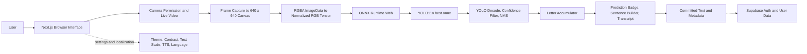
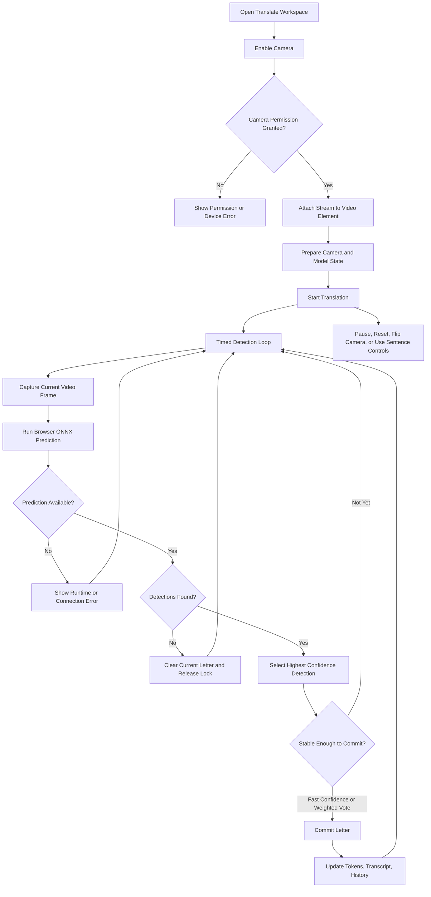

# Design Section for English Final Exam

## 1. Revised Design Section

Signify AI is a web-based application designed for real-time recognition of BISINDO alphabet hand shapes. BISINDO stands for *Bahasa Isyarat Indonesia*, an Indonesian sign language variety used by Deaf communities in Indonesia. For an international audience, the system should be introduced as an Indonesian sign-language learning and recognition tool, not as a universal sign-language translator. The current implemented scope is the recognition of BISINDO alphabet classes A to Z, supported by camera feedback, confidence scores, editable text output, text-to-speech controls, history, and practice features. This scope is supported by the model manifest in `apps/frontend/public/models/bisindo-yolo11n/manifest.json`, the frontend model constants in `apps/frontend/lib/yoloModel.ts`, and the public documentation text in `apps/frontend/messages/en.json`.

The application architecture is browser-first. The production frontend is a Next.js application located in `apps/frontend`, with dependencies declared in `apps/frontend/package.json`. The workspace routes are implemented with the Next.js App Router under `apps/frontend/app/[locale]/(workspace)/`, including `translate`, `practice`, `history`, `reference`, and `profile`. The shared workspace layout is defined in `apps/frontend/app/[locale]/(workspace)/layout.tsx`, which renders `WorkspaceShell` from `apps/frontend/components/layout/WorkspaceShell.tsx`. This shell provides the structural design for the authenticated workspace: a desktop sidebar, a mobile bottom navigation bar, and a settings dialog. Public documentation routes, such as `how-it-works` and `research`, are implemented separately under `apps/frontend/app/[locale]/(documentation)/`.

The main recognition experience is implemented in `apps/frontend/app/[locale]/(workspace)/translate/_content.tsx`. The user first enables the camera through the `WebcamCapture` component in `apps/frontend/components/features/translation/WebcamCapture.tsx`. This component uses a live HTML video element, permission-aware states, camera controls, fullscreen controls, mirror handling, and bounding-box overlays. The camera request uses `navigator.mediaDevices.getUserMedia` with video constraints, while audio capture is disabled. If permission is denied or the device is unavailable, the interface changes to an error state rather than leaving the user without feedback.

After the camera is available, the recognition loop samples frames at an interval of approximately 200 milliseconds on desktop and 300 milliseconds on mobile. This behavior is defined in `translate/_content.tsx`. Each frame is passed to `predictFromVideoFrame` in `apps/frontend/lib/translateApi.ts`. That function calls `captureImageData` from `apps/frontend/lib/imagePreprocess.ts`, which draws the video frame into a 640 by 640 canvas and reads it as `ImageData`. The pixel data is then prepared for inference by `apps/frontend/lib/yoloPreprocess.ts`, which converts RGBA image data into normalized RGB tensor data.

Model inference runs in the browser through ONNX Runtime Web. The production prediction path is `apps/frontend/lib/translateApi.ts` to `apps/frontend/lib/browserYoloRuntime.ts` to `apps/frontend/lib/yoloSession.ts`. The application first attempts worker-based inference through `apps/frontend/lib/yolo.worker.ts`. If worker execution fails or is unavailable, the runtime falls back to main-thread inference. The ONNX session loads the model artifact from `/models/bisindo-yolo11n/v1/best.onnx`, as defined in `apps/frontend/lib/yoloModel.ts` and `apps/frontend/public/models/bisindo-yolo11n/manifest.json`. The model manifest identifies the architecture as `yolo11n`, the input size as 640, the input name as `images`, the output name as `output0`, the confidence threshold as 0.5, the IoU threshold as 0.45, and the labels as A through Z. The runtime attempts WebGPU when supported and falls back to WASM, with local ONNX Runtime Web assets served from `apps/frontend/public/ort/` and configured through `ORT_WASM_PATH`.

After inference, `apps/frontend/lib/yoloPostprocess.ts` decodes the YOLO output tensor into candidate detections. It filters low-confidence predictions, clamps bounding-box coordinates to the input frame, and applies non-max suppression to reduce duplicate detections for the same class. The translation page then selects the highest-confidence detection as the current predicted letter. To reduce unstable output, `apps/frontend/lib/translateState.ts` uses a letter accumulator. A very high-confidence prediction can be committed quickly, while lower-confidence predictions require a weighted vote across several frames. This design makes the output less sensitive to temporary camera noise or small hand movements.

The prediction result is displayed in several coordinated interface elements. `PredictionBadge` shows the current letter and confidence progress. `WebcamCapture` overlays the detection box on the camera feed. `SentenceBuilder` accumulates confirmed letters into editable text, supports adding spaces, deleting the last character, clearing the sentence, and playing the sentence with browser speech synthesis. `PredictionDisplay` records session entries with timestamps, confidence values, copy controls, export controls, sharing, and per-entry speech. When a letter is committed, `appendHistoryEntry` in `apps/frontend/lib/userData.ts` stores the confirmed letter, confidence, timestamp, language, session ID, and commit method through Supabase RPC. The inspected code and documentation indicate that production inference does not send raw camera frames to FastAPI; the legacy backend is described as local and development-only in `apps/backend/README.md`.

The user interface supports usability through clear states, predictable navigation, and accessible controls. `WorkspaceShell` separates desktop and mobile navigation: `AppSidebar` is used on desktop, while `MobileBottomNav` is used on mobile and tablet breakpoints. `SettingsDrawer` provides camera mirroring, theme, high-contrast mode, text scaling, text-to-speech speed, text-to-speech volume, language switching, account information, and logout controls. The preference values are exposed through `apps/frontend/hooks/useAccessibilityPrefs.ts` and persisted through the provider and user data layer. Many interactive elements include `aria-label`, `role`, `aria-live`, `aria-current`, `aria-valuenow`, or status regions, as shown in `WebcamCapture.tsx`, `PredictionBadge.tsx`, `SentenceBuilder.tsx`, `DetectionStatus.tsx`, `AppSidebar.tsx`, `MobileBottomNav.tsx`, and `SettingsDrawer.tsx`. These choices make the interface more understandable for keyboard users, screen-reader users, mobile users, and users who need larger text or stronger contrast.

The design also includes localization for Indonesian and English audiences. The locale configuration in `apps/frontend/i18n/config.ts` supports `id` and `en`, with Indonesian as the default locale and English under the `/en` route prefix. The message files `apps/frontend/messages/id.json` and `apps/frontend/messages/en.json` provide parallel interface and documentation content. The `LanguageSwitcher` component allows users to change language without changing the application task. This design helps local Indonesian users access culturally familiar terminology while also allowing international readers or examiners to understand the system through formal English.

The design should be presented with careful boundaries. Signify AI recognizes BISINDO alphabet hand shapes and helps users build text from confirmed letters. It should not be described as a certified interpreter, a complete sign-language translation system, or a semantic sentence translator. This distinction is important because sign languages have their own grammar, regional usage, and community context. The design is strongest when explained as an implemented browser-based recognition workflow whose current output is confidence-scored alphabet predictions, editable text, and supporting learning tools.

## 2. Multimodal Element 1: System Architecture

**Figure 1. System architecture of the Signify AI browser-based recognition workflow.**

Figure 1 shows the main production architecture of Signify AI. The user interacts with a Next.js browser interface, grants camera access, and produces a live video stream. The frontend captures frames into a 640 by 640 canvas, converts the pixel data into a tensor, runs the YOLO11n ONNX model through ONNX Runtime Web, decodes detections, stabilizes letters through an accumulator, and displays the result through prediction, sentence, and transcript components. Supabase is shown only for authentication and committed user data, not as the production model-inference service.

This figure is included because the design section needs to make the system boundary visible. The most important boundary is that production recognition runs inside the browser. The diagram helps readers distinguish camera-frame processing, model inference, result display, and saved metadata. It also helps prevent an inaccurate explanation that would place FastAPI in the production prediction path.

The figure supports the written design argument by connecting each code-level responsibility to a clear architectural role. `WebcamCapture.tsx` corresponds to camera interaction, `imagePreprocess.ts` and `yoloPreprocess.ts` correspond to frame and tensor preparation, `browserYoloRuntime.ts` and `yoloSession.ts` correspond to ONNX Runtime Web inference, `yoloPostprocess.ts` corresponds to decoding and filtering, and `translateState.ts` corresponds to stable letter commitment. The diagram therefore turns the implementation evidence into a readable system design.

## 3. Multimodal Element 2: User Interaction or Recognition Flow

**Figure 2. Recognition and interaction flow in the Translate workspace.**

Figure 2 shows how a user moves through the Translate workspace. The interaction begins with camera permission, moves into the live video state, and then enters a timed detection loop. Each loop captures a frame, runs browser ONNX prediction, handles errors or missing detections, selects the strongest detection, and commits a letter only when the result is stable enough. The same page also supports pausing detection, resetting the session, flipping the camera, adding spaces, deleting characters, clearing the sentence, and using speech output.

This figure is included because the recognition feature is not only a model call. It is an interaction design that manages permission, camera readiness, model latency, repeated predictions, unstable hand positions, and user control. A text-only explanation may hide these transitions, while the flow diagram shows how the interface protects the user from sudden or unreliable output.

The figure supports the written design argument by demonstrating that Signify AI is designed as a controlled recognition loop rather than a one-time upload workflow. The loop is visible in `translate/_content.tsx`, where the app starts an interval, prevents overlapping predictions with `isBusy`, processes detections, and commits letters through `reduceLetterAccumulator`. The flow also explains why `PredictionBadge`, `SentenceBuilder`, `PredictionDisplay`, and `WebcamCapture` are coordinated: each component presents a different part of the same recognition state.

## 4. Optional Multimodal Element 3

**Table 1. Main workspace pages and their design purpose in the implemented Signify AI interface.**

| Workspace page | Main route evidence                                                                          | Main design purpose                                                                                             | Supporting implementation evidence                                                                                                             |
| -------------- | -------------------------------------------------------------------------------------------- | --------------------------------------------------------------------------------------------------------------- | ---------------------------------------------------------------------------------------------------------------------------------------------- |
| Translate      | `apps/frontend/app/[locale]/(workspace)/translate/page.tsx` and `translate/_content.tsx` | Provides the main camera-to-letter recognition workflow, sentence builder, transcript, and TTS controls.        | `WebcamCapture.tsx`, `PredictionBadge.tsx`, `SentenceBuilder.tsx`, `PredictionDisplay.tsx`, `translateApi.ts`, `translateState.ts` |
| Practice       | `apps/frontend/app/[locale]/(workspace)/practice/page.tsx` and `practice/_content.tsx`   | Lets users practice target alphabet signs and records attempts through adaptive targets and hold-based success. | `predictFromVideoFrame`, `recordPracticeAttempt`, `StatsDrawer`, `TargetBlock`, `HoldProgressRing`                                   |
| History        | `apps/frontend/app/[locale]/(workspace)/history/page.tsx` and `history/_content.tsx`     | Displays saved translation sessions, confidence values, copy actions, pagination, and delete or clear actions.  | `getHistorySessions`, `removeHistorySession`, `clearHistoryEntries` in `apps/frontend/lib/userData.ts`                                 |
| Reference      | `apps/frontend/app/[locale]/(workspace)/reference/page.tsx` and `reference/_content.tsx` | Shows BISINDO alphabet reference cards and per-letter practice statistics.                                      | `apps/frontend/public/alfabet/*.jpg`, `ALPHABET_LETTERS`, `getPracticeStats`                                                             |
| Profile        | `apps/frontend/app/[locale]/(workspace)/profile/page.tsx` and `profile/_content.tsx`     | Summarizes account identity, accessibility preferences, translation activity, and practice activity.            | `getAccountProfile`, `getTranslationHistoryTotals`, `getPracticeStats`, `useAccessibilityPrefs`                                        |

Table 1 is included because it connects the system design to the user-facing structure of the application. The table shows that Signify AI is not only a model demo; it is a workspace with translation, practice, history, reference, and profile surfaces. Each page has a distinct design purpose and a corresponding implementation path.

The table supports the written design argument by showing how the recognition model is embedded in a broader learning and accessibility workflow. The Translate and Practice pages use the same browser prediction path, while History, Reference, and Profile organize the outputs and learning progress that result from user interaction.

## 5. Intercultural Awareness Notes

For a local Indonesian audience, BISINDO may be a familiar term, but the explanation should still define it formally as *Bahasa Isyarat Indonesia*. The presentation should avoid treating BISINDO as identical to every other sign language used in Indonesia or internationally. It should also avoid claiming that the application replaces Deaf community knowledge, teachers, interpreters, or human communication. A suitable local explanation is: "Signify AI recognizes BISINDO alphabet hand shapes from A to Z and helps users practice, build text, and review results."

For an international audience, BISINDO must be introduced with more context. The speaker should explain that BISINDO is an Indonesian sign language variety and that the current implementation recognizes alphabet hand shapes rather than full sign-language grammar. International readers may not know the difference between alphabet recognition, word-level signs, and full sign-language interpretation. Therefore, the report should state the boundary clearly: Signify AI is a browser-based BISINDO alphabet recognition and learning application, not a certified interpreter and not a complete multilingual sign-language translation system.

In both contexts, the tone should be respectful and precise. The report should avoid slang, local abbreviations without definitions, and broad cultural assumptions. It should also explain why browser-side inference matters in user terms: camera frames are processed in the active browser session, while saved history stores committed letters and metadata. This explanation is understandable for Indonesian users, international readers, technical evaluators, and non-technical examiners.

## 6. Oral Explanation Script

### Script for Explaining Figure 1

Figure 1 shows the system architecture of Signify AI. The flow begins with the user and the Next.js browser interface. After the user allows camera access, the interface receives a live video stream. The frontend captures a video frame into a 640 by 640 canvas, converts the image data into a normalized tensor, and sends that tensor to ONNX Runtime Web. ONNX Runtime Web runs the YOLO11n model file, and the application decodes the model output into gesture detections. The result is then stabilized by the letter accumulator and displayed as a prediction, a sentence token, and a transcript entry.

This visual is included because it explains where each major responsibility belongs. The most important point is that the production inference path runs in the browser. Supabase supports authentication and saved user data, but it is not shown as the model server. This prevents a reader from misunderstanding the design as a backend-based prediction system.

The figure supports the report because it connects the design explanation to real implementation files. The camera layer is implemented in `WebcamCapture.tsx`, the frame capture and tensor preparation are implemented in `imagePreprocess.ts` and `yoloPreprocess.ts`, the ONNX Runtime Web path is implemented in `browserYoloRuntime.ts` and `yoloSession.ts`, and the result display is implemented through `PredictionBadge`, `SentenceBuilder`, and `PredictionDisplay`.

For a local Indonesian audience, I would say that this architecture helps the application recognize alphabet BISINDO directly from the user's browser camera. For an international audience, I would first define BISINDO as *Bahasa Isyarat Indonesia*, an Indonesian sign language variety, and then explain that this version recognizes alphabet hand shapes from A to Z, not full sign-language grammar.

### Script for Explaining Figure 2

Figure 2 shows the recognition flow inside the Translate workspace. The user opens the workspace, enables the camera, and grants permission. If the camera is ready, the application starts a timed detection loop. In each loop, it captures the current video frame, runs browser ONNX prediction, checks whether detections are available, and selects the highest-confidence detection. The letter is committed only if it is stable enough, either through a high-confidence fast path or through weighted voting over several frames.

This visual is included because it shows that recognition is an interaction process, not only a machine-learning prediction. The application must handle camera permission, loading state, missing hands, unstable predictions, runtime errors, pause, reset, camera flip, and sentence editing. The flow diagram makes these states easier to understand.

The figure supports the report by showing why the interface design is connected to the model design. The model produces predictions, but the user interface decides how to present them, when to commit them, and how to let users edit the final text. This is why the implementation includes `translateState.ts` for stable commitment, `PredictionBadge.tsx` for current output, `SentenceBuilder.tsx` for editable text, and `PredictionDisplay.tsx` for session history.

For a local Indonesian audience, I would explain that this flow helps users practice and read BISINDO alphabet signs with visible feedback. For an international audience, I would add that BISINDO is a local Indonesian sign language variety and that the diagram represents alphabet recognition, not certified interpretation of full sign-language conversations.

## 7. Codebase Evidence

- `README.md`: States that Signify AI is a browser-based BISINDO recognition app using Next.js, YOLO11n, ONNX Runtime Web, local frame processing, confidence voting, sentence builder, Supabase persistence, and accessibility settings.
- `apps/frontend/package.json`: Confirms the frontend stack: Next.js 16, React 19, TypeScript, `next-intl`, Supabase, `onnxruntime-web`, Motion, Tailwind CSS, Vitest, Playwright, and axe-core.
- `apps/frontend/next.config.ts`: Configures model and ONNX Runtime Web asset caching, cross-origin isolation headers, camera permission policy, CSP, and `next-intl`.
- `apps/frontend/app/[locale]/(workspace)/layout.tsx`: Wraps workspace pages in `WorkspaceShell`.
- `apps/frontend/components/layout/WorkspaceShell.tsx`: Defines the full workspace shell, desktop sidebar, mobile bottom navigation, settings drawer, user profile loading, logout behavior, and accessibility preference wiring.
- `apps/frontend/components/layout/AppSidebar.tsx`: Provides desktop workspace navigation with active route state, user account area, settings, and logout controls.
- `apps/frontend/components/layout/mobile-nav/MobileBottomNav.tsx`: Provides mobile and tablet navigation with safe-area spacing and settings access.
- `apps/frontend/components/layout/mobile-nav/workspaceNavConfig.ts`: Defines the workspace navigation targets: translate, practice, history, reference, and profile.
- `apps/frontend/components/layout/SettingsDrawer.tsx`: Provides camera mirroring, theme, high contrast, text size, TTS speed, TTS volume, language switching, account, and logout controls.
- `apps/frontend/components/layout/LanguageSwitcher.tsx`: Implements Indonesian and English switching through localized routes.
- `apps/frontend/hooks/useAccessibilityPrefs.ts`: Defines high contrast, text scale, TTS speed, and TTS volume preferences.
- `apps/frontend/i18n/config.ts`: Defines supported locales `id` and `en`, Indonesian default routing, English route prefix, HTML language tags, and TTS language codes.
- `apps/frontend/i18n/routing.ts`, `apps/frontend/i18n/request.ts`, and `apps/frontend/i18n/middleware.ts`: Implement `next-intl` routing and message loading.
- `apps/frontend/messages/en.json` and `apps/frontend/messages/id.json`: Provide public and workspace copy in English and Indonesian, including documentation about BISINDO, browser ONNX inference, model limits, accessibility, and production boundaries.
- `apps/frontend/app/[locale]/(workspace)/translate/page.tsx`: Shows that the Translate workspace is protected by `AuthGuard` and delegates recognition behavior to `_content.tsx`.
- `apps/frontend/app/[locale]/(workspace)/translate/_content.tsx`: Implements camera start, detection interval, frame prediction calls, current prediction state, weighted/fast letter commitment, sentence tokens, transcript, TTS, history persistence, responsive panels, and mobile tabs.
- `apps/frontend/components/features/translation/WebcamCapture.tsx`: Implements live video display, permission and device states, camera controls, fullscreen, flip camera, reset, hand-detection badge, detection bounding boxes, and accessible labels.
- `apps/frontend/components/features/translation/PredictionBadge.tsx`: Displays the current predicted letter, confidence progress, idle/no-hand states, and screen-reader live announcement.
- `apps/frontend/components/features/translation/SentenceBuilder.tsx`: Builds editable text from committed letter tokens and provides add-space, delete, clear, and TTS controls.
- `apps/frontend/components/features/translation/PredictionDisplay.tsx`: Displays transcript entries with timestamps, confidence values, copy, speech, download, and share controls.
- `apps/frontend/components/features/translation/DetectionStatus.tsx`: Shows accessible detection status and optional FPS feedback.
- `apps/frontend/lib/translateApi.ts`: Provides the prediction facade from video frame or `ImageData` to browser YOLO prediction.
- `apps/frontend/lib/imagePreprocess.ts`: Draws video frames to a 640 by 640 canvas and extracts `ImageData`.
- `apps/frontend/lib/yoloPreprocess.ts`: Converts RGBA pixel buffers into normalized RGB tensor data for the model.
- `apps/frontend/lib/browserYoloRuntime.ts`: Chooses worker-backed browser inference when possible and falls back to main-thread ONNX inference when needed.
- `apps/frontend/lib/yolo.worker.ts`: Runs ONNX inference inside a web worker and returns prediction results or safe errors.
- `apps/frontend/lib/yoloSession.ts`: Configures ONNX Runtime Web, loads cached model bytes, selects WebGPU plus WASM fallback or WASM, creates the inference session, runs the tensor, and reports detections with inference time.
- `apps/frontend/lib/yoloPostprocess.ts`: Decodes YOLO output, applies confidence filtering, clamps boxes, and performs non-max suppression.
- `apps/frontend/lib/yoloModel.ts`: Declares the active BISINDO YOLO11n model configuration, public model path, input size, thresholds, label list, ONNX Runtime Web WASM path, and cache name.
- `apps/frontend/public/models/bisindo-yolo11n/manifest.json`: Confirms the deployed model metadata: `best.onnx`, input size 640, thresholds, max detections, and labels A to Z.
- `apps/frontend/public/models/bisindo-yolo11n/v1/best.onnx`: Confirms that the production ONNX model artifact is present in the frontend public assets.
- `apps/frontend/public/ort/`: Confirms that ONNX Runtime Web WASM assets are served with the frontend.
- `apps/frontend/lib/translateState.ts`: Implements camera-state mapping and stable letter commitment through fast confidence and weighted voting.
- `apps/frontend/lib/userData.ts`: Defines alphabet letters, translation history inputs, practice statistics, Supabase RPC calls, queued history writes, and practice progress persistence.
- `apps/frontend/app/[locale]/(workspace)/practice/_content.tsx`: Reuses the browser prediction path for practice mode, implements target letters, hold-progress success, adaptive target selection, and practice statistics.
- `apps/frontend/app/[locale]/(workspace)/history/_content.tsx`: Loads, displays, copies, expands, deletes, clears, and paginates translation history sessions.
- `apps/frontend/app/[locale]/(workspace)/reference/_content.tsx`: Displays A-Z BISINDO alphabet reference cards from public images and practice statistics.
- `apps/frontend/app/[locale]/(workspace)/profile/_content.tsx`: Displays account, activity, accessibility preference, history, and practice summaries.
- `apps/frontend/components/auth/AuthGuard.tsx`: Protects workspace pages by checking Supabase session state and redirecting unauthenticated users.
- `apps/frontend/app/[locale]/(documentation)/how-it-works/page.tsx`: Provides a public documentation page that presents the camera-to-translation pipeline and limitations.
- `apps/frontend/app/[locale]/(documentation)/research/page.tsx` and `apps/frontend/components/features/research/ResearchSectionContent.tsx`: Provide public research sections that discuss the browser ONNX architecture, model scope, limitations, and future research boundaries.
- `docs/manual-book/Manual-Book-Signify-AI.md`: Provides an Indonesian user manual that describes the production browser inference design, technical specifications, workspace pages, camera flow, accessibility settings, and model boundaries.
- `docs/rencana-pengujian.md`: Provides testing-plan evidence for the actual route map, protected workspace, browser inference path, Supabase data layer, accessibility testing, and legacy backend separation.
- `apps/backend/README.md`: States that the FastAPI backend is legacy/dev-only and not used by the production frontend deployment or browser inference path.

## 8. References

Vercel. (n.d.). *Next.js App Router: Layouts and Pages*. Retrieved July 2, 2026, from https://nextjs.org/docs/app/getting-started/layouts-and-pages

Vercel. (n.d.). *Next.js App Router: Project Structure and Organization*. Retrieved July 2, 2026, from https://nextjs.org/docs/app/getting-started/project-structure

ONNX Runtime. (n.d.). *Get started with ONNX Runtime Web*. Retrieved July 2, 2026, from https://onnxruntime.ai/docs/get-started/with-javascript/web.html

ONNX Runtime. (n.d.). *Deploying ONNX Runtime Web*. Retrieved July 2, 2026, from https://onnxruntime.ai/docs/tutorials/web/deploy.html

ONNX Runtime. (n.d.). *Using the WebGPU Execution Provider*. Retrieved July 2, 2026, from https://onnxruntime.ai/docs/tutorials/web/ep-webgpu.html
