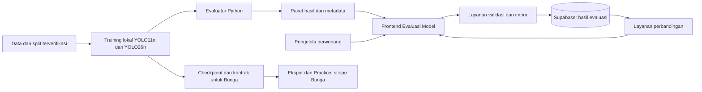
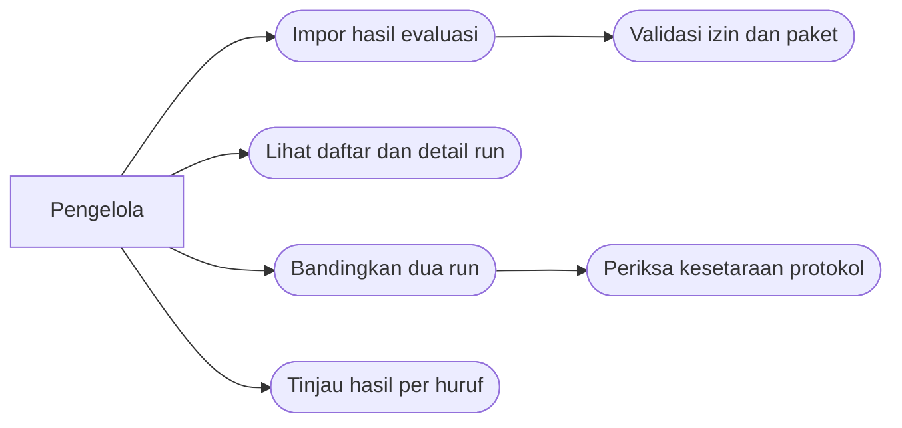
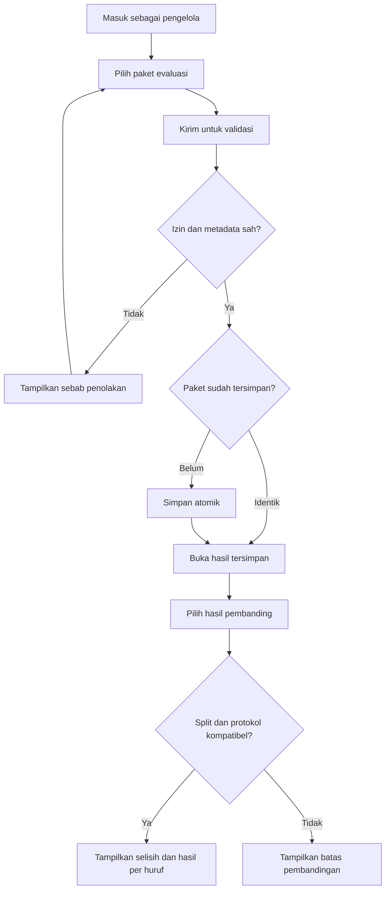
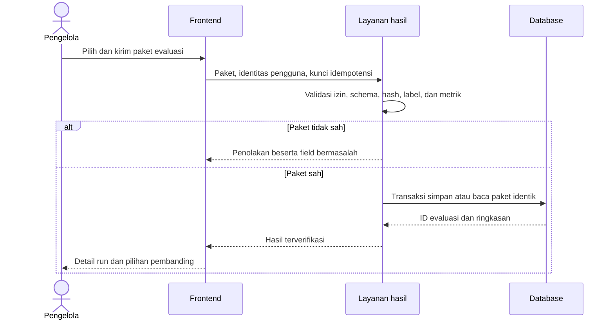
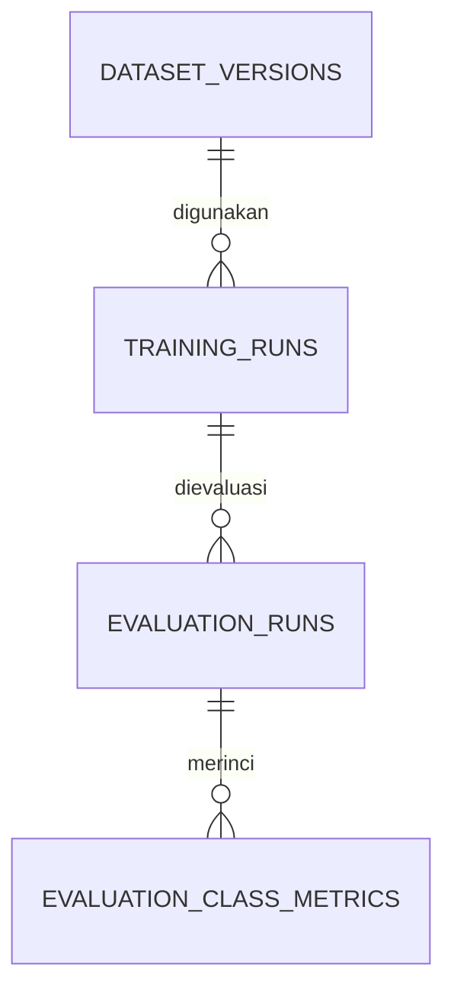

**PENGEMBANGAN MODUL EVALUASI PENGENALAN ALFABET BISINDO UNTUK PERBANDINGAN YOLO11n DAN YOLO26n**

Proposal Proyek Akhir

Disusun Oleh:

**Meiske Priskilla Sahertian  
3312401001**

![](data:image/png;base64,iVBORw0KGgoAAAANSUhEUgAAAIAAAAByCAYAAACbZNnZAAAABmJLR0QA/wD/AP+gvaeTAAAACXBIWXMAAA7EAAAOxAGVKw4bAAAgAElEQVR4nO1dd7wfRbX/ntn9tdtbKqSSkEIJEIoUFRB8IqhYEhug7z0F4YGCRiXBggIJAkJE1Ac2kKLAQ6UoBkQiRQRJCBBIchPScxOS3JLbf2XnvD9mZ3dmd3/33mAIKJzPJ7m/nZ1y5pwzp83sLjEz/l2BCGLu8vxUfV0AkE27h0op9xtyHwKdXJAPmX28tHHjKw+eMjm/Z7F9Y4D+1QVg9t1Ij92/u06QrBeZ7BEAICD+hwgOGEI4YiYDILMRM0BWCYI6/j1mow0Z9wFIKZdDos9vebdHvFVAbi30l17sa6/q/dHx6H6dprvH4V9KAGbfjXRX1Wo6aMyYY5yU2NdxnA9Ij0c4jngX/GkwMShgFQNMfjlAzGAQiBSfAQDEIKaIhACKLhTKiS8B7AsI+XWIyChjSOZVRPSCZLkcpdJf13TsfGb7ojHFxZei9LoS5zXCm14A5jzfPRzp9PC0wKcg6AJBThWgmAkixRcGGP6SZSimIBSEmAaAXz9QBH5DaAVAQZto27imCGuG7Vj1xkooPOYXAbql1F964KqDM6teBzK9ZnjTCQAB4sIVPSNyyL6bHP4awNMFORl/yQWqWzNec8fS6v7CD5oEnTOY/dUbWfS6vfkX8PtkLR76msH+igeTNRYCDeQ30vgyg1kyEXV6Hv+NHfp5e6f74I0z0bunabg78KYQAALovMUvVdaMnHKiELhckDjIX48I1DCzvjKpDb2MtTq2wJQKDgcLijkcgxHSIdQKhkD4GoWZDRxUe2VWtI0w6moMKcTVNDdSys1SynuJ0je0bMX6m49H/56i6VDhDRWA4y+Fe8jpqMrlile5jvN5Xa75Yq4+gyex1aoWoiKusvXaFwgbsSEMoZiwv9JNoYLFvKBBqPuVFjFkLWCvqW4MlWEaIksmGf5IgMe8iRjnbOzf+dhtM0b2GkrndYU3RAAIoLkr8x91nNTdvo+WaG+BwDIbjh2CVcik7bi2+Yj1YM6OjOty44Xt7LsEe2XDZGQEv1hfSdopwC7qZQJM8scdxd5v3TCtprVsp3sI9roAzF1VvFAIugKMnBAi0dsKV5Spfn0xGIhrxuqM+gixmmww1ViSlpkJkAk70qbCjDQC0QucUbLw1+YqHEvhGVoSf37aPwGDWXrMeDRf6L/g+wdVrxwygXcT9ooAnPLg6sxhEydcQYSzADSREIlBuLUeTHVsrPRIk8AVoIR+2PAGyWqEIKQjwyMMI4O4oxmV06jap8C5QGBWiHwT49sr8v8qM2UIhBFRmC4LgSBZFgD81ut0v3DlTOzaA+yw4PUWAJq7Mv8B4Tg/FySakiqEKxERuxqsRV/l+oTmKDeDBjrktwpiqj7iR5i/k7RGYDLYwCuCh2V8fAbHbI0xNgWq3iCUbgsEyJh+jud5HQT+6vyp6V8wQybR8rXA6yYAX13ed2w67d4mhDMeQIwIqkw7TYbTZXrRhrNtO1KhmjWKEyHGQIpX1X6GFpioNgpQJQM3mBqAYGYegl9BroIDphuTRDhYKI1mFUvz+BpESm+DLMnzFkzP/DF5xrsHe1wALlyG8ZUVpcsBni2Ek1KlnEz5KPjeVehA+0TxlyZpusXCPb+dT9CQgKHAWMkda3VFhcpmfWBioswM7psqTLcMDFDoLAa4IzALxMZNU6jAoSbyw5oQK4JkWQToD1dMdj48CEUHhT0mAASIi1cVvyoEfVGQGA3EpxXqXyBRGLRa9Cmn7bNO7yrCDE2QYlHBAENHtbW1SCmspK7ZcEbNGYZCHohwQFpfsCLqRQuIiaI5xzD3oMcK+wMzWPLaUqnwye8dUPHMIBQpC3tEAC5asmNURVX910G4QAgSAzM6qkTtquVSuJrIpvecBAFREXQY3fcpg0XIFQ4kgAbsIz6y7ilMGpkrnIIMYrmWJh1s1W/RwBcAIkBK7pQsr3/q1+nvvJb9hn9aAL7c3LtPjtIPCxLTNJJBQiVGtQSmm4rBUpd6o0XVVIsnKjC2YU/Y5IuNEae2Sda4QEb7sTebwnvwzUk0haz3K8IOEHLYp5Hp8AZ9mnyh8C6HFWwEJf+i+Xn33LtmoYDdgH9KAOauLH7BdZ2fmGXltDsSKkWzc1bcHLjlMGaNUHWGl0YopktUH+ybkGiO30rgMCKrMjKDMpemkoEWDFYlQRaSKdLGlHCC3okMtZHNC3NTKwyLw5kHi0QvB5a/7tjinr0729GvWQDmrip+XRBdLoRwy1ayvKAB6gQ08e1ftAuDQEFgZ6hWU2PoRqYGsXpM0gRRZIwzAYFgBWZdx+4h3r4UWZIRaKgEHCzfIopLTGXpCRn9k10vMBMMsPTu7+zoPOP6oxo7E6gdg90WACKIuSuK80jQtxXzk2159PeAqqFsI7/I2qLTHpOhijXDQVawYfkTxt69jgis8SLOg5WQsfCzBdqIZO0xtb03dg4tUhtnCqyQ1sDCVFvmBlU4HwvjoI1k+WhHMfXBHx0wuCbYLQE4ZwlSjZWlb5LAN4SRzYup1agTp1OsCZrAIuBAhEY8Aghta3zRRLeHBxK+cAMJ1jkDsOGHGIrHUv8RrWGqDbVngQARk9ZBSthQG9Zuoy416GGZBN2S/XZAuCMJwJNy6ab1O99163tH9pSZOQBADHTThNl3I91UXfqe44pvxlK5vnMTdWWCqRHFmM/QNlH9sybrtzHrmvl5kwGk7W2wADhsHnhkxrgRgQ88fuJQ9QcokIGKX8fHICZPmsnkp661qTAPFwR9aoEgaPNm5DzBpE0NgAi+ZBGBLBy1wwwAguiwcROa/jYbcKKomjBkAZg8o/QzIcRFiNpUhMyx8VUSUW7hkZ44axIYwPAPUHCYKtYdM0eIQlYb/VsLpPrNQVPtMwT12XfEtMPmr1qfh9YcNZbamYev1tnoS/3zx9JzMPBXKp99x41jczUQDcYn5oAGVj1dRmz0bwo5HTy5ufT9MiwAMEQBmLui8EkAn9ZYBROyMAl/aIUWT4iEEwzWkLZ/BqP8pW3bb0MHByvSGDvQNFr9JjiKRBGBNOrrFRuIomk+TNRhZ+WMzpQgB/gZ9yPaT+kAXzv4/ygoR1geIK1HMzSFL8eBQ+p3TIb/4puGC+atLr4bZWBQH+DLT23KVQ7bpzeoFzgsymiGx6EMTzSYSPjb8t+sEcIb1mmb3QbVT9Cb5ZiYFDIMusXliL9RDonyE4lVIxg47C5Ekkj2PVi0jd9U5iWYvifX9rZtPfDao8f0RWsPqAHmPdc1rKJx5Do1D1+6g7uh2gdCewltu0waabusnaJAM+isVtinqXkThTM0w8Fq9EcNRcA3K6Fm8K99qVTKy2S4YUZCrBNAefQAlNpFROUGSpEDQTPQ1dahTM8J11Frp/uhOJaKbhzMj8goccTEXOOIq5PGHVADXNLsPSgEvS8Z3fBEbqjDo46b/9tIZyaBqT0AJO/Y6cEiiR1rvEhIoXCgoL3lLCJCQFNLgDEyQxiWTpx28HdlN6zca3Qe4QCm3Q7POIZqUk2GfUR1OKsVSEz7GtqB/cVpK4zI7BiQLAtSFmYtmFpxnzmlskmcuS/1v0+knPckO5FqpMDeMmIMtqyjmTixJmDcNxoliYqimWnfDAhWXch4rbX0sJawBLRnZAShIQUcUyfQlAIaU4AgAYcANwERU5jzEpDM2FkEHm5ltOQJeU+jFK5SfdLHXCiGVxN68ooYCDwkgi/wEURM06C1gWa6sQACbQBACJEG0gsAWAKQqAHOWYJUU3VpmxCiITL9xOVZLuaOmuFwHnEJDSmAQL2bCZukjZToNq8uC1ZZFF8GXAGMzQIzqgnjs0BGAJUGpwfTVuEYceiVwJpe4LevMjzDAQ5OAsFgshHXq3oEIxlh+CAhI/VvrRXMxFagDfyuLJr6C0dKz5PsnbZgSvZPGudEDdCQK3xECLch7mWEW7NWaRlfxaQjRfpR09Gp35C5HNQ1EjBG91YiRGfJDJVpOan+UMyMI2sFplcBozJAhYhrrBBPbTJsQYgncexyIkKlAxxcxRiXJdy3A2juNVR4LB+g0dNz8WcWzF210RtQerFrXwKG4AfnB5JMh/4NgMhxBMQcAIEAxDTAfz+5s3rEsLqXHCHG6DN1ZVdu0kqOGW/NhKgQRBa+cWHbYwSaLeYrBDXinde5wH4VwIFVhHFZwBXJ2qMcDFUTlBOYgmTcux14oVs7Y+ay1Mjbh1yD085gg46G4Bga0N4mNs2NrXUR3oE6Y+j1XbF/qkLfiWmAYY01sxwhxqhmUXUfJUi41rTpiTFa8zCJlhGnSqswM5bXaU67s9DXCQ5YMqMxRRifA46sIzSlCBlhCFOC32Gu3qhK3V0zEK2fFoSPjAC6PcYrvcrqWyeW/DkEB15NrQiAA5XGMbVuCwisAyR6uQeZRK1h9ICg7LyVxW/Mn5q6XLU1JnLTEqQ21HhPEtERCSZ9SJDo68W84kgDRO7r8NBAwjYz4SgOARNzwKQKwmHVQNaxV2TcVsK6/1ohqX1UIwBAlwf8ZBOjy1N4k5E7CaYfJLqAcIfPJFdkL4V1OGofHQueQNLhthYGUzUwIKXc2r123YTrT5mctzTAqlzPgRWUO4KDYcswv9yNCFEsLRZcJxj2KJB/Xs5Y8QFxfOrVusDkCuDwGsI+WZvRGjxW62d1D6MggZ0Fxua8JaIGEqpdnUuYkAOGp4GmtHrGPInRSZCkQaodxpG1hL+0yWAuloJkAwtKIIlWF9ChpK+1dOhIYRXzuQQj16pJqnAngARGyBH7NAJosQQg62Y+4c8w4kxFuFRu4cTCFeO3aSd0UdTCcAIhTEeegeEZ4LAagXfUEhxTDfrE31oAWgvA2j5gda/ErhICjWL6MiMzQNZPg+2TUeZD38tLwqZ+4I87JQ6qIozPMYalk219uTKz/KAqxpPthDxrhzCUZdMkADDOQ0RMVnDqyTw6wmbgEPEREJoFfyHoyEgQiaqKijQQ9wE+7g9nFCVMDIbKGoAIptmN9sLB/2SVhT5eWJ4hxsQKwqQKgcNrdPpStd1VYmzNA6t7GC90q9icEa7SCgeodJRDmCbCO+tVn2kBOAkOnJnTOLxG/faYBzQZltZLqNOUJlQ4jP5i6AqywXj2Xfswr2Lo/1hKWPstvp9AysqbSi0wFxxSkkmHiUp8BBVvAFKnBQLw5WW9++Qq0jUm7QeS9nJEM3k6kIXVZiksCIVKa56cUOr4lCaBulTYW7cHtPQznuiQaMn7TPfVY1oQqh1gWJpwSI2K9auSMjrm0GU8ef3bMcqKDGzoZUyoCM1DOT/D/D0uB7SVNLPJ0nLxMJpC+uhQlyi8E5hEBLogUANmrkTnH8hnOxkNCTnA0ADZjPtOIUR9hDLGhe+takSsID+cgKXWDUEKVB1CobbSpob0ZxzCjCrCSY0CFQ4gAewqAVv6Gc91Mlb2mP0zUkRoSDMOriJMqSSMyAzs9JUTbPNvuVg/LQh1KcafdjLe20hIk10nCaxt6pCaPvqaGHYfAfMNHySyXkItAEAfSNVqPiy3DXlQh6hq9t1IBwJAjjjCQo8jTI56L/adxHuhUPsSolVW9IE7v25OAMfWEd5drwpLzHixS8XSK7oNxpBK09angMOrBY6pjzM2lppOWJnR+uXUfFQYhqUJNS7jmvUezh0jUOeG7a35x/ozsni+7tdRgM8Vg4GagEZ7Dn+weR0wwNz/CDWDDhsDz4EBh+jIsfu1jwoEQELOEBABMvpUi+WLGAhZ0gh7lQSHKqxY22xjOz4uAeNzwJmjlPfc7wH375B40TjRpgmZFsD0SuBDw0UsVz9YWDZY2DeUsFDXeVc94eldhJtbGBeMSY4WzHF1tk8xWdvIiCdFoTkl4/QRYGQ+dcUEVEMrHI3GItragEAAhFQ2xDp8anju1kR8V0J7lyDDCbHcO7Pctu8MwAFhWiXw4RFKtb6aZ9y7XWJz5AVsBGBEGvjoCMLIzOBMsjGJUMcqGnpfSXB0HWHRTsaj7YyTGpN31vUYr/QAA3tFfv1y5UN5IiroY+jzsqOAwGkwnY3wvF6oQthqElPxsLSV+s/AnxmoTxG+NFaFcs90Mv7appMlNhxaTTipAahJxSelhVL6+NzzKiNvPDfbkgd6pbo3Mg3U+LPNOsDpwyjQUtH+kvyAJJhSQVgEicfaCUfVMmrKOJuBf4FyPAzvKBJyvC6VazFApXIjGvYjFABfgK1JB/mAIGgNTHdkffkC4w+ofwIwvXsGMLVCe/XAX9oY/9gF9Ek2O4YrgE+MJIzPqXSuQiVUaxv6GKt7VdjX7zH6pF3nxAZCViiNoSElwu3dEitvPhNZtOX8hxj9AlxCAi/ayZg1MtnvWN4NdEtjYbDt2EUP0tr7L4aABlfhYotgBruQ4u0CZ1uVhD6AZJBgY3DfF/AR5GAVE8zjx3aKPbS3QV2/7dgs4aQGdcjiqQ7gH52KcaZhGJUBPjRcqXkzybOul7Gsi7Gun9Hph1LSn87EHDAsBRxbryKGFAGijD3WuLlElv8wWJq4nC/RkCKMzjBa8sCLXYz3D1M5hyhszbNJe8scJWJZRv4sq655lMDwwI/zSwLNa7iHLL3F3z+sfmPoAwhKlhfNTN9BCQRDO3ow8tYJvkaVA3xshECNCyxuYzT3qhUfeMGkdus+NIxQnwJS/onzLf2Mh1oZ2wtArwfrjQj7ZoGTGwjD00DOsYXFHD2JcYNl8YqeevtCxmBkOWHSh0aUidSmI25CVvdCe8qIBv0xJW2vqLLltuaI9ELWn2ixvpAMsKUB9Ct7AK3Co8gYgZ3Bcf3Ui97bJyKkCDimDjiilvBUB7DUX/FmFrHGJZw5ijDcX/Et/Yyndkms71Nxv8bFJbXKj6kjTMgpQbFpE9+EiTJ7qFu/rkP4/XaJExuAGifezgwXJav9hsBURkJKXa+1GDSOhXYxMSiHZ1KEAYOp5QQnXhNghvT4V4AZBWh7GEgqombejwJ8rWDNwLZZ+1cA764nrOxh/HQzY1fRRI7QlAJObiRMr1JlT3cwlnaplK4Z/NS5ygk8tEap28Splcm+DXW3L8ZgAKc2Ef53M+OMUeq4WLQ/zeDWImFLPlm4dNlj7RLFaMxcTnUj6V5yeVzpletPX5uLl8CU/itg+gAefi4Evyc4r25lGkLnRWetbB9AdT46A7yvidBWBO7bwXi1oCrooetc4MPDCRMqCHmPsbhN4okOWJ47AIzJAMfWE6ZWUmDPy9nlcl77PxPipQVh3wzj7x2M9w8LiWbCUBxFCcJznUMXRr/n8n2WvTuUvsM6krmwtn3Tq8AYmImgnVJSUQgnpRVAdGs3fD2q0R8BVQ7hHXWEsRng99sZ7UUEu1EAMCpDOKSacEQtYUM/4/YWiQ39yoPXklshgAOqCe+sI1Q7DFcYAyDUPlv6zeUUUVFgDE8rBg4EQ2FIjQs80QEcWsMYlZBaBoB+GR0/BCJCT4nRVkoQlt2I6Y0eyzcpLxmJIFk+un3RmCKONjTA96ZlH75kVakVwEgrXal7Z9/W6+wVqxMnB1Qqxj7Sxnik1dYZFQ7hiBrCO+sJa3qB27Yq+x5sURKhxgEOrFIp4NqUzfRdJWBbnrGjADzXpTTJzkI4RrUDaF5Pr1KRbL0L5JkxLEWYVpXMuKFs576jTuCJDolVPSo6SRKYDYYwphJ4ev92RpKMDMR/M58fVd1lYXeYL2WJPflD/TaRSCKI/8zMZ9i5AOPULYUiUeMS3tNIaOln3NzCod8AlRbdv4pw6jDC2l7gVy2MjZG34Fa6hCNrgePqKFixHgOdJWBjvwr71vaG3r/2uKdVKobsmyWMzfqEj5gGhWrcXJgw0L4BoKIXAFjXxzg+gcLMjJe6EfBnWiWQEyGzOkuMdf3JYw/Er3h4N1Bt640JQzUEu66clvmDvrYEwJPy967rnIGYk6cHAwQIM6pVJu+hVkavlb0jjMwAs0YI5CXwwA7Gih5Yj1w3pICjawWOrgvRbckzVvUAK7rVgQ4TRmWA/SuAaVWEfYaYBk5yBAuSsbkfmFhRnukmdBRVZJOUnQSAfkloLYTOcl3K7vOpDka/NHAByj5EYwFHDq8EFjc5DNS9m2G1HiI8KBKOKBk3mcNZApDn0t8cKVpIOKPNl1Lp3yMzhKNqCY+0Mnq0bmMlGg0pYGolYXIl8LtXOcjn61ewVDmKkacNU5s4OwtKOP7azuphCn9uBPVwxqQKwokN6ozfYGwvt5rN32mhElj3bZc4bZhAkptg9vNsZ/xtjOb95t4wA0kEvKM2TCu2FxlPdcB4rZ3hN0eSNPGAIIJYGXORqFMokhkwo0swpETzginuN+YbLS0BuG5a5da5KwvfIMIvtB8AqJTpUXWEnCDcuz0kCxFBCOUHvKeB8Ggb41ctCISCiJBxgAMqgVOaCK6/4fNgK2N9n3FSldTxrDFZ4Ph6wthcRKUPsloHU/caxmeBZV2E322X+OiI+OZNvF0k9DLuL+8OV4hLQM4Jx/9rO8ML2kR60YIaXCfMJzZypGI8exSvrTsx25N3G8Ox5Dp2LLxUko8JR5YI5BKUrT65gfB4B6O1aCRZoA5mfnA44Yl2xsKNtnfu6tM8jYQaF3hqF/BSt1ShIZT6EgBq08BBVYRj6igxjToUh22g+tF7h1Uzbm4BDq5mTK4oX3dtn8IyCXo841AKgEOrEWQjO0vAEv12HrL+mJNAdGnHMwNad4cLIPTFYC/xwF/0tYtuYkiSlPKFjpbUdZhsoxITgKsPzL4yt7n0w7SgiyZVAtsLKrQz0XQJeGe96v2WLRLhNrHCbniGcGoTYXSW8NBOiWc67ckJqMMcHxxGmFih43iGlIz+fBGFkgcpGTKy6SKIkE45yGXSiL6kZKhQnyI4xPjNNsbcCeGegOk8FqRKQScBM+NvHQYBCZhZG6reh1o5rt41R0wODuzbKYhbAyM9b3BYC31gCUJxYgIgJUvIa5PeHpb4aNiC/d05T7R5p/y5DVNLrFarfgBjfA74jybCzVskCoYyISjGfmg4YXIFsGgn8MsWaSPMjDE5wsdHqvDPk4ylKzbh+dWb8L//9xieW7URRS/Y2gsnFjED2VQKc848GbNOnokD9hsNR9jqfKDNnBpXRQ69HmNrnjEmG/cdCgzkpXaz7D4KEljWGWq7SgcY5T9FvDWvdihjhiTgd3TlGyE22UXh7qvPZOsFmdHKse6CWsrxkzcsmJK+BQlQ9vHwuc359wty7hMkAsVc66pQrcezzYtDwNRKYPYIgcfbJR5pC7WcJtzoDPDZ0QQuFvHgky/iWz+5D2tbdiJfKA3JzieBIEJNZRaXn/tBnDf7BDWhQUwGM+Oq9YxuD3hPA+H4hvi4P9ss/RifYnXu2CqxwlD/Z4xS5xAB4BdbJNbFXsGwp2H3sj5Syp6lr6xrLPedw7ICQADNbS494whxeDA0G5LsE3VMBjh1GOEfuxjLe/yVwwjCkRoX+MgwYP3LzfjuTQ9g6cqN6OnL26lla34+PoMJhKFViAjjRzXi/oXnY/rEUQMKwfY848ebGR4DTSng/LHC2k3s9RhXrZO+E0f4/L6EMX4iyGPG99aF3n+NC5w/hpBzCMs6Gb/drl5ZYeuOuEcelquV/Vqy1nHSxQeQUpYKxfwRVx9QuaxcP2XfEMIA57vcU8Zl+TFLRggAKcfuzFGEmbXqXNySTvjPxhOYVFr4v0cDvYv+gHd99GKcfO51eOy51ejWzAcCBlr/hjp765KxbmsrjvjMfPzpb8tj1U2B6JOAtjJTKwnCiHYAYF2fv8PnQ63hmN65jdFn5AWmVajtaI+BB3aGj2jGnp7W/0WmRzret/1n+68x5fhJrEFA8gUDMR8YQANo+MqavjE5ZDaa473HP3HzWLtSpSHOKgU7M92P++95CDff+wS2t3cNjqi56stpAGPFW/ci5RXZNJ67/RvYf9wIo0ro4D3cynisXfrzEJZ67/OAq9dLFH37NbUS+PQotUZe6fUznj7o1Z8WhNtaJNaUVf27obKtqokqY0hdSSklSz5vwdTUTRwTJRsGfUvY9yflNnle6SwpZXHfDPDJUYSXe1Qs32ns2acJeF+jwIv33IvZn70UV9/yILa3GW8rjQpa9NpkapJ4D9FU9PYXcN6VtyNftF+crTeTdhTK0+PZTlZbt+pFfTisRvVdkMDvtqtIRcNxdUr1r+5lrOkdiMZD1e8cqZpEAxuHsiMKumf+1NSNgzEfGOJr4hZMSd86LouPNbmy87fbGC39gOdvBjEDU3OMI3s24YL/uRy/uONP2Nq6y+ZvOS1TTu0PZgqStIABjz7bjEWGKdAmIC9V9pGZIEA4tCbso8djPNauhUodHJ3oJ6TW9LJ6xtBnSlYAM2sI7UXGvdsHd2A59iMJhiIo2q8vD1J6d23o2fGfQ+gMwG68KHLllq0PL+2St+b9+RLUqZ//qOjFE7f8Bqd9/kosW7UpeY5EyWrb/Geu6IEIOth9qPf2/OahZ2Plj/gfYSOog6dm4unJdqA/CGsZpw9XB1Lbisq5Myd22jBCSqiYv9sL21hgXFLsR7x64g17FQ06jud5v+hr3fbZW2cM/HpYE8q/6TsC1x49pu+cJbiosbqUJ/BFpw53KPVqCz7zpZ9ixfptcaSTYniT8dF7Q/FqknwFDZH2L67e4jdREUBRAq/0hSt8fDY8JdxZYiztktAcSpPKZQDAo23+gRVS4x9QRZhRTXh6F2O5lVaJ4B9lNhl/E6pbDXXYYM1J0yzS1v/teXJB65TUt2/EmCJ2A4YsAABw40wUCe6cezb3XvfnuxY9dt2vH5nQ0RX59G2UudbOIqGsMzdUMAXG7CvSX29/wa+mypZ2qXMFgFJ7JxrO359bgR6PgnufGa2cu6WdjOe7bPxPalRPJP9xx2BmCkNgdrxJkCuKfzHL31iKhnpeh+PgpPlTUkuGNooNQzYBBpL8kX0rNi+8488LOrt6N6jCBIcsurKjdcoxf3QVluEAABMLSURBVCD7bzI72lc09g+6U47dkx2hA1XrAqMz8Pf0Gc93hSnNpjQwJkfo8xgPBqGdgvc1EepShDu2DuG7bUnTG0QQSE+lTN1okZT8kif5Xd/d77UxH3gNAqChbfHCn46qz56ccpwHAchBY/mhMnwwrTAEHwDMyKZcvzrhqQ5GezHUwzN9588D4f4d6uweABAYHx6ufv9qKxs+gdqpPLZOnRhuyQNJRjxp5kNNbZTtheLFUsq8lPKOK/Z3DrxyavrF3R3BhNcsAACw+eEfrC48/eP3j2qqOTeTSrUnMmcgCuw+deLtk/ogwrjRjQDUsbLH2wIjjoYU4Zg6Ve2BHRI9RmJnQo6wb5awuE0dHgEU3SsdtXG1vNu0+6ZTGysxUbFRHjQyKxfuqj9SylXMOPWK/d1PD9LRkOCfEgANLYuuuSk/dsfIEXVV/+cQwpxz1AE0y4GhreaBYIC27zxkEiQDv98u0R++RBAnNKgdwB1FCrdtoZj8n/sIbMszHm0LzYVL6nkEALhzm0QpiX8EVT8a7wVzDtk+0PGWaNfmHomU0vNK8serW7ceOn+K+0jZTnYTdssJHAj4rrsKAGZduPA302679+k72rv7DpKAY3n+SRFBucxe4iAJ9xL6yGVSOOPUo7CqRz1D6D8GijoXOKSa0FkCfrLJONgC9bKpXg+4dSsHOXpAvZrm4Crgho0JD2zaiMTjvWAfP/ZCncSeKDJFIoKU0gNopee6779yIjYCY8pi8Fpgj2gAExZe+IkVOx+9bubHTz7sjKaaXJsQJGPhW7msX1LkYIJ5z/Q5IkJx0hFTUd/UqM4xsK6rnDiP4yt5VAY4sZHwUKtEp074kHqg9APDCA+1AvlIEo6jv8qaM/3eP7ODpIQAx8ghpezySnziFfs7Byrm73l4vT8e7Vx9y6JPX3PLoh9u7+yuBogSV340VDSh3I7hAFrjDwvPR+ekA/xTu6rvxjThwnECT7ar17uEZykYXx7n4PEOxjO7FJPUS6kZZ40SWN/HeKxDjwHEV27yak5UZEn8TwCWMs+SL7tiauqKgWv+87BXPh9PRKJ5Y8s7T7/oJz9dsf7VySrejQjC7kQDAwjA+94xHd++7Hz8oVU/E6CqzBnvoN9j3LApdAi1TzAirXb6TIs9e4RAR5HxcFswCOyA3MR36H6M9YY1ax4MlryLIb84f0r6Nt6DXwgfCPaKAGi46aYlKa+pa8o9i5695m8vrjupL19UydihaAINSTkHn5Bp18Ffb7kEj6RGWSHceWMIFQJYuIFRCqvjuDp1bvGObWxtAY/NqncLXL/RLn/NMLDzAJb890Kp8LX1L+We3t0vf/6zsMecwKHA2WfPLAJY3uTtOLWhJjesq7f4/n+s2Hh5e1fPCMkQiRs8SWnkaETh1/n+RbOwrGIU+vP6FiPnEOpd4OYW9j/uoFLDWaGeXr5xM6PEIX8qBXD6cMJPNtnlg3LRBL9qsNrNz9P6h/Ul805Pyov6+3qfWHhI3QYgx5i+O9TcM7BXNUAZSH/20p9Of2HV1o9s2t7x1Z27erIAhmb7fSAiHHfsIfjUhf+NLSV9Pltt+HxtgsAvt0hsNQ5EZQRw1ijCndsYnUYeoNoF/nO0ejLYPO8YppDKiEDA8Lh7RwbezLJHSu+7kjN3tfdgy40zsVt5+9cD3gwCEMDdd9+dvua+ldM6u4sferWj67SOrp7DAytejvkAZrzrHTj1C2eC9IfLmZF2CLOGE5p7Gf/ohMWdkxoJG/vUyyo0CADvbyL8fZf6AogNIYejb+CKVolee5KfAsvfE+Mv21p3rfr5sU1DOCGz9+BNJQAmTD7li5m2Ngzro+JRruuc0ZsvHigZk6LYjhvRgGuvvxhLudo4TMN4R506rHlLC1vMOa6ekCHgkTY/rvcF69QmtcO3s2jIWszZ9P8mfJMnzNTxEiZeLj3vHi54z72wZcuOcgcy3wzwphWAKOx38sW1a1t3jquqzB3Hkk/uKxQPrMiknJ98/8KujcMmHtxnqOzRGeDIWsIfdjD043uAerv46Azh8XbtYivOHV6jfi0Z4HPLoRlQdp3Z62GmbQBeZdBvpCy1UDHz3LLNq7e8mRkehX8ZAUiC8cdfWPfxhZfv4+TSZyslzlki+vTBVfzdl3voWyWGEIJyYAKz1zq1kvKremm0ciQBEFAl+OWRaR6+pl80+aEYg9AbkIUAIvqjZG8rJCA9usfzSkVKibarpmZWvYHT3yPwLy0Ag8HFa1HrSu+9ANDfWXjGraAJrpsaBg/qY2ge0N/ftyJbmZum25Q8Lnxvaup+Zt4rcfgbDf/WAvA2DA57fC/gbfjXgrcF4C0ObwvAWxzeFoC3OLwtAG9xeFsA3uLwtgC8xeFtAXiLw149D5AEdPg5U13H+TAEk2CiYdXZRzY/fO3fAWDECV96T1tv4Thdt74yddv2v1z/ir6e/dSm3KSGYcfo6+7e4gvXH1q9Y+/OAPjK8/n9M1lWpzUll+ZPy/11b+PwWuENFwDBeF/J8+bDA8AMQe7RAE4DAEe43yx5/e/WdbPpbAeAH+jrsRXDRjpO+s96164q634UwG/39hwyWecCxxHnA4Ak2Qmgdm/j8FrhzWMCBntWkBlMyfl5HupJndcJBNSXKwd/6OPNB2+4Bggg4WBo2nW6q7Jp6DdmuZx8NDpomvCewb0DIvgO8D/9tNNehjePAAAxDbAhv/1jDcWatL5ev+jqMqdp/FM6bxDtJSQcn5T8xiqj3QaXJp+SqR6x3yMA1Wv9atoFJir29Pc/W5PJrHBcurN18fWbk7sieuWyQyYJeF8WJE7gUj4NBiAI5GbXs5t+QHDql2Mvfrx9qMjtVzl6QTv6TtQ0nXr6t744++7vPjF5Rmk1AGQqUj4uwXHthfOaS5cQUA/wOjAtZQBEvKmrvfPm649qjB35mLeq9HciDGeWG0BinP0cDz/JTNsIKMhCz88XHFS7Vrf7+svdB7ip7N3MyAoSDSEZUHVJs7eYwWP9B0KWrXkhNeuuWfDmNZeuA/Ahfb4wbAIwsIUYf2cAXrH4u3Urcs9GTwjPfblwJrniO6pN9APxMHoNy/2DTY8CaAOhp1Tybr9qema1vu8CjZmu/uKBGNBxoRm7+gtwHZrbcMKF89sX/2ChuV++9qbZtc72GfMdWfiCAAv/iYtwQZf6J1Cp/wQp0uevWzDjkxPmPv90+bFCKJaKh7Z19RysdXxDXcWE7S/hySmH0gS/ygSzvuOIMQDGKEKICQBO1Gf4q+trz5+3snDp/KnpO8w2gnAwCcoBrtFXcP4nKKNMxVfmNRd/39qV+q8bZ6KXObWfIDEtygNBQoDwboMJE06aCAHAI6KjBdEExIAB0AQAx6l5ZOZMmlH82ZyXS5dfMz23IZwgVTtCJLQfFCbAf9yNXHxz7urSTyd0uhecPRPFcLEPwXaVPG5s7+y9uvKY8z5pljuvNt8Ir3AegfXXB8GSpeTwQVEGIGR+AhW8P7xy3QnH7vYUYm/LsI+QJztgDP915RAkJpMQt81dUXqvVYPZ0tvxfkgRjkTGEc7HG2uKnwcASoltUsp8rC9zbDCklC/Wz9QPeUSOs7Mme/T0M+AI53MZN3XZ8Zcmm2nrSTM2C81hzPHU425CCOGSOGd9dekywPQB/FVGwDPpCvcSeMQpx6nv7e/fR0ocDeaPQggXRKJQlLc0Hv2Fxa1P/e+WLdceP4tk4eMGAfsl3GuJnKvHv7x/1/qDXt6fvdLPHRJHAwQB2UidO64GcEyI3AARQOQxssWXonT8pSIFAIfN2jW+MlO1Wj3KR/BYzvrb7e7v/Xs1Wbf2bFDpQGL5KeEIEiQIkFeeswSP6iPZT/46VZM8sIJjPlmcIwTNIxLVAEBMc2Y/temmu44e88zdd6PyRy+Bjv1EaaFwxf+oL4nJridvdwOTsPhSFeACwCHL3GN/9FL5kOXYT+RPEW7qPl1DCHHmAbNwHhB/xy9LyU/82k1b7T/l/VoQf8w/gt5V2N6xzzMPN/WpeZS+S4SLhBBZACDgExcuw5WxT8ey9Lb2P/7jP0fG+4GYefYtDJwFAEUpnW5yjgDR1tJ3DvqEdRqa0hdN/PYLN2kTMR5YgZsOf/eGlp7VRDQOAJjlYWuuOf74SXMWL9bj7g7oz53MeT7jIUN+iAiAIfU9oLYNwJXnLHFTTdWlUwHU+UQ9tC6TnwRkVph9lYfUlZc0e+8l4hMAghBi30l1I/YDsHzWLHizZgHzVlnPinK5PnX98pC5f+6K4sVuyrlSl9S4xc8BqYWxqhTH/RtrEByBZUbPVcc2deNYjZs775Lm0ocBTPXpMM6V7bVDjgIE8W890Fm695qKzJde+vb0xyod8UEK3hfIKPb33hM7T3f2s0X+zvSHCfic6guZVE/bAQAWD2nw4NEAmSwp5LttCV/3uHEmivNWepeC3IX6eb5U2vkGgE8DwDlLkKrL5Cc5KdHAzKcJR/jmyRLrg/1Dp4O7+QNbUrpoSc/IXFV6ovRkk+O4X7HuCkA4GGk1ACIaagAc9FnHMkgw+HYAl5llQxYAr1RYAzcb2Jld3f1V6OyEqK12fUQhgdKyNWvaJid1kKpZysVd0F+4oar6jwH4kY3hwNRLiaSvM+vHrsoDS6xGgCWgv0REgJhbXfy5I9wzY091BA51+PAmrHcAhCAgAQiETxDHgQCau6owq6o2dycAOI5AYmXSyYxyzyFR+JhSFByjTkIFKXmzE0n9DT0P4KVUqKt9BUEAavxrRVABcifWzxRIWotOqZaK4Xex2ZPhu+zM5/6iYNj/Est4JtDky4CJIF+LGISd11y6RgjnTF1DsiwBCL8GwMF/tcSUMj+EbYLUQxOh3CHbucv7jnGymTuj+Egpd0a6zAoSVQM/hzhY7jMZhyTyDFkA3Ar36JJ+VJYItZXZHemaqhLcUjuKffWarBWjeiYAaI510NtzKERIPq+v7dfBvaH4AAO8NIIHe25TqHlqj1uyXDX7bqT3n4H/0uXMsrOvdevIa48eE3vr77xV+dPJSf2OgETaCoigvBwalHI/b15Lz/u//IbWz17zXvuljl9fUfh8KkU30YBaTS+kBAgfaypzH9Zn63yFYCzYhGw7zTiz0ivJC0wmtHX1Xzv50qc7JcsHwpQEI8f4inpIL4RXvnnoZACnaaSlxE53+IQ/WkgP9naxAYQkEhTGbgvHvUFlCwFAFnsK+RsThrg3ifk+vuHTggkDSQMJBqouaS6dGqsU+cIJF/q/GWU+oFYpDSJMA8Kgb1kLdSEQaABDOTjiEHH4OT9m6blgUSFcOhZubjQTBSFH2nV2ZamwFABKcBa6EmeQUP0KQWdvuHTakZg/82cM2oJi7ymug8+AKBN8jD6T/cfYcx8IM4IDvRZmsE0if1Iqnudz5zWXTgmLuY6IThFElYD/QWdP3vCDg6penb0SaVNxEOhj81bl18yfkvlutHshnPcGGCRqAN8HAOAIIaSUP5rXXDpduu5lwatdJAMOEHzyNlNx2ddWln581VT3UbMvD4BjPLm02/QYwA9Rt9UEdBeucUfb4XEMnAv/QyHqyylGj1IWCt2Fg/LLf9kGAJMueXbphvmHnYVi/lZdhYBDZKH3h4DKBFvtnfRSEpXxV5yVE4IhvBPQf3wLjuOcFL+v/vO7XrZxY9s3MXUk7pqFwtwV3hkAfqdyI5Rz4H7nkubSt1WXISGJDI4koNO5dsOc6v0mniUE1QAqxALwOSqV/uuSZmBnl5utTckF6Sz9BwkaqerQx1LMH72kuRRYMGaG6/iqoqwtUagMqA9D3yWhud1SGHd8giU3FERwBb2AfHEcL//lJvPeuHnP3V5KVb1LilSQtiQiEsFoDAli6eSurk4NO9HcD3BTjjBfBmG+kYOlPU+HHCvxEeKthccwJX6mDQRIyTu8UumzJcc5/lZD7S6YlnlAluQZUkql+pkgBAlHCCEcRwih/wkKx0DsFR7XnzI5z+SdK6W33Z+uppkgEmImgKsOzqzypJwjPRnspQghSJAeQQjH0WMZc4jAoP4OYKIabx8RjLgTyHgm7ToL9GXacZBz3d4d3Z3LpVfYxS/dmvAmauaJ8/D405cedXBDuuJQx+vdz62sny0Y9V6xsJSLhUVFr/Ds5CmTtmLWXVaE4Eq6w3HdtfpZvZpMNhCunOvOyTnOPo6jtFGhu2Cpy1dfXbV9zLgZH47jkweQAcv+3lJX5wtubnh+wUFI3IRaMD195xef2/qXdLZxRFqkJ4XtASBj/Nbk4f5n78yuxKV2P/Mnp++4cBn+mK0sTBAyPc68d87h8M5mYMHU9O0XL2l/oJTKVDuuczicTAJGeX9cBTLV+ShQry4KqT/JNNR8vSKi7PM8eTUhdYfCU/Yjoga8np6/iKr6gF5dvHYHYdKna1BbuRF6M0h69/LSn52egNnb8G8Ib54TQW/DGwJvC8BbHFzsKki3oboPzGkABOG+uU4JvQ2vK7i8/a7uKR+Yd0KJ4UJKQhV2vdFIvQ17D/4f9DCxHh3t1CAAAAAASUVORK5CYII=)

**PROGRAM STUDI TEKNIK INFORMATIKA**

**JURUSAN TEKNIK INFORMATIKA**  
**POLITEKNIK NEGERI BATAM**  
**2026**

> Draft untuk bimbingan, 14 September 2026. Dokumen memuat kondisi awal yang telah diperiksa dan rancangan pengembangan. Pengumpulan data baru, pelatihan YOLO26n, implementasi modul, dan pengujian yang diusulkan belum dilaksanakan.

# KATA PENGANTAR

Puji syukur penulis panjatkan kepada Tuhan Yang Maha Esa sehingga draft proposal Proyek Akhir ini dapat disusun sebagai bahan bimbingan. Proposal ini membahas pengembangan modul evaluasi pengenalan alfabet BISINDO pada Signify AI, dengan pelatihan dan perbandingan YOLO11n serta YOLO26n sebagai dasar penyediaan hasil evaluasi yang dapat ditelusuri.

Penulis menyampaikan terima kasih kepada pihak program studi atas pedoman penyusunan proposal serta kepada Bunga Citra Lestari Situmorang atas diskusi pembagian pekerjaan dalam pengembangan Signify AI. Masukan dosen pembimbing dan calon pengguna akan digunakan untuk menyempurnakan kebutuhan, rancangan, dan pelaksanaan proyek.

Penulis menyadari bahwa rancangan ini masih memerlukan peninjauan, terutama mengenai kelayakan sumber daya, cakupan pengujian, dan kebutuhan pengelola. Kritik dan saran diharapkan agar pengembangan dapat dilaksanakan secara terarah dan menghasilkan kontribusi yang dapat dipertanggungjawabkan.

Batam, September 2026  
Meiske Priskilla Sahertian

# DAFTAR ISI

- [KATA PENGANTAR](#kata-pengantar)
- [DAFTAR ISI](#daftar-isi)
- [DAFTAR TABEL](#daftar-tabel)
- [DAFTAR GAMBAR](#daftar-gambar)
- [DAFTAR LAMPIRAN](#daftar-lampiran)
- [ABSTRAK](#abstrak)
- [BAB I PENDAHULUAN](#bab-i-pendahuluan)
  - [1.1. Latar Belakang](#11-latar-belakang)
  - [1.2. Rumusan Masalah](#12-rumusan-masalah)
  - [1.3. Tujuan](#13-tujuan)
  - [1.4. Batasan Masalah](#14-batasan-masalah)
  - [1.5. Manfaat](#15-manfaat)
  - [1.6. Kolaborasi dan Sinergi dalam Pelaksanaan Proyek](#16-kolaborasi-dan-sinergi-dalam-pelaksanaan-proyek)
- [BAB II TINJAUAN PUSTAKA](#bab-ii-tinjauan-pustaka)
  - [2.1. Tinjauan Solusi dan Sistem Terkait](#21-tinjauan-solusi-dan-sistem-terkait)
  - [2.2. Landasan Konsep dan Teknologi](#22-landasan-konsep-dan-teknologi)
  - [2.3. Metode Pengembangan Produk](#23-metode-pengembangan-produk)
- [BAB III ANALISIS DAN PERANCANGAN](#bab-iii-analisis-dan-perancangan)
  - [3.1. Pengumpulan Data](#31-pengumpulan-data)
  - [3.2. Preprocessing Data](#32-preprocessing-data)
  - [3.3. Penerapan Metode AI](#33-penerapan-metode-ai)
  - [3.4. Integrasi ke Aplikasi](#34-integrasi-ke-aplikasi)
  - [3.5. Evaluasi Hasil](#35-evaluasi-hasil)
- [DAFTAR PUSTAKA](#daftar-pustaka)
- [LAMPIRAN](#lampiran)
  - [Lampiran A. Rencana Pengumpulan Kebutuhan](#lampiran-a-rencana-pengumpulan-kebutuhan)
  - [Lampiran B. Sumber Sistem dan Rencana Luaran Produk](#lampiran-b-sumber-sistem-dan-rencana-luaran-produk)
  - [Lampiran C. Rancangan Pengujian Penerimaan Pengguna](#lampiran-c-rancangan-pengujian-penerimaan-pengguna)
  - [Lampiran D. Agenda Bimbingan dan Rencana Pelaksanaan](#lampiran-d-agenda-bimbingan-dan-rencana-pelaksanaan)

Daftar isi pada draft Markdown menggunakan tautan judul. Nomor halaman akan dibuat otomatis pada dokumen pengolah kata setelah tata letak final diterapkan.

# DAFTAR TABEL

- [Tabel 1.1. Pembagian Peran dan Tanggung Jawab Tim](#tabel-1-1)
- [Tabel 2.1. Tinjauan Sistem dan Implementasi Terkait](#tabel-2-1)
- [Tabel 2.2. Tahapan Pengembangan dan Luaran](#tabel-2-2)
- [Tabel 3.1. Perbandingan Kondisi Awal dan Usulan Scope Meiske](#tabel-3-1)
- [Tabel 3.2. Penilaian Usulan Modul dengan Empat Kartu](#tabel-3-2)
- [Tabel 3.3. Matriks Eksperimen Utama](#tabel-3-3)
- [Tabel 3.4. Kebutuhan Modul Evaluasi](#tabel-3-4)
- [Tabel 3.5. Skenario Use Case Utama](#tabel-3-5)
- [Tabel 3.6. Rancangan Entitas dan Aturan Data](#tabel-3-6)
- [Tabel 3.7. Keterlacakan Tujuan, Kebutuhan, dan Pengujian](#tabel-3-7)

# DAFTAR GAMBAR

- [Gambar 3.1. Arsitektur Modul Evaluasi dan Batas Pertukaran dengan Bunga](#gambar-3-1)
- [Gambar 3.2. Diagram Use Case Modul Evaluasi](#gambar-3-2)
- [Gambar 3.3. Diagram Aktivitas Impor dan Perbandingan](#gambar-3-3)
- [Gambar 3.4. Diagram Sequence Impor Hasil Evaluasi](#gambar-3-4)
- [Gambar 3.5. Relasi Data Evaluasi yang Diusulkan](#gambar-3-5)
- [Gambar 3.6. Wireframe Modul Evaluasi Model](#gambar-3-6)

# DAFTAR LAMPIRAN

- [Lampiran A. Rencana Pengumpulan Kebutuhan](#lampiran-a-rencana-pengumpulan-kebutuhan)
- [Lampiran B. Sumber Sistem dan Rencana Luaran Produk](#lampiran-b-sumber-sistem-dan-rencana-luaran-produk)
- [Lampiran C. Rancangan Pengujian Penerimaan Pengguna](#lampiran-c-rancangan-pengujian-penerimaan-pengguna)
- [Lampiran D. Agenda Bimbingan dan Rencana Pelaksanaan](#lampiran-d-agenda-bimbingan-dan-rencana-pelaksanaan)

# ABSTRAK

Signify AI merupakan aplikasi berbasis web yang telah menyediakan pengenalan alfabet BISINDO menggunakan YOLO11n dan latihan melalui kamera. Pemeriksaan awal menunjukkan perlunya evaluasi model yang dapat ditelusuri: audit dataset lokal menemukan salinan gambar yang melintasi data pelatihan dan validasi, sedangkan test set independen belum ditemukan pada snapshot tersebut. Hasil eksperimen juga belum disajikan melalui modul yang menghubungkan identitas model, pembagian data, konfigurasi pengujian, dan kesalahan per huruf. Proyek Akhir ini bertujuan mengembangkan modul evaluasi pengenalan alfabet BISINDO untuk membandingkan YOLO11n dan YOLO26n serta mendukung pengelola meninjau kelayakan model sebelum diterapkan dalam latihan. Pengembangan akan meliputi perencanaan data, pra-pemrosesan, pelatihan kedua model pada protokol sebanding, evaluasi deteksi, implementasi layanan pengelolaan hasil, dan antarmuka perbandingan. Pengujian model akan menggunakan mAP50–95, mAP50, precision, recall, F1, dan analisis kesalahan per kelas. Pengujian aplikasi akan mencakup validasi impor, ketepatan agregasi, pembatasan akses, serta penerimaan pengguna pengelola. Luaran yang diharapkan berupa checkpoint teridentifikasi, pipeline eksperimen yang dapat dijalankan ulang, modul evaluasi yang berfungsi, dan laporan perbandingan dengan batas klaim yang jelas. Penerapan YOLO26n merupakan bagian wajib pengembangan, sedangkan besarnya perubahan kinerja akan ditentukan berdasarkan pengujian.

**Kata Kunci**: alfabet BISINDO; YOLO11n; YOLO26n; evaluasi model; aplikasi web.

# BAB I PENDAHULUAN

## 1.1. Latar Belakang

Bahasa Isyarat Indonesia (BISINDO) berkaitan dengan bahasa alamiah yang berkembang dalam komunitas Tuli. Pusbisindo menempatkan pengembangan bahasa isyarat dan pemanfaatan teknologi yang aksesibel sebagai bagian dari misinya. Dalam konteks proyek ini, pengenalan alfabet dipilih sebagai cakupan terbatas untuk mendukung pemula melakukan latihan awal. Aplikasi tidak dimaksudkan mewakili keseluruhan bahasa ataupun menggantikan pengajaran oleh orang yang kompeten (Pusbisindo, n.d., [tentang kami](https://www.pusbisindo.org/tentang-kami)).

Signify AI telah menyediakan navigasi Translate, Practice, History, Reference, dan Profile. Pengenalan alfabet berjalan melalui ONNX Runtime Web di browser menggunakan YOLO11n. Practice telah menyediakan target huruf, referensi visual, pemilihan huruf adaptif, serta statistik latihan. Dengan demikian, proyek ini melanjutkan sistem yang sudah memiliki fungsi utama, bukan membangun aplikasi pengenalan alfabet dari awal. Kondisi tersebut didasarkan pada pemeriksaan kode yang dirinci dalam Lampiran B.

Masalah yang menjadi fokus penulis adalah dasar evaluasi model sebelum model digunakan oleh pemula. Audit tanggal 7 September 2026 mencatat 9.169 gambar train dan 2.301 gambar validation; sebanyak 338 gambar validation memiliki salinan byte-identik di train, dan test set lokal tidak ditemukan. Temuan ini berlaku pada snapshot audit. Hubungan snapshot dengan seluruh data historis pelatihan checkpoint lama belum dapat dipastikan, sehingga besarnya pengaruh terhadap skor lama belum diketahui. Temuan tersebut memberi alasan untuk menyiapkan pembagian data dan evaluasi yang dapat ditelusuri, tanpa menyatakan bahwa semua hasil lama tidak sah (Dokumentasi proyek Signify AI, 2026a, [hasil audit](research/2026-09-07-data-audit.json)).

Pengelola juga memerlukan cara meninjau hasil eksperimen yang menghubungkan model, data uji, dan kesalahan per huruf. Dokumen riset serta log pelatihan sudah tersedia, tetapi belum ditemukan modul operasional untuk mengimpor, memvalidasi, dan membandingkan hasil YOLO11n–YOLO26n secara terpadu. Kebutuhan tampilan ini merupakan usulan yang akan divalidasi dengan pengelola; belum merupakan hasil wawancara pengguna.

YOLO26n dipilih sebagai model pengembangan dan YOLO11n sebagai pembanding yang sesuai dengan keluarga model sistem awal. Dokumentasi resmi menyediakan dukungan pelatihan dan penerapan YOLO26, tetapi hasil pada benchmark umum tidak dapat langsung dianggap sebagai peningkatan pengenalan BISINDO pada perangkat proyek. Oleh karena itu, pergantian model akan disertai pengujian pada data dan protokol yang sebanding (Ultralytics, n.d.-c, [YOLO26](https://docs.ultralytics.com/models/yolo26/)).

Kontribusi penulis mencakup pipeline eksperimen dan satu modul aplikasi evaluasi dari analisis hingga pengujian. Modul ini mendukung proses pengelolaan mutu: menjalankan evaluasi, memeriksa kesalahan, membandingkan hasil, dan menyediakan dasar keputusan perbaikan atau penerapan model. Pengumpulan serta anotasi dataset baru akan dikerjakan pada tahap development; proposal ini menetapkan prinsip dan batas evaluasinya.

## 1.2. Rumusan Masalah

1. Bagaimana menyusun pipeline pelatihan dan evaluasi YOLO11n serta YOLO26n pada alfabet BISINDO dengan pembagian data, konfigurasi, dan identitas model yang dapat ditelusuri?
2. Bagaimana mengembangkan frontend dan backend modul evaluasi agar pengelola dapat mengimpor hasil, memeriksa kelengkapan metadata, dan membandingkan kinerja kedua model per huruf?
3. Bagaimana hasil perbandingan deteksi kedua model serta hasil pengujian ketepatan fungsi dan penerimaan modul evaluasi yang dikembangkan?

## 1.3. Tujuan

1. Menghasilkan pipeline yang melatih YOLO11n dan YOLO26n serta mencatat versi data, konfigurasi, seed, lingkungan eksekusi, dan identitas checkpoint.
2. Mengimplementasikan modul Evaluasi Model dengan layanan validasi dan penyimpanan hasil, perbandingan run yang memenuhi syarat, serta tampilan metrik dan kesalahan per huruf.
3. Menyajikan perbandingan model pada test set terpisah dan memverifikasi ketepatan impor, agregasi, akses, serta penggunaan modul melalui skenario pengujian yang ditetapkan.

## 1.4. Batasan Masalah

1. Objek pengenalan dibatasi pada 26 kelas alfabet A–Z sesuai varian dan referensi yang akan diverifikasi. Satu sampel menggambarkan satu target huruf terisolasi. Pengenalan kata, kalimat, dan percakapan berkesinambungan tidak termasuk.
2. Representasi utama berupa citra. Kemampuan memahami lintasan gerak tidak diklaim dari pengujian citra tunggal; huruf atau variasi yang membutuhkan informasi temporal akan dicatat sebagai keterbatasan representasi.
3. Model utama dibatasi pada YOLO11n dan YOLO26n melalui transfer learning dari bobot pretrained umum masing-masing. Pembuatan arsitektur baru dan pencarian banyak keluarga model tidak termasuk.
4. Pelatihan dijalankan pada laptop Meiske. Spesifikasi perangkat, batch, epoch, dan anggaran eksperimen akan ditetapkan melalui pilot sebelum eksperimen utama.
5. Pengumpulan mandiri direncanakan menghasilkan citra A–Z beserta metadata sumber. Jumlah partisipan, citra, dan alat anotasi akan ditetapkan saat development. Prinsip independensi test set tetap wajib.
6. Modul aplikasi dibatasi pada pengguna pengelola/peneliti yang berwenang: impor hasil evaluasi, daftar run, perbandingan dua run, dan analisis per kelas. Tidak dibuat platform anotasi, dashboard administrasi umum, atau layanan training berbasis web.
7. Backend modul menggunakan layanan aplikasi dan Supabase/PostgreSQL sesuai arsitektur yang sudah ada. Skrip pelatihan lokal merupakan komponen eksperimen, terpisah dari backend aplikasi.
8. Ekspor ONNX, runtime browser, dan pengembangan sesi Practice menjadi scope utama Bunga. Penulis menyerahkan checkpoint dan kontrak evaluasi serta melakukan pengujian batas pertukaran data.
9. Keberhasilan modul dan hasil perbandingan akan dilaporkan meskipun YOLO26n tidak mengungguli YOLO11n pada seluruh metrik. Klaim peningkatan pembelajaran pemula tidak ditarik dari mAP atau confidence model.

## 1.5. Manfaat

Secara praktis, modul diharapkan membantu pengelola mengetahui identitas model yang diuji, kondisi pengujian, dan huruf yang masih bermasalah. Dasar evaluasi ini mendukung pemeliharaan kualitas pengenal yang digunakan dalam latihan pemula. Bagi pengembangan berikutnya, konfigurasi dan catatan run memungkinkan eksperimen diperiksa serta dijalankan ulang.

Secara akademis, proyek memberikan contoh penerapan evaluasi deteksi yang terhubung dengan aplikasi, berikut pemisahan antara hasil eksperimen dan manfaat produk yang masih perlu diuji. Proyek mendukung arah SDG 4 mengenai pendidikan berkualitas dan inklusif melalui pengembangan sarana pendukung latihan alfabet. Keterkaitan tersebut merupakan tujuan kontribusi; dampak pendidikan belum diukur dalam proposal ini (United Nations, n.d., [Goal 4](https://sdgs.un.org/goals/goal4)).

## 1.6. Kolaborasi dan Sinergi dalam Pelaksanaan Proyek

Pekerjaan dibagi berdasarkan modul dengan tanggung jawab menyeluruh. Penulis tetap memiliki analisis kebutuhan, perancangan, frontend, backend, pengujian, dan dokumentasi untuk modul evaluasi. Bunga memiliki rangkaian yang setara pada penerapan model dan latihan.

<a id="tabel-1-1"></a>

**Tabel 1.1. Pembagian Peran dan Tanggung Jawab Tim**

| Mahasiswa | Modul dan tanggung jawab utama | Luaran dan bukti individu |
| --- | --- | --- |
| Meiske Priskilla Sahertian, 3312401001 | Data dan protokol; training YOLO11n–YOLO26n; evaluasi; FE perbandingan; BE impor, validasi, penyimpanan, dan agregasi | Manifest data, konfigurasi, runner, checkpoint, layanan dan antarmuka Evaluasi Model, pengujian, analisis per huruf |
| Bunga Citra Lestari Situmorang, 3312401034 | Ekspor ONNX; kontrak dan runtime browser; FE Practice/Progres Latihan; BE sesi, outcome, dan versi model | Skrip ekspor, manifest artifact, integrasi browser, benchmark/parity, layanan sesi dan tampilan latihan, pengujian |

Laptop Meiske digunakan sebagai perangkat eksekusi bersama. Penulis skrip, perancang eksperimen, operator run, dan penganalisis hasil dicatat terpisah. Misalnya, skrip ekspor yang dibuat Bunga tetap merupakan kontribusi Bunga meskipun perintahnya dijalankan Meiske pada laptop training. Jumlah commit dan waktu GPU berjalan tidak menjadi ukuran tunggal pembagian.

Kontrak yang disepakati bersama meliputi label A–Z, ukuran dan transformasi input, jalur output model, hash checkpoint, identitas split, serta sampel referensi pengembangan. Meiske menyerahkan model terlatih; Bunga menyerahkan hasil validasi ekspor dan penerapan. Keduanya dapat merujuk hasil bersama dengan atribusi, sedangkan analisis utama setiap laporan tetap dibedakan. Pembimbing memberikan tinjauan akademis; pengelola memberi masukan alur evaluasi; calon pengguna BISINDO yang kompeten akan dilibatkan untuk memeriksa referensi sesuai akses yang tersedia.

# BAB II TINJAUAN PUSTAKA

## 2.1. Tinjauan Solusi dan Sistem Terkait

Tinjauan difokuskan pada sistem awal, implementasi alfabet yang relevan, serta perangkat model yang akan digunakan. Kajian ini mendukung perancangan solusi teknis, tanpa mensyaratkan pembuatan algoritma baru.

<a id="tabel-2-1"></a>

**Tabel 2.1. Tinjauan Sistem dan Implementasi Terkait**

| Pengembang/tahun | Sistem atau implementasi | Pendekatan dan fungsi | Kelebihan sebagai acuan | Keterbatasan terhadap kebutuhan proyek |
| --- | --- | --- | --- | --- |
| Tim proyek Signify AI, snapshot 2026 | Signify AI existing | YOLO11n ONNX, aplikasi web, latihan alfabet dan penyimpanan data | Sistem dapat dikembangkan secara langsung | Evaluasi eksperimen dan keterlacakan data perlu dilengkapi; temuan berasal dari pemeriksaan lokal |
| Raihan dkk., 2026 | TUD-BISINDO | Dataset alfabet dan sistem pengenalan menggunakan YOLOv8l | Abstrak menekankan variasi kondisi citra dan evaluasi deteksi | Data dan protokol berbeda; hasilnya tidak menjadi baseline numerik proyek ini |
| Ultralytics, dokumentasi diakses 2026 | YOLO11 | Model deteksi dengan fasilitas train, validation, dan export | Pembanding yang dekat dengan sistem awal | Tetap memerlukan pelatihan alfabet dan evaluasi lokal |
| Ultralytics, dokumentasi diakses 2026 | YOLO26 | Keluarga model dengan dukungan deployment dan pilihan jalur keluaran | Kandidat migrasi yang dapat diimplementasikan | Kemampuan pada BISINDO dan aplikasi harus diukur, bukan disimpulkan dari benchmark umum |

Rujukan eksternal tabel: Raihan dkk. (2026), [halaman artikel TUD-BISINDO](https://www.ijain.org/index.php/IJAIN/article/view/2329/0); Ultralytics (n.d.-b), [YOLO11](https://docs.ultralytics.com/models/yolo11/); Ultralytics (n.d.-c), [YOLO26](https://docs.ultralytics.com/models/yolo26/). Tinjauan TUD-BISINDO dibatasi pada abstrak dan metadata artikel yang tersedia; protokol rinci belum dijadikan dasar klaim.

Posisi proyek ini adalah pengembangan modul evaluasi untuk dua model pada konteks Signify AI. Nilai tambah berupa hasil eksperimen yang terhubung dengan identitas data/model dan alur pemeriksaan pengelola, sehingga perbandingan dapat dipakai dalam pengembangan aplikasi.

## 2.2. Landasan Konsep dan Teknologi

### 2.2.1. Deteksi Alfabet dan Anotasi

Dalam rancangan ini, deteksi menghasilkan kelas huruf, skor, dan bounding box. Kelas folder membantu menentukan identitas huruf, sedangkan box memerlukan anotasi posisi objek. Untuk isyarat dua tangan yang diperlakukan sebagai satu objek huruf, pedoman anotasi akan menetapkan box gabungan secara konsisten. Bentuk isyarat dan kebijakan anotasi harus diperiksa sebelum data dipakai sebagai referensi benar.

### 2.2.2. Transfer Learning dan Pembanding

Transfer learning digunakan dengan melatih bobot awal masing-masing model pada kelas alfabet proyek. YOLO11n lama yang sudah digunakan aplikasi dibedakan dari YOLO11n yang dilatih ulang pada protokol penelitian. Model lama dapat menjadi acuan kondisi aplikasi, sedangkan perbandingan utama menggunakan dua model yang dilatih pada split baru yang sama. Kesamaan nama keluarga model tidak berarti semua checkpoint mempunyai riwayat data identik.

### 2.2.3. Pemisahan Data dan Keterlacakan

Data train digunakan untuk belajar, validation untuk memilih konfigurasi, dan test untuk evaluasi akhir. Penggunaan informasi test dalam pemilihan model dapat menghasilkan estimasi yang terlalu optimistis; prinsip pencegahan kebocoran data menjadi dasar protokol proyek (scikit-learn developers, n.d., [common pitfalls](https://scikit-learn.org/stable/common_pitfalls.html#data-leakage)).

Penerapannya pada proyek adalah mengelompokkan citra dari sumber, orang, sesi, atau rangkaian pengambilan yang berkaitan sebelum membagi data. Turunan augmentasi mengikuti kelompok asal. Hash file membantu menemukan salinan byte-identik, tetapi pemeriksaan asal diperlukan untuk citra yang telah diubah ukuran, dipotong, atau dibalik.

### 2.2.4. Metrik Deteksi

Intersection over Union (IoU) mengukur tumpang tindih box prediksi dan referensi. Precision dan recall menunjukkan ketepatan prediksi serta cakupan objek yang ditemukan. AP merangkum kurva precision–recall; mAP50 memakai IoU 0,50, sedangkan mAP50–95 merata-ratakan hasil pada beberapa ambang IoU dari 0,50 sampai 0,95 (Ultralytics, n.d.-d, [panduan metrik](https://docs.ultralytics.com/guides/yolo-performance-metrics/)).

Dalam laporan ini, F1 dihitung dari precision dan recall pada aturan pencocokan serta ambang confidence yang dinyatakan. mAP tidak disamakan dengan persentase pengguna berhasil belajar. Rincian penggunaan metrik tercantum pada Bagian 3.5.

### 2.2.5. Teknologi Aplikasi dan Lokasi Penerapan

Pengembangan dilakukan pada repositori Signify AI dalam konteks Proyek Akhir Program Studi Teknik Informatika Politeknik Negeri Batam. Pengguna langsung modul adalah pengelola/peneliti proyek; pemula merupakan penerima manfaat dari kualitas pengenal. Keterlibatan instansi atau komunitas eksternal belum ditetapkan.

Frontend mengikuti Next.js, React, dan TypeScript yang sudah digunakan. Backend memakai Supabase/PostgreSQL dan RPC atau endpoint aplikasi untuk aturan impor dan pembacaan data. Row Level Security memungkinkan pembatasan akses data pada basis data; dalam rancangan ini hak pengelola tetap diperiksa di sisi layanan, bukan hanya dengan menyembunyikan menu (Supabase, n.d., [Row Level Security](https://supabase.com/docs/guides/database/postgres/row-level-security)). Python, Ultralytics, dan PyTorch dipakai untuk eksperimen lokal. FastAPI legacy/dev yang ada tidak dijadikan syarat inferensi produksi.

## 2.3. Metode Pengembangan Produk

Pengembangan mengikuti alur pengumpulan data, pra-pemrosesan, penerapan AI, integrasi, dan evaluasi sesuai struktur template. Setiap tahap menghasilkan artifact yang dapat diperiksa dan diperbaiki pada data pengembangan. Pemilihan konfigurasi berhenti sebelum test akhir dibuka.

<a id="tabel-2-2"></a>

**Tabel 2.2. Tahapan Pengembangan dan Luaran**

| Tahap | Kegiatan Meiske | Luaran |
| --- | --- | --- |
| Analisis dan pengumpulan | Tinjau kode, diskusikan kebutuhan pengelola, rencanakan citra dan metadata | Kebutuhan, kondisi awal, protokol pengumpulan |
| Pra-pemrosesan | Periksa label/sumber, buat split, tetapkan transformasi | Dataset manifest dan kontrak input |
| Penerapan AI | Pilot perangkat, latih dua model, evaluasi validation | Konfigurasi, log, checkpoint terpilih |
| Integrasi | Bangun BE hasil dan FE perbandingan | Modul Evaluasi Model dan kontrak pertukaran |
| Evaluasi | Jalankan test model, uji layanan/UI, lakukan UAT pengelola | Laporan metrik, hasil uji, analisis keterbatasan |

# BAB III ANALISIS DAN PERANCANGAN

## 3.1. Pengumpulan Data

### 3.1.1. Kondisi Sistem Saat Ini dan Sistem Usulan

Tabel berikut membedakan bukti existing dari pengembangan yang direncanakan. Istilah baru berarti belum ditemukan sebagai alur operasional terpadu pada kode yang diperiksa, bukan menyatakan bahwa aplikasi tidak memiliki informasi riset sama sekali.

<a id="tabel-3-1"></a>

**Tabel 3.1. Perbandingan Kondisi Awal dan Usulan Scope Meiske**

| Aspek | Kondisi awal | Sistem usulan | Jenis perubahan |
| --- | --- | --- | --- |
| Model alfabet | YOLO11n digunakan aplikasi | YOLO11n pembanding dan YOLO26n dilatih serta diuji pada protokol sebanding | Enhancement model dan evaluasi |
| Pembagian data | Audit menunjukkan overlap train–validation dan tidak menemukan test lokal | Manifest kelompok sumber dan test terpisah | Enhancement metodologi |
| Hasil eksperimen | Log/dokumen tersedia terpisah | BE impor paket hasil dengan identitas data, model, dan protokol | Fitur baru |
| Tampilan evaluasi | Informasi riset tersedia; belum ada alur perbandingan run terintegrasi | Menu pengelola Evaluasi Model: daftar, detail, bandingkan, hasil per huruf | Fitur baru |
| Pengambilan keputusan | Memerlukan penelusuran berkas manual | Perbandingan hanya untuk run yang memenuhi syarat kesetaraan | Enhancement alur pengelolaan |

### 3.1.2. Kebutuhan dan Empat Kartu Fitur

<a id="tabel-3-2"></a>

**Tabel 3.2. Penilaian Usulan Modul dengan Empat Kartu**

| Kartu | Dasar dan batas usulan |
| --- | --- |
| Kebutuhan | Pengelola perlu menelusuri model, data uji, dan huruf bermasalah; kebutuhan antarmuka akan diperiksa lewat tugas peninjauan hasil |
| Alasan | Mengubah keluaran eksperimen menjadi informasi yang dapat dipakai menilai kesiapan model |
| Kemampuan | Menggunakan runner lokal dan layanan aplikasi existing; ruang lingkup hanya pengelolaan hasil dua keluarga model |
| Nilai proses bisnis | Mendukung evaluasi → identifikasi masalah → perbaikan → keputusan penerapan model untuk latihan |

Wawancara pengelola akan menanyakan cara menilai model saat ini, informasi yang sulit ditelusuri, dan kebutuhan membandingkan hasil. Rencana awal melibatkan 2–3 peninjau yang memahami pengelolaan proyek atau evaluasi teknis. Jumlah tersebut untuk masukan formatif dan penerimaan alur, bukan sampel statistik populasi. Daftar pertanyaan tersedia pada Lampiran A.

### 3.1.3. Rencana Data Citra dan Metadata

Tim berencana mengumpulkan citra sendiri dalam folder A–Z. Penulis akan mengatur identitas sumber, kelas, partisipan berkode, sesi, kondisi pengambilan, dan keterkaitan gambar turunan. Variasi latar, pencahayaan, serta perangkat disusun secara realistis setelah pilot. Persetujuan penggunaan citra dan pembatasan akses akan dicatat; identitas pribadi tidak diperlukan dalam laporan metrik.

Dataset lama dan folder Citra BISINDO diperlakukan sebagai calon sumber yang perlu diperiksa. Nama folder baru tidak membuktikan independensi dari data lama. Data tersebut tidak otomatis digabung ataupun digunakan untuk mengganti tepat 338 gambar validation. Penentuan jumlah dan komposisi akhir mengikuti kualitas serta pengelompokan sumber, bukan mengejar jumlah pengganti.

Anotasi dapat dibantu prediksi model atau alat anotasi, kemudian diperiksa manusia. Folder kelas saja belum menyediakan box. Prediksi YOLO11 yang belum diverifikasi tidak dipakai sebagai ground truth test untuk menilai YOLO11–YOLO26. Implementasi skrip, pemilihan alat, dan pengukuran efisiensi anotasi ditunda ke development dan bukan fitur aplikasi dalam proposal ini.

## 3.2. Preprocessing Data

### 3.2.1. Pemeriksaan dan Pemisahan

Tahap ini akan memeriksa keterbacaan gambar, pasangan label, kelas A–Z, koordinat box, dan keterkaitan sumber. Data bermasalah ditandai untuk ditinjau. Salinan atau turunan satu sumber ditempatkan pada split yang sama. Augmentasi hanya diterapkan pada train setelah pemisahan; perubahan geometri diikuti transformasi label yang sesuai.

Pembagian train–validation–test mempertimbangkan kelompok dan ketersediaan contoh setiap kelas. Rasio final ditetapkan setelah inventaris; tidak ditetapkan hanya berdasarkan persentase acak gambar. Test untuk klaim pengguna baru memerlukan orang yang tidak muncul di train maupun validation. Jika pemisahan yang tersedia hanya antarsesi, kesimpulan dibatasi pada skenario antarsesi tersebut. Kelas tanpa dukungan test tidak diberi skor seolah telah diuji.

### 3.2.2. Transformasi Input dan Kontrak Data

Ukuran awal rancangan adalah 640 × 640, mengikuti model aplikasi. Penulis dan Bunga akan menetapkan satu transformasi yang konsisten antara referensi Python dan browser, mencakup rasio aspek, padding bila digunakan, urutan kanal, skala piksel, serta pembalikan koordinat. Letterbox menjadi kandidat awal; keputusan dikunci setelah pilot pada validation, bukan dipilih berdasarkan test akhir.

Manifest akan mencatat versi data, daftar sampel dan split, hash gambar/label, kelompok asal, aturan transformasi, serta urutan kelas. Nilai metadata yang belum diketahui dicatat sebagai unknown dan menjadi pembatas klaim. Test akhir dipisahkan dari sampel yang dipakai Bunga untuk debugging integrasi.

## 3.3. Penerapan Metode AI

### 3.3.1. Rancangan Eksperimen

<a id="tabel-3-3"></a>

**Tabel 3.3. Matriks Eksperimen Utama**

| Komponen | YOLO11n | YOLO26n | Aturan pembandingan |
| --- | --- | --- | --- |
| Bobot awal | Pretrained umum YOLO11n | Pretrained umum YOLO26n | Sumber dan hash dicatat |
| Data | Train/validation/test versi yang disepakati | Versi data yang sama | Keanggotaan sampel identik |
| Input | Kontrak input final | Kontrak input final | Resolusi dan transformasi sama |
| Pelatihan | Runner parametrik | Runner parametrik | Anggaran tuning sebanding; optimizer dan resep aktual dicatat |
| Pemilihan checkpoint | Metrik validation yang ditetapkan | Kriteria yang sama | Test tidak digunakan memilih checkpoint |
| Pengujian | Referensi Python | Referensi Python dengan head yang ditetapkan | Aturan matching dan pelaporan sama |

Pilot memeriksa kemampuan laptop untuk menjalankan kedua model. Target awal adalah tiga seed per model bila sumber daya memungkinkan; bila hanya satu run per model yang layak, kedua model tetap memperoleh anggaran sebanding dan keterbatasan variasi run dilaporkan. Besar epoch, batch, early stopping, dan anggaran tuning dibekukan sebelum eksperimen utama. Kesamaan varian nano tidak dianggap sebagai kesamaan jumlah parameter atau waktu komputasi.

Satu jalur output YOLO26 dipilih bersama Bunga sebelum eksperimen final. Jika konfigurasi head memengaruhi inferensi yang dipakai aplikasi, evaluasi referensi mengikuti konfigurasi tersebut. Perubahan head tidak diperlakukan sebagai konversi identik. Dokumentasi ekspor menegaskan perlunya memilih opsi artifact secara eksplisit (Ultralytics, n.d.-a, [ekspor model](https://docs.ultralytics.com/modes/export/)).

### 3.3.2. Pencatatan dan Pertukaran Artifact

Setiap run mencatat commit kode, versi library, seed, konfigurasi, identitas data, perangkat, durasi, operator, dan hash checkpoint. Pemilihan model memakai validation. Setelah protokol dibekukan, evaluasi test menghasilkan metrik agregat, per kelas, serta daftar kesalahan yang dapat ditinjau.

Paket serah terima kepada Bunga berisi checkpoint kedua model, metadata run, label map, kontrak input/output, dan sampel pengembangan beserta prediksi referensi. Bobot besar disimpan melalui mekanisme artifact proyek; laporan mencatat lokasi dan hash. Hasil akhir model yang dirujuk Bunga diberi atribusi kepada eksperimen Meiske.

## 3.4. Integrasi ke Aplikasi

### 3.4.1. Arsitektur dan Alur Sistem



<a id="gambar-3-1"></a>

*Gambar 3.1. Arsitektur Modul Evaluasi dan Batas Pertukaran dengan Bunga*

Training dijalankan lokal. Backend aplikasi menerima hasil yang sudah dihasilkan evaluator dan menegakkan aturan data. Keputusan penerapan model tetap dilakukan pengelola melalui proses yang disepakati; modul tidak melatih atau mengganti model produksi secara otomatis.

### 3.4.2. Kebutuhan Fungsional dan Nonfungsional

<a id="tabel-3-4"></a>

**Tabel 3.4. Kebutuhan Modul Evaluasi**

| ID | Kebutuhan | Ukuran penerimaan |
| --- | --- | --- |
| M-F01 | Pengelola mengimpor paket hasil dengan metadata wajib | Paket sah diterima; kesalahan ditunjukkan pada field terkait |
| M-F02 | Layanan mencegah duplikasi impor | Pengiriman ulang paket identik tidak menggandakan data |
| M-F03 | Pengelola membuka daftar dan detail run | Identitas data, checkpoint, protokol, dan metrik dapat ditelusuri |
| M-F04 | Pengelola membandingkan dua hasil | Perbandingan langsung dibatasi pada split dan protokol yang kompatibel |
| M-F05 | Pengelola meninjau metrik per huruf | Jumlah dukungan dan hasil A–Z sesuai keluaran evaluator |
| M-N01 | Akses pengelola diperiksa di backend/database | Akun biasa tidak dapat mengimpor atau membaca hasil terbatas |
| M-N02 | Agregasi memiliki aturan eksplisit | Angka UI sesuai hasil verifikasi fixture dan data tersimpan |
| M-N03 | Kegagalan tidak menyimpan paket sebagian | Impor gagal dibatalkan secara atomik dan dapat dicoba ulang |

### 3.4.3. Aktor dan Skenario Use Case



<a id="gambar-3-2"></a>

*Gambar 3.2. Diagram Use Case Modul Evaluasi*

<a id="tabel-3-5"></a>

**Tabel 3.5. Skenario Use Case Utama**

| Use case | Prasyarat | Alur utama | Alternatif/kegagalan | Kondisi akhir |
| --- | --- | --- | --- | --- |
| M-UC01 Impor | Pengelola masuk dan mempunyai paket evaluator | Pilih berkas → tinjau metadata → kirim → layanan validasi → simpan | Format salah ditolak; paket identik mengembalikan hasil lama; konflik isi dengan ID sama ditolak | Satu hasil evaluasi lengkap tersimpan |
| M-UC02 Bandingkan | Dua hasil sudah tersimpan | Pilih run → periksa split/protokol → lihat selisih metrik dan per huruf | Protokol berbeda: tampilkan alasan tidak dapat dibandingkan langsung; detail masing-masing tetap tersedia | Pengelola dapat menjelaskan perbedaan hasil beserta konteksnya |
| M-UC03 Tinjau kelas | Detail evaluasi tersedia | Pilih huruf → lihat support dan jenis kesalahan → catat temuan | Tidak ada sampel: tampilkan tidak tersedia, bukan nol palsu | Temuan kelas dapat ditelusuri ke run |

### 3.4.4. Activity dan Sequence



<a id="gambar-3-3"></a>

*Gambar 3.3. Diagram Aktivitas Impor dan Perbandingan*



<a id="gambar-3-4"></a>

*Gambar 3.4. Diagram Sequence Impor Hasil Evaluasi*

### 3.4.5. Rancangan Data dan Layanan Backend

Nama tabel dan operasi di bawah merupakan rancangan, belum objek yang sudah tersedia. Registri model produksi existing tetap dibedakan dari catatan eksperimen.

<a id="tabel-3-6"></a>

**Tabel 3.6. Rancangan Entitas dan Aturan Data**

| Entitas usulan | Data utama | Aturan |
| --- | --- | --- |
| dataset_versions | ID, hash manifest, versi label, ringkasan kelompok/split | Perubahan isi menghasilkan versi baru |
| training_runs | ID, dataset ID, arsitektur, konfigurasi, seed, checkpoint hash, operator | Metadata tidak ditimpa untuk mengubah riwayat run |
| evaluation_runs | ID, training run ID, split hash, protocol hash, jumlah sampel, metrik, payload hash | Satu run training dapat memiliki beberapa evaluasi yang terpisah |
| evaluation_class_metrics | Evaluation ID, kelas, support, TP/FP/FN, precision, recall, F1, AP | Unik per evaluasi dan kelas; nilai tanpa dukungan ditandai sesuai protokol |



<a id="gambar-3-5"></a>

*Gambar 3.5. Relasi Data Evaluasi yang Diusulkan*

Operasi backend mencakup `import_evaluation`, `list_evaluations`, `get_evaluation`, dan `compare_evaluations`. Impor memvalidasi kelas, nilai numerik dan rentangnya, support, kecocokan identitas, serta batas ukuran payload. Pengiriman ID sama dengan isi berbeda ditolak. Semua perubahan satu paket berjalan dalam transaksi.

Precision, recall, dan F1 diperiksa atau dihitung kembali dari TP/FP/FN pada ambang yang dinyatakan. AP berasal dari evaluator yang mempunyai prediksi dan kurva yang diperlukan; backend memeriksa kelengkapan serta konsistensi agregat, tidak merekonstruksi AP hanya dari satu nilai precision/recall. mAP dihitung sesuai himpunan kelas protokol, dan metrik dari test berbeda tidak digabung menjadi satu skor. Kondisi pengambilan hanya ditampilkan bila metadata serta jumlah sampelnya tersedia.

### 3.4.6. Rancangan Antarmuka dan Navigasi

Menu **Evaluasi Model** ditambahkan untuk pengelola berwenang. Pengguna pemula tetap mengakses alur belajar. Modul menggunakan tiga keadaan tampilan dalam satu area: daftar/impor, perbandingan, dan detail huruf. Penambahan navigasi berfungsi sebagai pintu menuju pekerjaan evaluasi yang nyata.

```text
Evaluasi Model                              [Impor Hasil]
Daftar run: model | data | protokol | tanggal | status

Bandingkan: [Run YOLO11n] [Run YOLO26n] [Bandingkan]
Kesetaraan data dan protokol: [hasil pemeriksaan]

Metrik       YOLO11n       YOLO26n       Selisih
mAP50–95     [hasil]       [hasil]       [hasil]
Precision    [hasil]       [hasil]       [hasil]
Recall       [hasil]       [hasil]       [hasil]

Per huruf: kelas | support | AP | FP | FN | [Detail]
Detail run: data, konfigurasi, checkpoint, batas pengujian
```

<a id="gambar-3-6"></a>

*Gambar 3.6. Wireframe Modul Evaluasi Model*

Angka pada wireframe sengaja berupa penanda hasil, bukan data pengujian. Keadaan kosong, sedang memuat, impor ditolak, akses ditolak, dan protokol tidak setara mempunyai pesan yang menjelaskan tindakan berikutnya. Pada layar sempit, pemilihan run ditumpuk dan tabel dapat digulir dengan identitas kolom tetap jelas.

## 3.5. Evaluasi Hasil

### 3.5.1. Evaluasi Model

Pengujian utama menggunakan test set yang tidak dipakai melatih, memilih checkpoint, mengatur threshold, atau memperbaiki integrasi. Kedua model menerima sampel dan aturan evaluasi yang sama. Prediksi dicocokkan dengan referensi secara satu-ke-satu menurut IoU dan kelas. Objek yang tidak ditemukan menjadi false negative; prediksi yang tidak cocok menjadi false positive. Jumlah sampel, kelas, orang/sesi, dan kondisi yang tersedia disertakan dalam hasil.

Metrik utama adalah mAP50–95. mAP50, precision, recall, dan F1 per kelas menjadi pelengkap. Precision = TP/(TP+FP), recall = TP/(TP+FN), dan F1 = 2PR/(P+R), dengan aturan penyebut nol dicatat. F1 menggunakan ambang operasional yang ditentukan pada validation; mAP menggunakan prosedur evaluator yang mencakup rentang confidence dan konfigurasi pencocokan tersendiri. Macro-F1 merupakan rata-rata F1 kelas yang ditetapkan protokol, bukan F1 yang dihitung dari rata-rata precision dan recall.

Selisih YOLO26n terhadap YOLO11n dilaporkan per metrik dan huruf, termasuk kelas yang menurun. Jika tersedia beberapa seed, tampilkan hasil tiap seed dan ringkasan variasinya. Banyak citra dari satu orang tidak dianggap banyak pengguna independen. Analisis generalisasi dibatasi pada kelompok yang benar-benar dipisahkan. Skor validation historis tidak dibandingkan langsung dengan skor test baru sebagai bukti peningkatan.

### 3.5.2. Pengujian Aplikasi dan Penerimaan

<a id="tabel-3-7"></a>

**Tabel 3.7. Keterlacakan Tujuan, Kebutuhan, dan Pengujian**

| Pengujian | Tujuan/kebutuhan | Cara dan alasan | Kriteria |
| --- | --- | --- | --- |
| M-T01 Reproduksi run | Tujuan 1 | Jalankan runner dari konfigurasi tersimpan; periksa identitas input/output | Metadata lengkap dan konfigurasi dapat dijalankan ulang; variasi nondeterministik dicatat |
| M-T02 Perbandingan model | Tujuan 3 | Evaluasi kedua model pada test final yang sama | Semua metrik yang dijanjikan dilaporkan beserta dukungan kelas dan batasnya |
| M-T03 Impor dan retry | M-F01, M-F02, M-N03 | Paket sah, schema salah, hash konflik, kirim ulang | Tidak ada data parsial atau duplikasi; pesan salah sesuai penyebab |
| M-T04 Ketepatan hasil | M-F03, M-F05, M-N02 | Fixture kecil dengan hitungan manual dan paket evaluator nyata | UI/BE sesuai nilai rujukan dalam presisi tampilan |
| M-T05 Pembandingan | M-F04 | Split/protokol sama dan berbeda | Perbandingan sah tampil; perbandingan tidak setara diberi batas |
| M-T06 Hak akses | M-N01 | Akun pengelola dan akun biasa pada UI serta layanan langsung | Akses yang tidak diizinkan ditolak |
| M-T07 UAT pengelola | Tujuan 2–3 | Tugas impor, pilih pembanding, identifikasi huruf bermasalah | Tugas inti dapat diselesaikan; bantuan, waktu, dan kesalahan dicatat |

Pengujian unit dipakai untuk validasi dan perhitungan; integrasi untuk transaksi dan akses; pengujian alur antarmuka untuk tugas pengelola. Seluruh skenario fungsi kritis ditargetkan lulus sebelum serah terima. UAT menilai kegunaan modul, bukan akurasi model. Masukan formatif dapat dipakai memperbaiki UI, sedangkan test model tetap tertutup dari tuning.

### 3.5.3. Kriteria Penyelesaian dan Batas Klaim

Pekerjaan dinyatakan lengkap ketika kedua model telah dilatih dan dievaluasi dengan protokol yang dapat ditelusuri, modul FE–BE berfungsi, pengujian kritis lulus, dan laporan menyajikan temuan serta keterbatasan. Kenaikan skor tertentu tidak dijanjikan sebelum eksperimen. Jika hasil model belum layak dipakai pemula, laporan menyatakan keterbatasan tersebut dan membedakan keberhasilan implementasi dari kelayakan penggunaan.

Ukuran dataset, anggaran pelatihan, dan batas penerimaan model untuk penggunaan aplikasi ditetapkan setelah pilot dan pembahasan kebutuhan, sebelum test akhir. Apabila test digunakan untuk mengubah metode, data itu menjadi data pengembangan dan evaluasi akhir membutuhkan holdout baru. Ringkasan benchmark browser yang dibuat Bunga boleh dilampirkan dengan atribusi, tetapi tidak menggantikan evaluasi model dan modul milik penulis.

# DAFTAR PUSTAKA

Dokumentasi proyek Signify AI. (2026a, 7 September). *Hasil audit dataset lokal* [Data internal]. [Berkas audit](research/2026-09-07-data-audit.json).

Dokumentasi proyek Signify AI. (2026b, 8 September). *Draft judul dan pembagian TA Meiske–Bunga: Migrasi YOLO11n ke YOLO26n* [Dokumen kerja internal]. [Draft pembagian](research/2026-09-08-draft-judul-ta-alfabet.md).

Pusbisindo. (n.d.). *Tentang kami*. Diakses 14 September 2026, dari [situs Pusbisindo](https://www.pusbisindo.org/tentang-kami).

Raihan, M., Lestari, A. A. D., Aulia, S., Hariyani, Y. S., & Maharani, D. A. (2026). TUD-BISINDO: A new dataset and its recognition system using YOLO. *International Journal of Advances in Intelligent Informatics, 12*(1). [DOI artikel](https://doi.org/10.26555/ijain.v12i1.2329).

scikit-learn developers. (n.d.). *Common pitfalls and recommended practices*. Diakses 14 September 2026, dari [dokumentasi scikit-learn](https://scikit-learn.org/stable/common_pitfalls.html).

Supabase. (n.d.). *Row level security*. Diakses 14 September 2026, dari [dokumentasi Supabase](https://supabase.com/docs/guides/database/postgres/row-level-security).

Ultralytics. (n.d.-a). *Model export with Ultralytics YOLO*. Diakses 14 September 2026, dari [dokumentasi ekspor](https://docs.ultralytics.com/modes/export/).

Ultralytics. (n.d.-b). *Ultralytics YOLO11*. Diakses 14 September 2026, dari [dokumentasi YOLO11](https://docs.ultralytics.com/models/yolo11/).

Ultralytics. (n.d.-c). *Ultralytics YOLO26*. Diakses 14 September 2026, dari [dokumentasi YOLO26](https://docs.ultralytics.com/models/yolo26/).

Ultralytics. (n.d.-d). *YOLO performance metrics*. Diakses 14 September 2026, dari [dokumentasi metrik](https://docs.ultralytics.com/guides/yolo-performance-metrics/).

United Nations. (n.d.). *Goal 4*. Diakses 14 September 2026, dari [Department of Economic and Social Affairs](https://sdgs.un.org/goals/goal4).

# LAMPIRAN

## Lampiran A. Rencana Pengumpulan Kebutuhan

Instrumen berikut merupakan rancangan; wawancara belum dilakukan.

1. Bagaimana pengelola saat ini menentukan model yang akan dipakai dalam aplikasi?
2. Berkas apa yang harus dibuka untuk mengetahui data dan konfigurasi suatu hasil?
3. Informasi apa yang diperlukan untuk menyimpulkan suatu huruf masih bermasalah?
4. Bagaimana pengelola membedakan hasil yang layak dibandingkan dengan hasil yang menggunakan protokol berbeda?
5. Setelah mencoba rancangan modul, bagian mana yang membantu, membingungkan, atau tidak diperlukan?

Catatan wawancara akan memuat kode responden, peran, tanggal, tugas, jawaban, interpretasi kebutuhan, dan perubahan rancangan. Pendapat calon pengguna tidak ditulis sebagai fakta sebelum pengumpulan dilakukan.

## Lampiran B. Sumber Sistem dan Rencana Luaran Produk

Sumber existing yang menjadi dasar draft:

- [Kajian awal proyek](../PROPOSAL_RESEARCH_TA.md) dan [pembagian scope 8 September](research/2026-09-08-draft-judul-ta-alfabet.md). Kajian awal masih membahas beberapa arah; proposal ini memakai keputusan alfabet.
- [Audit data 7 September](research/2026-09-07-data-audit.json): bukti kondisi snapshot, bukan jumlah dataset baru yang dijanjikan.
- [Konfigurasi model browser](../apps/frontend/lib/yoloModel.ts): YOLO11n, label A–Z, input 640.
- [Navigasi workspace](../apps/frontend/components/layout/mobile-nav/workspaceNavConfig.ts): lima menu existing.
- [Practice existing](../apps/frontend/app/%5Blocale%5D/%28workspace%29/practice/_content.tsx): pemilihan adaptif, target, dan statistik.
- [Penjelasan backend legacy/dev](../apps/backend/README.md): batas arsitektur produksi.

Luaran yang akan diserahkan adalah kode modul evaluasi, migrasi/layanan data, konfigurasi dan skrip eksperimen, manifest, checkpoint beserta hash, hasil evaluasi, serta panduan penggunaan. Tautan versi produk dan commit final dicantumkan setelah implementasi tersedia. Draft ini tidak menyatakan modul telah diterapkan.

## Lampiran C. Rancangan Pengujian Penerimaan Pengguna

Calon peserta: pengelola atau peninjau teknis proyek. Skenario: impor paket sah; jelaskan penolakan paket tidak lengkap; bandingkan dua hasil; identifikasi satu huruf bermasalah; jelaskan mengapa dua hasil dengan data berbeda tidak dapat dibandingkan langsung.

Untuk setiap tugas dicatat status selesai/tidak selesai, bantuan yang diperlukan, durasi, kesalahan, komentar, dan tindak lanjut. Penilaian penerimaan dilakukan setelah peserta mencoba tugas; kolom hasil belum diisi. Daftar uji teknis M-T03 sampai M-T06 menjadi prasyarat UAT agar peserta tidak dibebani masalah dasar yang sudah dapat diuji secara otomatis.

## Lampiran D. Agenda Bimbingan dan Rencana Pelaksanaan

Pokok yang dibawa saat bimbingan adalah kesesuaian judul berbasis modul, batas pengguna pengelola, kecukupan kontribusi FE–BE, akses partisipan/validator, serta kelayakan anggaran eksperimen pada laptop Meiske. Rincian dataset dan alat anotasi dibahas saat development; protokol independensi data tidak dihilangkan dari proposal.

Urutan pelaksanaan yang diusulkan: validasi kebutuhan dan pilot perangkat → pengumpulan serta penyiapan data → training dan prototipe modul → integrasi hasil dan serah terima checkpoint → pengujian model/aplikasi → UAT dan penyusunan laporan. Tanggal serta durasi tiap tahap akan mengikuti kalender Proyek Akhir dan hasil pilot, sehingga belum ditulis sebagai jadwal yang telah disepakati.

Pada dokumen pengolah kata, terapkan A4 portrait, margin kiri 4 cm dan sisi lain 3 cm, Times New Roman 12 pt, spasi 1,5, serta penomoran halaman dan caption otomatis sesuai template. Diagram Mermaid dan wireframe pada draft ini menjadi bahan gambar rancangan untuk versi cetak.
