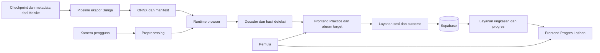
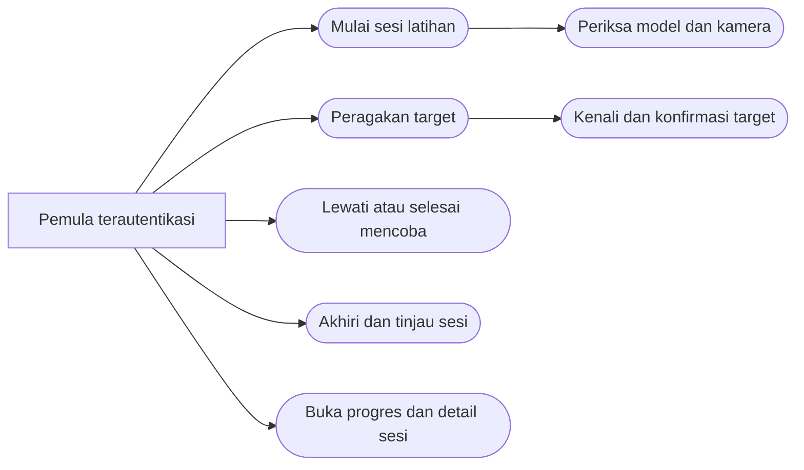
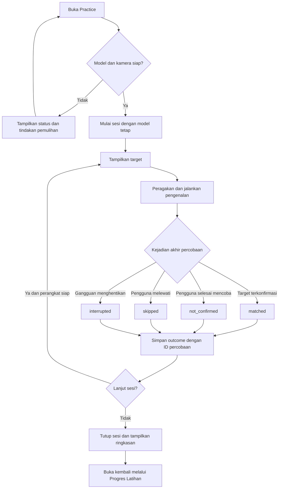
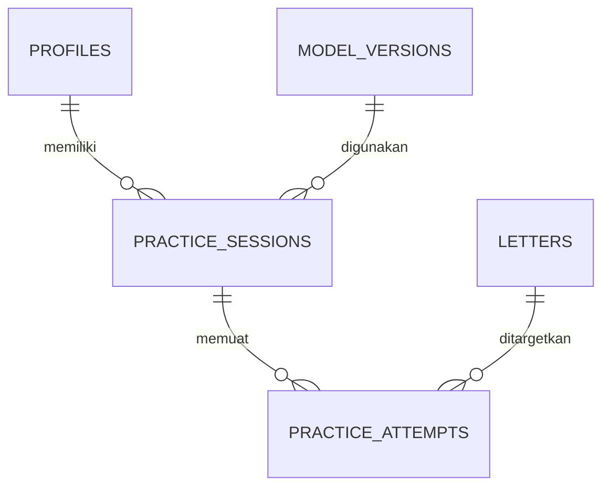

**PENGEMBANGAN DAN EVALUASI INFERENSI YOLO26n BERBASIS ONNX RUNTIME WEB PADA MODUL LATIHAN ALFABET BISINDO**

Proposal Proyek Akhir

Disusun Oleh:

**Bunga Citra Lestari Situmorang  
3312401034**

![](data:image/png;base64,iVBORw0KGgoAAAANSUhEUgAAAIAAAAByCAYAAACbZNnZAAAABmJLR0QA/wD/AP+gvaeTAAAACXBIWXMAAA7EAAAOxAGVKw4bAAAgAElEQVR4nO1dd7wfRbX/ntn9tdtbKqSSkEIJEIoUFRB8IqhYEhug7z0F4YGCRiXBggIJAkJE1Ac2kKLAQ6UoBkQiRQRJCBBIchPScxOS3JLbf2XnvD9mZ3dmd3/33mAIKJzPJ7m/nZ1y5pwzp83sLjEz/l2BCGLu8vxUfV0AkE27h0op9xtyHwKdXJAPmX28tHHjKw+eMjm/Z7F9Y4D+1QVg9t1Ij92/u06QrBeZ7BEAICD+hwgOGEI4YiYDILMRM0BWCYI6/j1mow0Z9wFIKZdDos9vebdHvFVAbi30l17sa6/q/dHx6H6dprvH4V9KAGbfjXRX1Wo6aMyYY5yU2NdxnA9Ij0c4jngX/GkwMShgFQNMfjlAzGAQiBSfAQDEIKaIhACKLhTKiS8B7AsI+XWIyChjSOZVRPSCZLkcpdJf13TsfGb7ojHFxZei9LoS5zXCm14A5jzfPRzp9PC0wKcg6AJBThWgmAkixRcGGP6SZSimIBSEmAaAXz9QBH5DaAVAQZto27imCGuG7Vj1xkooPOYXAbql1F964KqDM6teBzK9ZnjTCQAB4sIVPSNyyL6bHP4awNMFORl/yQWqWzNec8fS6v7CD5oEnTOY/dUbWfS6vfkX8PtkLR76msH+igeTNRYCDeQ30vgyg1kyEXV6Hv+NHfp5e6f74I0z0bunabg78KYQAALovMUvVdaMnHKiELhckDjIX48I1DCzvjKpDb2MtTq2wJQKDgcLijkcgxHSIdQKhkD4GoWZDRxUe2VWtI0w6moMKcTVNDdSys1SynuJ0je0bMX6m49H/56i6VDhDRWA4y+Fe8jpqMrlile5jvN5Xa75Yq4+gyex1aoWoiKusvXaFwgbsSEMoZiwv9JNoYLFvKBBqPuVFjFkLWCvqW4MlWEaIksmGf5IgMe8iRjnbOzf+dhtM0b2GkrndYU3RAAIoLkr8x91nNTdvo+WaG+BwDIbjh2CVcik7bi2+Yj1YM6OjOty44Xt7LsEe2XDZGQEv1hfSdopwC7qZQJM8scdxd5v3TCtprVsp3sI9roAzF1VvFAIugKMnBAi0dsKV5Spfn0xGIhrxuqM+gixmmww1ViSlpkJkAk70qbCjDQC0QucUbLw1+YqHEvhGVoSf37aPwGDWXrMeDRf6L/g+wdVrxwygXcT9ooAnPLg6sxhEydcQYSzADSREIlBuLUeTHVsrPRIk8AVoIR+2PAGyWqEIKQjwyMMI4O4oxmV06jap8C5QGBWiHwT49sr8v8qM2UIhBFRmC4LgSBZFgD81ut0v3DlTOzaA+yw4PUWAJq7Mv8B4Tg/FySakiqEKxERuxqsRV/l+oTmKDeDBjrktwpiqj7iR5i/k7RGYDLYwCuCh2V8fAbHbI0xNgWq3iCUbgsEyJh+jud5HQT+6vyp6V8wQybR8rXA6yYAX13ed2w67d4mhDMeQIwIqkw7TYbTZXrRhrNtO1KhmjWKEyHGQIpX1X6GFpioNgpQJQM3mBqAYGYegl9BroIDphuTRDhYKI1mFUvz+BpESm+DLMnzFkzP/DF5xrsHe1wALlyG8ZUVpcsBni2Ek1KlnEz5KPjeVehA+0TxlyZpusXCPb+dT9CQgKHAWMkda3VFhcpmfWBioswM7psqTLcMDFDoLAa4IzALxMZNU6jAoSbyw5oQK4JkWQToD1dMdj48CEUHhT0mAASIi1cVvyoEfVGQGA3EpxXqXyBRGLRa9Cmn7bNO7yrCDE2QYlHBAENHtbW1SCmspK7ZcEbNGYZCHohwQFpfsCLqRQuIiaI5xzD3oMcK+wMzWPLaUqnwye8dUPHMIBQpC3tEAC5asmNURVX910G4QAgSAzM6qkTtquVSuJrIpvecBAFREXQY3fcpg0XIFQ4kgAbsIz6y7ilMGpkrnIIMYrmWJh1s1W/RwBcAIkBK7pQsr3/q1+nvvJb9hn9aAL7c3LtPjtIPCxLTNJJBQiVGtQSmm4rBUpd6o0XVVIsnKjC2YU/Y5IuNEae2Sda4QEb7sTebwnvwzUk0haz3K8IOEHLYp5Hp8AZ9mnyh8C6HFWwEJf+i+Xn33LtmoYDdgH9KAOauLH7BdZ2fmGXltDsSKkWzc1bcHLjlMGaNUHWGl0YopktUH+ybkGiO30rgMCKrMjKDMpemkoEWDFYlQRaSKdLGlHCC3okMtZHNC3NTKwyLw5kHi0QvB5a/7tjinr0729GvWQDmrip+XRBdLoRwy1ayvKAB6gQ08e1ftAuDQEFgZ6hWU2PoRqYGsXpM0gRRZIwzAYFgBWZdx+4h3r4UWZIRaKgEHCzfIopLTGXpCRn9k10vMBMMsPTu7+zoPOP6oxo7E6gdg90WACKIuSuK80jQtxXzk2159PeAqqFsI7/I2qLTHpOhijXDQVawYfkTxt69jgis8SLOg5WQsfCzBdqIZO0xtb03dg4tUhtnCqyQ1sDCVFvmBlU4HwvjoI1k+WhHMfXBHx0wuCbYLQE4ZwlSjZWlb5LAN4SRzYup1agTp1OsCZrAIuBAhEY8Aghta3zRRLeHBxK+cAMJ1jkDsOGHGIrHUv8RrWGqDbVngQARk9ZBSthQG9Zuoy416GGZBN2S/XZAuCMJwJNy6ab1O99163tH9pSZOQBADHTThNl3I91UXfqe44pvxlK5vnMTdWWCqRHFmM/QNlH9sybrtzHrmvl5kwGk7W2wADhsHnhkxrgRgQ88fuJQ9QcokIGKX8fHICZPmsnkp661qTAPFwR9aoEgaPNm5DzBpE0NgAi+ZBGBLBy1wwwAguiwcROa/jYbcKKomjBkAZg8o/QzIcRFiNpUhMyx8VUSUW7hkZ44axIYwPAPUHCYKtYdM0eIQlYb/VsLpPrNQVPtMwT12XfEtMPmr1qfh9YcNZbamYev1tnoS/3zx9JzMPBXKp99x41jczUQDcYn5oAGVj1dRmz0bwo5HTy5ufT9MiwAMEQBmLui8EkAn9ZYBROyMAl/aIUWT4iEEwzWkLZ/BqP8pW3bb0MHByvSGDvQNFr9JjiKRBGBNOrrFRuIomk+TNRhZ+WMzpQgB/gZ9yPaT+kAXzv4/ygoR1geIK1HMzSFL8eBQ+p3TIb/4puGC+atLr4bZWBQH+DLT23KVQ7bpzeoFzgsymiGx6EMTzSYSPjb8t+sEcIb1mmb3QbVT9Cb5ZiYFDIMusXliL9RDonyE4lVIxg47C5Ekkj2PVi0jd9U5iWYvifX9rZtPfDao8f0RWsPqAHmPdc1rKJx5Do1D1+6g7uh2gdCewltu0waabusnaJAM+isVtinqXkThTM0w8Fq9EcNRcA3K6Fm8K99qVTKy2S4YUZCrBNAefQAlNpFROUGSpEDQTPQ1dahTM8J11Frp/uhOJaKbhzMj8goccTEXOOIq5PGHVADXNLsPSgEvS8Z3fBEbqjDo46b/9tIZyaBqT0AJO/Y6cEiiR1rvEhIoXCgoL3lLCJCQFNLgDEyQxiWTpx28HdlN6zca3Qe4QCm3Q7POIZqUk2GfUR1OKsVSEz7GtqB/cVpK4zI7BiQLAtSFmYtmFpxnzmlskmcuS/1v0+knPckO5FqpMDeMmIMtqyjmTixJmDcNxoliYqimWnfDAhWXch4rbX0sJawBLRnZAShIQUcUyfQlAIaU4AgAYcANwERU5jzEpDM2FkEHm5ltOQJeU+jFK5SfdLHXCiGVxN68ooYCDwkgi/wEURM06C1gWa6sQACbQBACJEG0gsAWAKQqAHOWYJUU3VpmxCiITL9xOVZLuaOmuFwHnEJDSmAQL2bCZukjZToNq8uC1ZZFF8GXAGMzQIzqgnjs0BGAJUGpwfTVuEYceiVwJpe4LevMjzDAQ5OAsFgshHXq3oEIxlh+CAhI/VvrRXMxFagDfyuLJr6C0dKz5PsnbZgSvZPGudEDdCQK3xECLch7mWEW7NWaRlfxaQjRfpR09Gp35C5HNQ1EjBG91YiRGfJDJVpOan+UMyMI2sFplcBozJAhYhrrBBPbTJsQYgncexyIkKlAxxcxRiXJdy3A2juNVR4LB+g0dNz8WcWzF210RtQerFrXwKG4AfnB5JMh/4NgMhxBMQcAIEAxDTAfz+5s3rEsLqXHCHG6DN1ZVdu0kqOGW/NhKgQRBa+cWHbYwSaLeYrBDXinde5wH4VwIFVhHFZwBXJ2qMcDFUTlBOYgmTcux14oVs7Y+ay1Mjbh1yD085gg46G4Bga0N4mNs2NrXUR3oE6Y+j1XbF/qkLfiWmAYY01sxwhxqhmUXUfJUi41rTpiTFa8zCJlhGnSqswM5bXaU67s9DXCQ5YMqMxRRifA46sIzSlCBlhCFOC32Gu3qhK3V0zEK2fFoSPjAC6PcYrvcrqWyeW/DkEB15NrQiAA5XGMbVuCwisAyR6uQeZRK1h9ICg7LyVxW/Mn5q6XLU1JnLTEqQ21HhPEtERCSZ9SJDo68W84kgDRO7r8NBAwjYz4SgOARNzwKQKwmHVQNaxV2TcVsK6/1ohqX1UIwBAlwf8ZBOjy1N4k5E7CaYfJLqAcIfPJFdkL4V1OGofHQueQNLhthYGUzUwIKXc2r123YTrT5mctzTAqlzPgRWUO4KDYcswv9yNCFEsLRZcJxj2KJB/Xs5Y8QFxfOrVusDkCuDwGsI+WZvRGjxW62d1D6MggZ0Fxua8JaIGEqpdnUuYkAOGp4GmtHrGPInRSZCkQaodxpG1hL+0yWAuloJkAwtKIIlWF9ChpK+1dOhIYRXzuQQj16pJqnAngARGyBH7NAJosQQg62Y+4c8w4kxFuFRu4cTCFeO3aSd0UdTCcAIhTEeegeEZ4LAagXfUEhxTDfrE31oAWgvA2j5gda/ErhICjWL6MiMzQNZPg+2TUeZD38tLwqZ+4I87JQ6qIozPMYalk219uTKz/KAqxpPthDxrhzCUZdMkADDOQ0RMVnDqyTw6wmbgEPEREJoFfyHoyEgQiaqKijQQ9wE+7g9nFCVMDIbKGoAIptmN9sLB/2SVhT5eWJ4hxsQKwqQKgcNrdPpStd1VYmzNA6t7GC90q9icEa7SCgeodJRDmCbCO+tVn2kBOAkOnJnTOLxG/faYBzQZltZLqNOUJlQ4jP5i6AqywXj2Xfswr2Lo/1hKWPstvp9AysqbSi0wFxxSkkmHiUp8BBVvAFKnBQLw5WW9++Qq0jUm7QeS9nJEM3k6kIXVZiksCIVKa56cUOr4lCaBulTYW7cHtPQznuiQaMn7TPfVY1oQqh1gWJpwSI2K9auSMjrm0GU8ef3bMcqKDGzoZUyoCM1DOT/D/D0uB7SVNLPJ0nLxMJpC+uhQlyi8E5hEBLogUANmrkTnH8hnOxkNCTnA0ADZjPtOIUR9hDLGhe+takSsID+cgKXWDUEKVB1CobbSpob0ZxzCjCrCSY0CFQ4gAewqAVv6Gc91Mlb2mP0zUkRoSDMOriJMqSSMyAzs9JUTbPNvuVg/LQh1KcafdjLe20hIk10nCaxt6pCaPvqaGHYfAfMNHySyXkItAEAfSNVqPiy3DXlQh6hq9t1IBwJAjjjCQo8jTI56L/adxHuhUPsSolVW9IE7v25OAMfWEd5drwpLzHixS8XSK7oNxpBK09angMOrBY6pjzM2lppOWJnR+uXUfFQYhqUJNS7jmvUezh0jUOeG7a35x/ozsni+7tdRgM8Vg4GagEZ7Dn+weR0wwNz/CDWDDhsDz4EBh+jIsfu1jwoEQELOEBABMvpUi+WLGAhZ0gh7lQSHKqxY22xjOz4uAeNzwJmjlPfc7wH375B40TjRpgmZFsD0SuBDw0UsVz9YWDZY2DeUsFDXeVc94eldhJtbGBeMSY4WzHF1tk8xWdvIiCdFoTkl4/QRYGQ+dcUEVEMrHI3GItragEAAhFQ2xDp8anju1kR8V0J7lyDDCbHcO7Pctu8MwAFhWiXw4RFKtb6aZ9y7XWJz5AVsBGBEGvjoCMLIzOBMsjGJUMcqGnpfSXB0HWHRTsaj7YyTGpN31vUYr/QAA3tFfv1y5UN5IiroY+jzsqOAwGkwnY3wvF6oQthqElPxsLSV+s/AnxmoTxG+NFaFcs90Mv7appMlNhxaTTipAahJxSelhVL6+NzzKiNvPDfbkgd6pbo3Mg3U+LPNOsDpwyjQUtH+kvyAJJhSQVgEicfaCUfVMmrKOJuBf4FyPAzvKBJyvC6VazFApXIjGvYjFABfgK1JB/mAIGgNTHdkffkC4w+ofwIwvXsGMLVCe/XAX9oY/9gF9Ek2O4YrgE+MJIzPqXSuQiVUaxv6GKt7VdjX7zH6pF3nxAZCViiNoSElwu3dEitvPhNZtOX8hxj9AlxCAi/ayZg1MtnvWN4NdEtjYbDt2EUP0tr7L4aABlfhYotgBruQ4u0CZ1uVhD6AZJBgY3DfF/AR5GAVE8zjx3aKPbS3QV2/7dgs4aQGdcjiqQ7gH52KcaZhGJUBPjRcqXkzybOul7Gsi7Gun9Hph1LSn87EHDAsBRxbryKGFAGijD3WuLlElv8wWJq4nC/RkCKMzjBa8sCLXYz3D1M5hyhszbNJe8scJWJZRv4sq655lMDwwI/zSwLNa7iHLL3F3z+sfmPoAwhKlhfNTN9BCQRDO3ow8tYJvkaVA3xshECNCyxuYzT3qhUfeMGkdus+NIxQnwJS/onzLf2Mh1oZ2wtArwfrjQj7ZoGTGwjD00DOsYXFHD2JcYNl8YqeevtCxmBkOWHSh0aUidSmI25CVvdCe8qIBv0xJW2vqLLltuaI9ELWn2ixvpAMsKUB9Ct7AK3Co8gYgZ3Bcf3Ui97bJyKkCDimDjiilvBUB7DUX/FmFrHGJZw5ijDcX/Et/Yyndkms71Nxv8bFJbXKj6kjTMgpQbFpE9+EiTJ7qFu/rkP4/XaJExuAGifezgwXJav9hsBURkJKXa+1GDSOhXYxMSiHZ1KEAYOp5QQnXhNghvT4V4AZBWh7GEgqombejwJ8rWDNwLZZ+1cA764nrOxh/HQzY1fRRI7QlAJObiRMr1JlT3cwlnaplK4Z/NS5ygk8tEap28Splcm+DXW3L8ZgAKc2Ef53M+OMUeq4WLQ/zeDWImFLPlm4dNlj7RLFaMxcTnUj6V5yeVzpletPX5uLl8CU/itg+gAefi4Evyc4r25lGkLnRWetbB9AdT46A7yvidBWBO7bwXi1oCrooetc4MPDCRMqCHmPsbhN4okOWJ47AIzJAMfWE6ZWUmDPy9nlcl77PxPipQVh3wzj7x2M9w8LiWbCUBxFCcJznUMXRr/n8n2WvTuUvsM6krmwtn3Tq8AYmImgnVJSUQgnpRVAdGs3fD2q0R8BVQ7hHXWEsRng99sZ7UUEu1EAMCpDOKSacEQtYUM/4/YWiQ39yoPXklshgAOqCe+sI1Q7DFcYAyDUPlv6zeUUUVFgDE8rBg4EQ2FIjQs80QEcWsMYlZBaBoB+GR0/BCJCT4nRVkoQlt2I6Y0eyzcpLxmJIFk+un3RmCKONjTA96ZlH75kVakVwEgrXal7Z9/W6+wVqxMnB1Qqxj7Sxnik1dYZFQ7hiBrCO+sJa3qB27Yq+x5sURKhxgEOrFIp4NqUzfRdJWBbnrGjADzXpTTJzkI4RrUDaF5Pr1KRbL0L5JkxLEWYVpXMuKFs576jTuCJDolVPSo6SRKYDYYwphJ4ev92RpKMDMR/M58fVd1lYXeYL2WJPflD/TaRSCKI/8zMZ9i5AOPULYUiUeMS3tNIaOln3NzCod8AlRbdv4pw6jDC2l7gVy2MjZG34Fa6hCNrgePqKFixHgOdJWBjvwr71vaG3r/2uKdVKobsmyWMzfqEj5gGhWrcXJgw0L4BoKIXAFjXxzg+gcLMjJe6EfBnWiWQEyGzOkuMdf3JYw/Er3h4N1Bt640JQzUEu66clvmDvrYEwJPy967rnIGYk6cHAwQIM6pVJu+hVkavlb0jjMwAs0YI5CXwwA7Gih5Yj1w3pICjawWOrgvRbckzVvUAK7rVgQ4TRmWA/SuAaVWEfYaYBk5yBAuSsbkfmFhRnukmdBRVZJOUnQSAfkloLYTOcl3K7vOpDka/NHAByj5EYwFHDq8EFjc5DNS9m2G1HiI8KBKOKBk3mcNZApDn0t8cKVpIOKPNl1Lp3yMzhKNqCY+0Mnq0bmMlGg0pYGolYXIl8LtXOcjn61ewVDmKkacNU5s4OwtKOP7azuphCn9uBPVwxqQKwokN6ozfYGwvt5rN32mhElj3bZc4bZhAkptg9vNsZ/xtjOb95t4wA0kEvKM2TCu2FxlPdcB4rZ3hN0eSNPGAIIJYGXORqFMokhkwo0swpETzginuN+YbLS0BuG5a5da5KwvfIMIvtB8AqJTpUXWEnCDcuz0kCxFBCOUHvKeB8Ggb41ctCISCiJBxgAMqgVOaCK6/4fNgK2N9n3FSldTxrDFZ4Ph6wthcRKUPsloHU/caxmeBZV2E322X+OiI+OZNvF0k9DLuL+8OV4hLQM4Jx/9rO8ML2kR60YIaXCfMJzZypGI8exSvrTsx25N3G8Ox5Dp2LLxUko8JR5YI5BKUrT65gfB4B6O1aCRZoA5mfnA44Yl2xsKNtnfu6tM8jYQaF3hqF/BSt1ShIZT6EgBq08BBVYRj6igxjToUh22g+tF7h1Uzbm4BDq5mTK4oX3dtn8IyCXo841AKgEOrEWQjO0vAEv12HrL+mJNAdGnHMwNad4cLIPTFYC/xwF/0tYtuYkiSlPKFjpbUdZhsoxITgKsPzL4yt7n0w7SgiyZVAtsLKrQz0XQJeGe96v2WLRLhNrHCbniGcGoTYXSW8NBOiWc67ckJqMMcHxxGmFih43iGlIz+fBGFkgcpGTKy6SKIkE45yGXSiL6kZKhQnyI4xPjNNsbcCeGegOk8FqRKQScBM+NvHQYBCZhZG6reh1o5rt41R0wODuzbKYhbAyM9b3BYC31gCUJxYgIgJUvIa5PeHpb4aNiC/d05T7R5p/y5DVNLrFarfgBjfA74jybCzVskCoYyISjGfmg4YXIFsGgn8MsWaSPMjDE5wsdHqvDPk4ylKzbh+dWb8L//9xieW7URRS/Y2gsnFjED2VQKc848GbNOnokD9hsNR9jqfKDNnBpXRQ69HmNrnjEmG/cdCgzkpXaz7D4KEljWGWq7SgcY5T9FvDWvdihjhiTgd3TlGyE22UXh7qvPZOsFmdHKse6CWsrxkzcsmJK+BQlQ9vHwuc359wty7hMkAsVc66pQrcezzYtDwNRKYPYIgcfbJR5pC7WcJtzoDPDZ0QQuFvHgky/iWz+5D2tbdiJfKA3JzieBIEJNZRaXn/tBnDf7BDWhQUwGM+Oq9YxuD3hPA+H4hvi4P9ss/RifYnXu2CqxwlD/Z4xS5xAB4BdbJNbFXsGwp2H3sj5Syp6lr6xrLPedw7ICQADNbS494whxeDA0G5LsE3VMBjh1GOEfuxjLe/yVwwjCkRoX+MgwYP3LzfjuTQ9g6cqN6OnL26lla34+PoMJhKFViAjjRzXi/oXnY/rEUQMKwfY848ebGR4DTSng/LHC2k3s9RhXrZO+E0f4/L6EMX4iyGPG99aF3n+NC5w/hpBzCMs6Gb/drl5ZYeuOuEcelquV/Vqy1nHSxQeQUpYKxfwRVx9QuaxcP2XfEMIA57vcU8Zl+TFLRggAKcfuzFGEmbXqXNySTvjPxhOYVFr4v0cDvYv+gHd99GKcfO51eOy51ejWzAcCBlr/hjp765KxbmsrjvjMfPzpb8tj1U2B6JOAtjJTKwnCiHYAYF2fv8PnQ63hmN65jdFn5AWmVajtaI+BB3aGj2jGnp7W/0WmRzret/1n+68x5fhJrEFA8gUDMR8YQANo+MqavjE5ZDaa473HP3HzWLtSpSHOKgU7M92P++95CDff+wS2t3cNjqi56stpAGPFW/ci5RXZNJ67/RvYf9wIo0ro4D3cynisXfrzEJZ67/OAq9dLFH37NbUS+PQotUZe6fUznj7o1Z8WhNtaJNaUVf27obKtqokqY0hdSSklSz5vwdTUTRwTJRsGfUvY9yflNnle6SwpZXHfDPDJUYSXe1Qs32ns2acJeF+jwIv33IvZn70UV9/yILa3GW8rjQpa9NpkapJ4D9FU9PYXcN6VtyNftF+crTeTdhTK0+PZTlZbt+pFfTisRvVdkMDvtqtIRcNxdUr1r+5lrOkdiMZD1e8cqZpEAxuHsiMKumf+1NSNgzEfGOJr4hZMSd86LouPNbmy87fbGC39gOdvBjEDU3OMI3s24YL/uRy/uONP2Nq6y+ZvOS1TTu0PZgqStIABjz7bjEWGKdAmIC9V9pGZIEA4tCbso8djPNauhUodHJ3oJ6TW9LJ6xtBnSlYAM2sI7UXGvdsHd2A59iMJhiIo2q8vD1J6d23o2fGfQ+gMwG68KHLllq0PL+2St+b9+RLUqZ//qOjFE7f8Bqd9/kosW7UpeY5EyWrb/Geu6IEIOth9qPf2/OahZ2Plj/gfYSOog6dm4unJdqA/CGsZpw9XB1Lbisq5Myd22jBCSqiYv9sL21hgXFLsR7x64g17FQ06jud5v+hr3fbZW2cM/HpYE8q/6TsC1x49pu+cJbiosbqUJ/BFpw53KPVqCz7zpZ9ixfptcaSTYniT8dF7Q/FqknwFDZH2L67e4jdREUBRAq/0hSt8fDY8JdxZYiztktAcSpPKZQDAo23+gRVS4x9QRZhRTXh6F2O5lVaJ4B9lNhl/E6pbDXXYYM1J0yzS1v/teXJB65TUt2/EmCJ2A4YsAABw40wUCe6cezb3XvfnuxY9dt2vH5nQ0RX59G2UudbOIqGsMzdUMAXG7CvSX29/wa+mypZ2qXMFgFJ7JxrO359bgR6PgnufGa2cu6WdjOe7bPxPalRPJP9xx2BmCkNgdrxJkCuKfzHL31iKhnpeh+PgpPlTUkuGNooNQzYBBpL8kX0rNi+8488LOrt6N6jCBIcsurKjdcoxf3QVluEAABMLSURBVCD7bzI72lc09g+6U47dkx2hA1XrAqMz8Pf0Gc93hSnNpjQwJkfo8xgPBqGdgvc1EepShDu2DuG7bUnTG0QQSE+lTN1okZT8kif5Xd/d77UxH3gNAqChbfHCn46qz56ccpwHAchBY/mhMnwwrTAEHwDMyKZcvzrhqQ5GezHUwzN9588D4f4d6uweABAYHx6ufv9qKxs+gdqpPLZOnRhuyQNJRjxp5kNNbZTtheLFUsq8lPKOK/Z3DrxyavrF3R3BhNcsAACw+eEfrC48/eP3j2qqOTeTSrUnMmcgCuw+deLtk/ogwrjRjQDUsbLH2wIjjoYU4Zg6Ve2BHRI9RmJnQo6wb5awuE0dHgEU3SsdtXG1vNu0+6ZTGysxUbFRHjQyKxfuqj9SylXMOPWK/d1PD9LRkOCfEgANLYuuuSk/dsfIEXVV/+cQwpxz1AE0y4GhreaBYIC27zxkEiQDv98u0R++RBAnNKgdwB1FCrdtoZj8n/sIbMszHm0LzYVL6nkEALhzm0QpiX8EVT8a7wVzDtk+0PGWaNfmHomU0vNK8serW7ceOn+K+0jZTnYTdssJHAj4rrsKAGZduPA302679+k72rv7DpKAY3n+SRFBucxe4iAJ9xL6yGVSOOPUo7CqRz1D6D8GijoXOKSa0FkCfrLJONgC9bKpXg+4dSsHOXpAvZrm4Crgho0JD2zaiMTjvWAfP/ZCncSeKDJFIoKU0gNopee6779yIjYCY8pi8Fpgj2gAExZe+IkVOx+9bubHTz7sjKaaXJsQJGPhW7msX1LkYIJ5z/Q5IkJx0hFTUd/UqM4xsK6rnDiP4yt5VAY4sZHwUKtEp074kHqg9APDCA+1AvlIEo6jv8qaM/3eP7ODpIQAx8ghpezySnziFfs7Byrm73l4vT8e7Vx9y6JPX3PLoh9u7+yuBogSV340VDSh3I7hAFrjDwvPR+ekA/xTu6rvxjThwnECT7ar17uEZykYXx7n4PEOxjO7FJPUS6kZZ40SWN/HeKxDjwHEV27yak5UZEn8TwCWMs+SL7tiauqKgWv+87BXPh9PRKJ5Y8s7T7/oJz9dsf7VySrejQjC7kQDAwjA+94xHd++7Hz8oVU/E6CqzBnvoN9j3LApdAi1TzAirXb6TIs9e4RAR5HxcFswCOyA3MR36H6M9YY1ax4MlryLIb84f0r6Nt6DXwgfCPaKAGi46aYlKa+pa8o9i5695m8vrjupL19UydihaAINSTkHn5Bp18Ffb7kEj6RGWSHceWMIFQJYuIFRCqvjuDp1bvGObWxtAY/NqncLXL/RLn/NMLDzAJb890Kp8LX1L+We3t0vf/6zsMecwKHA2WfPLAJY3uTtOLWhJjesq7f4/n+s2Hh5e1fPCMkQiRs8SWnkaETh1/n+RbOwrGIU+vP6FiPnEOpd4OYW9j/uoFLDWaGeXr5xM6PEIX8qBXD6cMJPNtnlg3LRBL9qsNrNz9P6h/Ul805Pyov6+3qfWHhI3QYgx5i+O9TcM7BXNUAZSH/20p9Of2HV1o9s2t7x1Z27erIAhmb7fSAiHHfsIfjUhf+NLSV9Pltt+HxtgsAvt0hsNQ5EZQRw1ijCndsYnUYeoNoF/nO0ejLYPO8YppDKiEDA8Lh7RwbezLJHSu+7kjN3tfdgy40zsVt5+9cD3gwCEMDdd9+dvua+ldM6u4sferWj67SOrp7DAytejvkAZrzrHTj1C2eC9IfLmZF2CLOGE5p7Gf/ohMWdkxoJG/vUyyo0CADvbyL8fZf6AogNIYejb+CKVolee5KfAsvfE+Mv21p3rfr5sU1DOCGz9+BNJQAmTD7li5m2Ngzro+JRruuc0ZsvHigZk6LYjhvRgGuvvxhLudo4TMN4R506rHlLC1vMOa6ekCHgkTY/rvcF69QmtcO3s2jIWszZ9P8mfJMnzNTxEiZeLj3vHi54z72wZcuOcgcy3wzwphWAKOx38sW1a1t3jquqzB3Hkk/uKxQPrMiknJ98/8KujcMmHtxnqOzRGeDIWsIfdjD043uAerv46Azh8XbtYivOHV6jfi0Z4HPLoRlQdp3Z62GmbQBeZdBvpCy1UDHz3LLNq7e8mRkehX8ZAUiC8cdfWPfxhZfv4+TSZyslzlki+vTBVfzdl3voWyWGEIJyYAKz1zq1kvKremm0ciQBEFAl+OWRaR6+pl80+aEYg9AbkIUAIvqjZG8rJCA9usfzSkVKibarpmZWvYHT3yPwLy0Ag8HFa1HrSu+9ANDfWXjGraAJrpsaBg/qY2ge0N/ftyJbmZum25Q8Lnxvaup+Zt4rcfgbDf/WAvA2DA57fC/gbfjXgrcF4C0ObwvAWxzeFoC3OLwtAG9xeFsA3uLwtgC8xeFtAXiLw149D5AEdPg5U13H+TAEk2CiYdXZRzY/fO3fAWDECV96T1tv4Thdt74yddv2v1z/ir6e/dSm3KSGYcfo6+7e4gvXH1q9Y+/OAPjK8/n9M1lWpzUll+ZPy/11b+PwWuENFwDBeF/J8+bDA8AMQe7RAE4DAEe43yx5/e/WdbPpbAeAH+jrsRXDRjpO+s96164q634UwG/39hwyWecCxxHnA4Ak2Qmgdm/j8FrhzWMCBntWkBlMyfl5HupJndcJBNSXKwd/6OPNB2+4Bggg4WBo2nW6q7Jp6DdmuZx8NDpomvCewb0DIvgO8D/9tNNehjePAAAxDbAhv/1jDcWatL5ev+jqMqdp/FM6bxDtJSQcn5T8xiqj3QaXJp+SqR6x3yMA1Wv9atoFJir29Pc/W5PJrHBcurN18fWbk7sieuWyQyYJeF8WJE7gUj4NBiAI5GbXs5t+QHDql2Mvfrx9qMjtVzl6QTv6TtQ0nXr6t744++7vPjF5Rmk1AGQqUj4uwXHthfOaS5cQUA/wOjAtZQBEvKmrvfPm649qjB35mLeq9HciDGeWG0BinP0cDz/JTNsIKMhCz88XHFS7Vrf7+svdB7ip7N3MyAoSDSEZUHVJs7eYwWP9B0KWrXkhNeuuWfDmNZeuA/Ahfb4wbAIwsIUYf2cAXrH4u3Urcs9GTwjPfblwJrniO6pN9APxMHoNy/2DTY8CaAOhp1Tybr9qema1vu8CjZmu/uKBGNBxoRm7+gtwHZrbcMKF89sX/2ChuV++9qbZtc72GfMdWfiCAAv/iYtwQZf6J1Cp/wQp0uevWzDjkxPmPv90+bFCKJaKh7Z19RysdXxDXcWE7S/hySmH0gS/ygSzvuOIMQDGKEKICQBO1Gf4q+trz5+3snDp/KnpO8w2gnAwCcoBrtFXcP4nKKNMxVfmNRd/39qV+q8bZ6KXObWfIDEtygNBQoDwboMJE06aCAHAI6KjBdEExIAB0AQAx6l5ZOZMmlH82ZyXS5dfMz23IZwgVTtCJLQfFCbAf9yNXHxz7urSTyd0uhecPRPFcLEPwXaVPG5s7+y9uvKY8z5pljuvNt8Ir3AegfXXB8GSpeTwQVEGIGR+AhW8P7xy3QnH7vYUYm/LsI+QJztgDP915RAkJpMQt81dUXqvVYPZ0tvxfkgRjkTGEc7HG2uKnwcASoltUsp8rC9zbDCklC/Wz9QPeUSOs7Mme/T0M+AI53MZN3XZ8Zcmm2nrSTM2C81hzPHU425CCOGSOGd9dekywPQB/FVGwDPpCvcSeMQpx6nv7e/fR0ocDeaPQggXRKJQlLc0Hv2Fxa1P/e+WLdceP4tk4eMGAfsl3GuJnKvHv7x/1/qDXt6fvdLPHRJHAwQB2UidO64GcEyI3AARQOQxssWXonT8pSIFAIfN2jW+MlO1Wj3KR/BYzvrb7e7v/Xs1Wbf2bFDpQGL5KeEIEiQIkFeeswSP6iPZT/46VZM8sIJjPlmcIwTNIxLVAEBMc2Y/temmu44e88zdd6PyRy+Bjv1EaaFwxf+oL4nJridvdwOTsPhSFeACwCHL3GN/9FL5kOXYT+RPEW7qPl1DCHHmAbNwHhB/xy9LyU/82k1b7T/l/VoQf8w/gt5V2N6xzzMPN/WpeZS+S4SLhBBZACDgExcuw5WxT8ey9Lb2P/7jP0fG+4GYefYtDJwFAEUpnW5yjgDR1tJ3DvqEdRqa0hdN/PYLN2kTMR5YgZsOf/eGlp7VRDQOAJjlYWuuOf74SXMWL9bj7g7oz53MeT7jIUN+iAiAIfU9oLYNwJXnLHFTTdWlUwHU+UQ9tC6TnwRkVph9lYfUlZc0e+8l4hMAghBi30l1I/YDsHzWLHizZgHzVlnPinK5PnX98pC5f+6K4sVuyrlSl9S4xc8BqYWxqhTH/RtrEByBZUbPVcc2deNYjZs775Lm0ocBTPXpMM6V7bVDjgIE8W890Fm695qKzJde+vb0xyod8UEK3hfIKPb33hM7T3f2s0X+zvSHCfic6guZVE/bAQAWD2nw4NEAmSwp5LttCV/3uHEmivNWepeC3IX6eb5U2vkGgE8DwDlLkKrL5Cc5KdHAzKcJR/jmyRLrg/1Dp4O7+QNbUrpoSc/IXFV6ovRkk+O4X7HuCkA4GGk1ACIaagAc9FnHMkgw+HYAl5llQxYAr1RYAzcb2Jld3f1V6OyEqK12fUQhgdKyNWvaJid1kKpZysVd0F+4oar6jwH4kY3hwNRLiaSvM+vHrsoDS6xGgCWgv0REgJhbXfy5I9wzY091BA51+PAmrHcAhCAgAQiETxDHgQCau6owq6o2dycAOI5AYmXSyYxyzyFR+JhSFByjTkIFKXmzE0n9DT0P4KVUqKt9BUEAavxrRVABcifWzxRIWotOqZaK4Xex2ZPhu+zM5/6iYNj/Est4JtDky4CJIF+LGISd11y6RgjnTF1DsiwBCL8GwMF/tcSUMj+EbYLUQxOh3CHbucv7jnGymTuj+Egpd0a6zAoSVQM/hzhY7jMZhyTyDFkA3Ar36JJ+VJYItZXZHemaqhLcUjuKffWarBWjeiYAaI510NtzKERIPq+v7dfBvaH4AAO8NIIHe25TqHlqj1uyXDX7bqT3n4H/0uXMsrOvdevIa48eE3vr77xV+dPJSf2OgETaCoigvBwalHI/b15Lz/u//IbWz17zXvuljl9fUfh8KkU30YBaTS+kBAgfaypzH9Zn63yFYCzYhGw7zTiz0ivJC0wmtHX1Xzv50qc7JcsHwpQEI8f4inpIL4RXvnnoZACnaaSlxE53+IQ/WkgP9naxAYQkEhTGbgvHvUFlCwFAFnsK+RsThrg3ifk+vuHTggkDSQMJBqouaS6dGqsU+cIJF/q/GWU+oFYpDSJMA8Kgb1kLdSEQaABDOTjiEHH4OT9m6blgUSFcOhZubjQTBSFH2nV2ZamwFABKcBa6EmeQUP0KQWdvuHTakZg/82cM2oJi7ymug8+AKBN8jD6T/cfYcx8IM4IDvRZmsE0if1Iqnudz5zWXTgmLuY6IThFElYD/QWdP3vCDg6penb0SaVNxEOhj81bl18yfkvlutHshnPcGGCRqAN8HAOAIIaSUP5rXXDpduu5lwatdJAMOEHzyNlNx2ddWln581VT3UbMvD4BjPLm02/QYwA9Rt9UEdBeucUfb4XEMnAv/QyHqyylGj1IWCt2Fg/LLf9kGAJMueXbphvmHnYVi/lZdhYBDZKH3h4DKBFvtnfRSEpXxV5yVE4IhvBPQf3wLjuOcFL+v/vO7XrZxY9s3MXUk7pqFwtwV3hkAfqdyI5Rz4H7nkubSt1WXISGJDI4koNO5dsOc6v0mniUE1QAqxALwOSqV/uuSZmBnl5utTckF6Sz9BwkaqerQx1LMH72kuRRYMGaG6/iqoqwtUagMqA9D3yWhud1SGHd8giU3FERwBb2AfHEcL//lJvPeuHnP3V5KVb1LilSQtiQiEsFoDAli6eSurk4NO9HcD3BTjjBfBmG+kYOlPU+HHCvxEeKthccwJX6mDQRIyTu8UumzJcc5/lZD7S6YlnlAluQZUkql+pkgBAlHCCEcRwih/wkKx0DsFR7XnzI5z+SdK6W33Z+uppkgEmImgKsOzqzypJwjPRnspQghSJAeQQjH0WMZc4jAoP4OYKIabx8RjLgTyHgm7ToL9GXacZBz3d4d3Z3LpVfYxS/dmvAmauaJ8/D405cedXBDuuJQx+vdz62sny0Y9V6xsJSLhUVFr/Ds5CmTtmLWXVaE4Eq6w3HdtfpZvZpMNhCunOvOyTnOPo6jtFGhu2Cpy1dfXbV9zLgZH47jkweQAcv+3lJX5wtubnh+wUFI3IRaMD195xef2/qXdLZxRFqkJ4XtASBj/Nbk4f5n78yuxKV2P/Mnp++4cBn+mK0sTBAyPc68d87h8M5mYMHU9O0XL2l/oJTKVDuuczicTAJGeX9cBTLV+ShQry4KqT/JNNR8vSKi7PM8eTUhdYfCU/Yjoga8np6/iKr6gF5dvHYHYdKna1BbuRF6M0h69/LSn52egNnb8G8Ib54TQW/DGwJvC8BbHFzsKki3oboPzGkABOG+uU4JvQ2vK7i8/a7uKR+Yd0KJ4UJKQhV2vdFIvQ17D/4f9DCxHh3t1CAAAAAASUVORK5CYII=)

**PROGRAM STUDI TEKNIK INFORMATIKA**

**JURUSAN TEKNIK INFORMATIKA**  
**POLITEKNIK NEGERI BATAM**  
**2026**

> Draft untuk bimbingan, 14 September 2026. Dokumen memuat kondisi awal yang telah diperiksa dan rancangan pengembangan. Ekspor YOLO26n, perubahan runtime, pengembangan sesi latihan, benchmark, dan pengujian pengguna yang diusulkan belum dilaksanakan.

# KATA PENGANTAR

Puji syukur penulis panjatkan kepada Tuhan Yang Maha Esa sehingga draft proposal Proyek Akhir ini dapat disusun sebagai bahan bimbingan. Proposal membahas penerapan YOLO26n melalui ONNX Runtime Web pada modul latihan alfabet BISINDO dalam Signify AI, disertai pengembangan pencatatan sesi dan penyajian hasil latihan bagi pemula.

Penulis menyampaikan terima kasih kepada pihak program studi atas pedoman penyusunan proposal serta kepada Meiske Priskilla Sahertian atas diskusi pembagian pekerjaan dalam pengembangan Signify AI. Masukan dosen pembimbing dan calon pengguna akan digunakan untuk menyempurnakan kebutuhan serta rancangan yang diajukan.

Penulis menyadari bahwa kompatibilitas model, kemampuan perangkat, dan kemudahan penggunaan perlu dibuktikan melalui implementasi dan pengujian. Kritik dan saran diharapkan agar pekerjaan tetap terarah, realistis, serta mempunyai kontribusi individu yang jelas.

Batam, September 2026  
Bunga Citra Lestari Situmorang

# DAFTAR ISI

- [KATA PENGANTAR](#kata-pengantar)
- [DAFTAR ISI](#daftar-isi)
- [DAFTAR TABEL](#daftar-tabel)
- [DAFTAR GAMBAR](#daftar-gambar)
- [DAFTAR LAMPIRAN](#daftar-lampiran)
- [ABSTRAK](#abstrak)
- [BAB I PENDAHULUAN](#bab-i-pendahuluan)
  - [1.1. Latar Belakang](#11-latar-belakang)
  - [1.2. Rumusan Masalah](#12-rumusan-masalah)
  - [1.3. Tujuan](#13-tujuan)
  - [1.4. Batasan Masalah](#14-batasan-masalah)
  - [1.5. Manfaat](#15-manfaat)
  - [1.6. Kolaborasi dan Sinergi dalam Pelaksanaan Proyek](#16-kolaborasi-dan-sinergi-dalam-pelaksanaan-proyek)
- [BAB II TINJAUAN PUSTAKA](#bab-ii-tinjauan-pustaka)
  - [2.1. Tinjauan Solusi dan Sistem Terkait](#21-tinjauan-solusi-dan-sistem-terkait)
  - [2.2. Landasan Konsep dan Teknologi](#22-landasan-konsep-dan-teknologi)
  - [2.3. Metode Pengembangan Produk](#23-metode-pengembangan-produk)
- [BAB III ANALISIS DAN PERANCANGAN](#bab-iii-analisis-dan-perancangan)
  - [3.1. Pengumpulan Data](#31-pengumpulan-data)
  - [3.2. Preprocessing Data](#32-preprocessing-data)
  - [3.3. Penerapan Metode AI](#33-penerapan-metode-ai)
  - [3.4. Integrasi ke Aplikasi](#34-integrasi-ke-aplikasi)
  - [3.5. Evaluasi Hasil](#35-evaluasi-hasil)
- [DAFTAR PUSTAKA](#daftar-pustaka)
- [LAMPIRAN](#lampiran)
  - [Lampiran A. Rencana Pengumpulan Kebutuhan](#lampiran-a-rencana-pengumpulan-kebutuhan)
  - [Lampiran B. Sumber Sistem dan Rencana Luaran Produk](#lampiran-b-sumber-sistem-dan-rencana-luaran-produk)
  - [Lampiran C. Rancangan Pengujian Penerimaan Pengguna](#lampiran-c-rancangan-pengujian-penerimaan-pengguna)
  - [Lampiran D. Agenda Bimbingan dan Rencana Pelaksanaan](#lampiran-d-agenda-bimbingan-dan-rencana-pelaksanaan)

Daftar isi pada draft Markdown menggunakan tautan judul. Nomor halaman akan dibuat otomatis pada dokumen pengolah kata setelah tata letak final diterapkan.

# DAFTAR TABEL

- [Tabel 1.1. Pembagian Peran dan Tanggung Jawab Tim](#tabel-1-1)
- [Tabel 2.1. Tinjauan Sistem dan Implementasi Terkait](#tabel-2-1)
- [Tabel 2.2. Tahapan Pengembangan dan Luaran](#tabel-2-2)
- [Tabel 3.1. Perbandingan Kondisi Awal dan Usulan Scope Bunga](#tabel-3-1)
- [Tabel 3.2. Penilaian Usulan Fitur dengan Empat Kartu](#tabel-3-2)
- [Tabel 3.3. Kontrak Artifact yang Diusulkan](#tabel-3-3)
- [Tabel 3.4. Paket Implementasi dan Bukti Kontribusi Bunga](#tabel-3-4)
- [Tabel 3.5. Definisi Outcome dan Pengaruhnya pada Ringkasan](#tabel-3-5)
- [Tabel 3.6. Kebutuhan Modul Latihan](#tabel-3-6)
- [Tabel 3.7. Skenario Use Case Utama](#tabel-3-7)
- [Tabel 3.8. Rancangan Data Latihan](#tabel-3-8)
- [Tabel 3.9. Matriks Pengujian Penerapan Model](#tabel-3-9)
- [Tabel 3.10. Keterlacakan Kebutuhan dan Skenario Pengujian](#tabel-3-10)

# DAFTAR GAMBAR

- [Gambar 3.1. Arsitektur Penerapan Model dan Modul Latihan](#gambar-3-1)
- [Gambar 3.2. Diagram Use Case Modul Latihan](#gambar-3-2)
- [Gambar 3.3. Diagram Aktivitas Sesi Latihan](#gambar-3-3)
- [Gambar 3.4. Diagram Sequence Pencatatan Percobaan](#gambar-3-4)
- [Gambar 3.5. Relasi Data Sesi Latihan yang Diusulkan](#gambar-3-5)
- [Gambar 3.6. Wireframe Practice dan Progres Latihan](#gambar-3-6)

# DAFTAR LAMPIRAN

- [Lampiran A. Rencana Pengumpulan Kebutuhan](#lampiran-a-rencana-pengumpulan-kebutuhan)
- [Lampiran B. Sumber Sistem dan Rencana Luaran Produk](#lampiran-b-sumber-sistem-dan-rencana-luaran-produk)
- [Lampiran C. Rancangan Pengujian Penerimaan Pengguna](#lampiran-c-rancangan-pengujian-penerimaan-pengguna)
- [Lampiran D. Agenda Bimbingan dan Rencana Pelaksanaan](#lampiran-d-agenda-bimbingan-dan-rencana-pelaksanaan)

# ABSTRAK

Signify AI telah menyediakan latihan alfabet BISINDO berbasis kamera dengan inferensi YOLO11n melalui ONNX Runtime Web. Pengembangan menuju YOLO26n memerlukan pemeriksaan ekspor, kesesuaian pemrosesan input dan output, serta kompatibilitas pada browser pengguna. Selain itu, pencatatan latihan existing masih menggunakan hasil boolean dan tindakan melewati target tersimpan sebagai hasil tidak benar, sehingga belum membedakan penyelesaian target, percobaan yang belum terkonfirmasi, dan gangguan teknis secara terstruktur. Proyek Akhir ini bertujuan menerapkan YOLO26n pada browser dengan keluaran yang terverifikasi, waktu respons terukur, serta pengembangan sesi dan progres latihan untuk pemula. Metode pengembangan meliputi analisis kebutuhan, penerimaan checkpoint dari scope Meiske, ekspor ONNX, penyesuaian runtime, implementasi frontend Practice dan Progres Latihan, serta backend pencatatan sesi dan versi model. Pengujian akan mencakup kesesuaian prediksi Python–browser, perubahan metrik setelah ekspor, waktu muat dan latensi keseluruhan, validasi hasil serta kepemilikan sesi, dan penerimaan pengguna. Luaran yang diharapkan adalah pipeline ekspor, artifact dan manifest teridentifikasi, integrasi YOLO26n, sesi latihan yang dapat ditinjau kembali, serta laporan pengujian. Pengenalan model diperlakukan sebagai hasil sistem terhadap target, bukan sebagai diagnosis bentuk jari atau ukuran langsung penguasaan BISINDO.

**Kata Kunci**: alfabet BISINDO; YOLO26n; ONNX Runtime Web; latihan; sesi pengguna.

# BAB I PENDAHULUAN

## 1.1. Latar Belakang

Pengenalan alfabet dipilih sebagai cakupan awal Signify AI untuk pemula yang belajar BISINDO. Bahasa dan referensi yang digunakan perlu menghormati konteks komunitas Tuli; Pusbisindo menempatkan pengembangan bahasa isyarat serta teknologi aksesibel sebagai bagian dari misinya. Dalam proyek ini, aplikasi berperan sebagai sarana pendukung latihan terbatas, dengan referensi yang akan diperiksa oleh pihak yang kompeten sesuai akses yang tersedia (Pusbisindo, n.d., [tentang kami](https://www.pusbisindo.org/tentang-kami)).

Sistem existing menjalankan YOLO11n dalam browser dan menyediakan Practice dengan target huruf, referensi visual, pemilihan huruf adaptif, serta statistik per huruf. Pengembangan tidak perlu mengulang fungsi-fungsi tersebut. Fokus penulis adalah penerapan model pengganti dan perbaikan cara aplikasi mencatat serta menyampaikan hasil sesi latihan.

Pemeriksaan kode menunjukkan konfigurasi model dan cache masih mengarah pada YOLO11n versi tertentu. Decoder membaca bentuk keluaran yang telah ditetapkan untuk model lama, dan pengukuran waktu pada runtime hanya mencakup eksekusi inti model. Artinya, keberhasilan melatih YOLO26n di Python belum membuktikan bahwa hasilnya dapat dipakai browser dengan prediksi yang konsisten ataupun waktu respons yang sesuai. Dokumentasi ONNX Runtime Web juga menunjukkan bahwa dukungan operator berbeda menurut execution provider, sehingga jalur browser yang dipilih perlu diuji secara nyata (Microsoft, n.d., [ONNX Runtime Web](https://onnxruntime.ai/docs/tutorials/web/)).

Pada Practice, percobaan disimpan dengan nilai `is_correct`, sedangkan tindakan skip mengirim nilai false. Catatan ini belum mempunyai identitas sesi latihan dan versi model pada entitas percobaan existing. Akibatnya, usulan pengembangan perlu memberi makna yang lebih jelas pada kejadian latihan tanpa menyatakan semua hasil tidak terkonfirmasi sebagai kesalahan peragaan pengguna. Temuan berasal dari kode Practice dan skema data, bukan hasil wawancara pemula; sumbernya tersedia pada Lampiran B.

Penulis mengusulkan sesi latihan dengan hasil per target, ringkasan sesi, dan akses Progres Latihan. Usulan ini mendukung alur mencoba, memahami hasil sistem, lalu mencoba kembali. Penambahan navigasi menjadi akses menuju informasi tersebut. Kebutuhan tampilan dan istilah hasil akan divalidasi bersama pemula agar fungsi yang ditambahkan mendukung tugas pengguna.

Migrasi YOLO11n ke YOLO26n dikerjakan bersama Meiske. Meiske menyiapkan data, pelatihan, dan evaluasi model. Penulis bertanggung jawab atas ekspor, inferensi browser, pengujian penerapan, serta frontend dan backend latihan. Dengan pembagian ini, penulis memiliki kontribusi langsung terhadap migrasi model meskipun pelatihan dijalankan pada laptop Meiske.

## 1.2. Rumusan Masalah

1. Bagaimana mengekspor dan menerapkan checkpoint YOLO26n pada ONNX Runtime Web dengan kontrak input/output dan identitas artifact yang konsisten?
2. Bagaimana mengembangkan frontend dan backend sesi latihan agar pemula dapat membedakan hasil pengenalan, melewati target, dan gangguan teknis serta meninjau hasil sesi kembali?
3. Bagaimana kesesuaian prediksi, kinerja browser, ketepatan penyimpanan sesi, dan penerimaan pengguna setelah pengembangan dilakukan?

## 1.3. Tujuan

1. Menghasilkan pipeline ekspor dan integrasi YOLO26n yang mencatat konfigurasi, hash artifact, label map, preprocessing, dan kontrak output.
2. Mengimplementasikan sesi Practice serta Progres Latihan dengan pencatatan outcome, kepemilikan sesi, dan versi model yang digunakan runtime.
3. Memverifikasi kesesuaian Python–browser, membandingkan kinerja YOLO11n dan YOLO26n pada kondisi aplikasi yang sebanding, serta menguji layanan dan penggunaan modul latihan.

## 1.4. Batasan Masalah

1. Latihan dibatasi pada pengenalan 26 kelas alfabet BISINDO A–Z berdasarkan referensi yang diverifikasi. Satu target latihan berupa satu huruf terisolasi; pengenalan kata dan percakapan berkesinambungan tidak termasuk.
2. Model menggunakan citra sebagai input. Keluaran tidak diklaim menilai lintasan gerak lengkap, ketepatan seluruh bentuk jari, atau kompetensi kebahasaan pengguna.
3. Checkpoint YOLO11n pembanding dan YOLO26n diperoleh dari eksperimen Meiske. Penulis membuat pipeline ekspor serta evaluasi penerapan, bukan mengulang seluruh pekerjaan pelatihan sebagai kontribusi individu.
4. Satu konfigurasi ekspor utama YOLO26n dipilih melalui pilot. Perbandingan berbagai head, quantization, dan banyak ukuran model bukan kewajiban scope.
5. Inferensi tetap dijalankan di browser. Backend aplikasi mengatur data latihan dan identitas model, tanpa menjadikan FastAPI legacy/dev sebagai layanan inferensi produksi.
6. Target awal pengujian adalah laptop Meiske dan satu perangkat pengguna lain yang tersedia, dengan browser serta execution provider yang dicatat. Dukungan seluruh perangkat dan browser tidak dijanjikan.
7. Fitur aplikasi dibatasi pada sesi Practice, kategori hasil, ringkasan/detail sesi, dan Progres Latihan. Pemilihan huruf adaptif dan referensi existing digunakan kembali; ejaan bertarget, sistem rekomendasi baru, dan diagnosis bentuk jari tidak ditambahkan.
8. Runtime dan identitas model dipakai bersama modul lain. Perubahan terkait Translate/History dibatasi pada kompatibilitas kontrak dan pengujian regresi, bukan perluasan fitur baru.
9. Data baru akan disiapkan saat development bersama tim. Anotasi otomatis tanpa verifikasi tidak dijadikan referensi benar pada evaluasi akhir. Pengujian penerimaan tidak dipakai untuk mengklaim peningkatan kemampuan belajar tanpa studi tambahan.

## 1.5. Manfaat

Untuk pemula, hasil yang diharapkan adalah alur latihan yang membantu memahami apakah target dikenali, dilewati, belum terkonfirmasi, atau terganggu secara teknis. Ringkasan sesi memberi catatan yang dapat dibuka kembali tanpa harus menafsirkan semua kejadian sebagai nilai benar atau salah.

Untuk pengelola, identitas artifact dan hasil benchmark memudahkan penelusuran masalah ketika model diterapkan pada perangkat berbeda. Untuk pengembangan berikutnya, pipeline ekspor dan pengujian browser menyediakan dasar verifikasi bahwa artifact baru tetap sesuai kontrak aplikasi.

Proyek mendukung arah SDG 4 mengenai pendidikan berkualitas dan inklusif melalui sarana latihan alfabet yang dapat digunakan dan ditinjau hasilnya. Keterkaitan tersebut merupakan tujuan kontribusi praktis, sedangkan dampak terhadap pembelajaran belum dibuktikan dalam proposal (United Nations, n.d., [Goal 4](https://sdgs.un.org/goals/goal4)).

## 1.6. Kolaborasi dan Sinergi dalam Pelaksanaan Proyek

<a id="tabel-1-1"></a>

**Tabel 1.1. Pembagian Peran dan Tanggung Jawab Tim**

| Mahasiswa | Modul dan tanggung jawab utama | Luaran dan bukti individu |
| --- | --- | --- |
| Meiske Priskilla Sahertian, 3312401001 | Data/split, training YOLO11n–YOLO26n, evaluasi model, FE–BE Evaluasi Model | Manifest data, runner, checkpoint, laporan deteksi, layanan impor dan tampilan perbandingan |
| Bunga Citra Lestari Situmorang, 3312401034 | Ekspor, runtime dan evaluasi browser, FE Practice/Progres, BE sesi/outcome/versi model | Skrip ekspor, manifest, integrasi, benchmark/parity, migrasi dan layanan sesi, antarmuka latihan, pengujian |

Penulis mengerjakan modul latihan dari analisis, perancangan, implementasi, pengujian, sampai dokumentasi. Paket pekerjaan penulis mencakup kode Python untuk ekspor, TypeScript untuk inferensi dan antarmuka, serta SQL/RPC atau endpoint aplikasi untuk aturan sesi. Meiske dan penulis menyepakati label, transformasi input, konfigurasi head, serta sampel pengembangan untuk pembandingan.

Laptop Meiske merupakan perangkat eksekusi bersama. Penulis dapat menyiapkan skrip ekspor pada komputernya lalu meminta Meiske menjalankannya pada checkpoint tertentu. Catatan run menyebut penulis kode, operator, commit, konfigurasi, dan hash hasil. Kepemilikan laptop tidak menggantikan atribusi kontribusi. Pengembangan awal dapat memakai checkpoint pilot dan fixture; hasil benchmark akhir tetap menggunakan artifact model nyata yang teridentifikasi.

Pembimbing akan meninjau kelayakan scope. Pemula memberi masukan kebutuhan dan penggunaan. Validator yang kompeten dalam BISINDO akan dilibatkan untuk memeriksa referensi sesuai ketersediaan; keterlibatan pihak tertentu belum dinyatakan telah disepakati. Hasil eksperimen Meiske dapat dirujuk dengan atribusi, sedangkan analisis utama penulis berpusat pada penerapan model dan alur latihan.

# BAB II TINJAUAN PUSTAKA

## 2.1. Tinjauan Solusi dan Sistem Terkait

<a id="tabel-2-1"></a>

**Tabel 2.1. Tinjauan Sistem dan Implementasi Terkait**

| Pengembang/tahun | Sistem atau implementasi | Fungsi/teknologi | Kelebihan sebagai acuan | Keterbatasan terhadap kebutuhan proyek |
| --- | --- | --- | --- | --- |
| Tim proyek Signify AI, snapshot 2026 | Practice existing | YOLO11n ONNX, target huruf, pemilihan adaptif, statistik | Fondasi latihan sudah tersedia | Migrasi runtime, identitas model, dan makna hasil sesi perlu dilengkapi |
| Raihan dkk., 2026 | TUD-BISINDO | Dataset alfabet dan pengenalan dengan YOLOv8l | Relevan untuk konteks deteksi alfabet dalam kondisi citra beragam | Abstrak tidak membuktikan kesesuaian ekspor dan runtime browser proyek ini |
| Microsoft, dokumentasi diakses 2026 | ONNX Runtime Web | Inferensi model ONNX melalui JavaScript dengan beberapa execution provider | Mendukung penerapan model pada sisi pengguna | Kompatibilitas artifact aktual dan perangkat sasaran perlu diuji |

Rujukan eksternal tabel: Raihan dkk. (2026), [halaman artikel TUD-BISINDO](https://www.ijain.org/index.php/IJAIN/article/view/2329/0); Microsoft (n.d.), [ONNX Runtime Web](https://onnxruntime.ai/docs/tutorials/web/). Tinjauan TUD-BISINDO menggunakan abstrak dan metadata artikel; angka hasilnya tidak dipakai sebagai target ataupun baseline browser.

Posisi proyek ini adalah menjembatani checkpoint alfabet dengan alur latihan yang dapat dipakai pemula. Komponen model, runtime, dan antarmuka telah mempunyai fondasi, tetapi hubungan antarartifact, prediksi browser, dan data sesi perlu diimplementasikan serta dibuktikan melalui pengujian.

## 2.2. Landasan Konsep dan Teknologi

### 2.2.1. YOLO26n dan Artifact ONNX

YOLO26 menyediakan fasilitas pelatihan dan penerapan untuk deteksi. Varian nano dipakai sebagai batas awal sesuai scope bersama. Bobot hasil training menjadi sumber ekspor, sedangkan ONNX menjadi artifact yang dimuat aplikasi. Dukungan ekspor tidak dengan sendirinya menjamin bahwa semua konfigurasi dapat dijalankan pada perangkat sasaran (Ultralytics, n.d.-b, [YOLO26](https://docs.ultralytics.com/models/yolo26/); Ultralytics, n.d.-a, [ekspor model](https://docs.ultralytics.com/modes/export/)).

### 2.2.2. Kontrak Input, Output, dan Postprocessing

Preprocessing mengubah citra menjadi tensor yang dibutuhkan model. Postprocessing mengubah tensor keluaran menjadi kelas, skor, dan box. Jalur one-to-many memerlukan penyaringan dan NMS, sedangkan jalur one-to-one menghasilkan deteksi yang diproses berbeda. Bentuk tensor saja tidak cukup mengidentifikasi semua pilihan ekspor; konfigurasi dan metadata graph perlu diperiksa (Ultralytics, n.d.-c, [end-to-end detection](https://docs.ultralytics.com/guides/end2end-detection/)).

Dalam proyek ini, kontrak mencatat transformasi citra, urutan kanal, skala nilai, koordinat box, urutan kelas, threshold, dan penanganan NMS. Satu kontrak digunakan bersama referensi Python agar kesalahan integrasi dapat dibedakan dari keterbatasan model.

### 2.2.3. Kesesuaian Prediksi dan Kinerja Browser

Kesesuaian atau parity berarti membandingkan keluaran model sumber dan penerapannya pada input serta konfigurasi yang setara. Pengujian tidak mensyaratkan setiap bilangan floating-point identik, tetapi menggunakan toleransi yang ditetapkan sebelum uji akhir. Perbedaan kelas, box, skor, dan deteksi yang hilang tetap dianalisis.

Latensi inferensi inti dibedakan dari waktu capture sampai hasil, waktu muat model, serta waktu target terkonfirmasi. Warm-up, cache, perangkat, dan backend eksekusi harus dicatat. ONNX Runtime Web menyediakan jalur CPU/WASM dan GPU, tetapi dukungan operator GPU merupakan subset; pemilihan jalur dan fallback perlu disertai verifikasi (Microsoft, n.d., [dokumentasi runtime](https://onnxruntime.ai/docs/tutorials/web/)).

### 2.2.4. Sesi dan Makna Hasil Latihan

Sesi mengelompokkan percobaan dalam satu rangkaian latihan. Outcome menyatakan kejadian yang tercatat pada target tertentu, bukan putusan menyeluruh mengenai kemampuan pengguna. Confidence merupakan skor model; target yang dikenali belum membuktikan ketepatan seluruh gerakan. Sebaliknya, tidak ada deteksi dapat berkaitan dengan posisi kamera, kondisi citra, atau keterbatasan model.

### 2.2.5. Teknologi Aplikasi dan Konteks Penerapan

Proyek diterapkan pada aplikasi web Signify AI dalam konteks Proyek Akhir Program Studi Teknik Informatika Politeknik Negeri Batam. Sasaran langsung adalah pemula yang belajar alfabet BISINDO menggunakan kamera perangkat. Institusi atau komunitas mitra eksternal belum ditetapkan.

Frontend memakai Next.js, React, TypeScript, dan ONNX Runtime Web sesuai sistem existing. Python dan Ultralytics digunakan untuk ekspor serta referensi pengujian. Supabase/PostgreSQL mengelola autentikasi dan data latihan. Pembatasan akses menggunakan pemeriksaan layanan serta kebijakan data; RLS menyediakan pengendalian baris pada database (Supabase, n.d., [Row Level Security](https://supabase.com/docs/guides/database/postgres/row-level-security)). Kredensial berhak tinggi tidak ditempatkan pada browser.

## 2.3. Metode Pengembangan Produk

Pengembangan mengikuti tahapan template AI, dengan penerapan model difokuskan pada hasil training dari scope Meiske. Iterasi dilakukan pada data pengembangan dan skenario uji teknis. Artifact dan protokol final dibekukan sebelum evaluasi akhir.

<a id="tabel-2-2"></a>

**Tabel 2.2. Tahapan Pengembangan dan Luaran**

| Tahap | Kegiatan Bunga | Luaran |
| --- | --- | --- |
| Pengumpulan data/kebutuhan | Observasi Practice, wawancara pemula, terima metadata model dan sampel pengembangan | Kebutuhan, skenario, paket masukan |
| Pra-pemrosesan | Samakan transformasi input serta pemetaan koordinat dengan referensi | Kontrak Python–browser |
| Penerapan AI | Ekspor ONNX, periksa graph, implementasikan runtime dan manifest | Artifact dan inferensi yang teridentifikasi |
| Integrasi aplikasi | Bangun alur sesi, outcome, ringkasan/progres dan layanan penyimpanan | Modul Practice/Progres FE–BE |
| Evaluasi | Parity, benchmark, uji data/akses, pengujian pengguna | Laporan penerapan dan penerimaan |

# BAB III ANALISIS DAN PERANCANGAN

## 3.1. Pengumpulan Data

### 3.1.1. Kondisi Sistem Saat Ini dan Usulan

<a id="tabel-3-1"></a>

**Tabel 3.1. Perbandingan Kondisi Awal dan Usulan Scope Bunga**

| Aspek | Kondisi awal yang diperiksa | Sistem usulan | Jenis perubahan |
| --- | --- | --- | --- |
| Model browser | YOLO11n dengan path dan cache tertentu | YOLO26n dengan artifact/manifest teridentifikasi serta pembanding YOLO11n | Enhancement inferensi |
| Decoder dan preprocessing | Kontrak keluaran model lama; capture meregangkan citra ke persegi | Pemrosesan mengikuti kontrak ekspor dan referensi yang disepakati | Enhancement konsistensi |
| Pengukuran | Timer inti model | Waktu muat, cache, inferensi inti, dan capture sampai hasil | Enhancement evaluasi penerapan |
| Target latihan | Referensi, adaptasi huruf, dan hold sudah ada | Fungsi tersebut dipakai dalam sesi yang mempunyai awal/akhir jelas | Enhancement alur |
| Hasil percobaan | Boolean; skip dicatat false | Outcome per target dan alasan hasil belum terkonfirmasi/interupsi | Enhancement makna data |
| Riwayat latihan | Statistik per huruf sudah tersedia | Ringkasan dan detail sesi serta tab Progres Latihan | Fitur baru |
| Identitas model latihan | Percobaan existing belum terkait versi model | Sesi terikat artifact yang dilaporkan runtime dan dikenal registry | Enhancement keterlacakan |

### 3.1.2. Empat Kartu dan Rencana Validasi Pengguna

<a id="tabel-3-2"></a>

**Tabel 3.2. Penilaian Usulan Fitur dengan Empat Kartu**

| Kartu | Dasar dan batas usulan |
| --- | --- |
| Kebutuhan | Pemula perlu membedakan hasil latihan dan mengetahui langkah berikutnya; istilah dan kebutuhan ringkasan diuji melalui tugas penggunaan |
| Alasan | Menyajikan hasil yang sesuai kejadian, termasuk melewati target dan gangguan teknis |
| Kemampuan | Memperluas Practice dan layanan data existing; tidak membangun kurikulum atau sistem rekomendasi baru |
| Nilai proses bisnis | Mendukung mencoba → memahami hasil → mengulang latihan, dengan catatan sesi yang dapat ditinjau |

Rencana awal melibatkan 6–8 pemula untuk observasi dan pengujian formatif, disesuaikan akses dan bimbingan. Mereka diminta menjalankan tugas, menjelaskan arti status, dan mencari kembali hasil sesi. Jumlah ini merupakan rencana untuk menemukan masalah penggunaan, bukan dasar generalisasi statistik ataupun pengukuran peningkatan belajar. Wawancara belum dilakukan; pertanyaan terdapat pada Lampiran A.

### 3.1.3. Data untuk Pengujian Teknis

Masukan model mencakup checkpoint, hash, versi data, label map, konfigurasi input/output, serta prediksi referensi dari Meiske. Sampel pengembangan meliputi huruf yang beragam, gambar nonpersegi, kondisi tanpa deteksi, dan kasus ambigu yang tersedia. Fixture buatan digunakan untuk menguji aturan program, sedangkan prediksi model nyata digunakan untuk kesimpulan parity dan kinerja.

Dataset mandiri dan anotasinya disiapkan pada development. Pembagian mengikuti kelompok sumber/orang/sesi sebelum augmentasi. Dataset Citra BISINDO tidak otomatis menjadi data uji independen hanya karena berada di folder terpisah. Test akhir yang digunakan untuk metrik model harus berlabel terverifikasi dan terpisah dari sampel debugging. Bunga berkontribusi pada validasi format dan kebutuhan sampel; Meiske tetap menjadi pemilik utama protokol data.

Data sesi pengguna menyimpan target, outcome, waktu, dan identitas model sesuai kebutuhan. Rekaman kamera mentah tidak menjadi bagian penyimpanan latihan default. Pengambilan citra penelitian merupakan proses terpisah dengan persetujuan penggunaan yang dicatat.

## 3.2. Preprocessing Data

### 3.2.1. Penyelarasan Input dan Box

Ukuran awal rancangan adalah 640 × 640. Penulis akan menyamakan transformasi browser dengan referensi Python, meliputi resize, rasio aspek, padding bila digunakan, urutan RGB, normalisasi, dan tata letak tensor. Letterbox menjadi kandidat awal yang diputuskan bersama pada pilot. Koordinat prediksi dikembalikan ke ruang citra asal sebelum digambar pada kamera.

Mirror pada tampilan kamera dibedakan dari pembalikan citra input model. Pengujian menggunakan contoh dengan posisi box yang diketahui untuk memastikan overlay tidak bergeser ketika rasio video atau orientasi berubah. Keputusan transformasi dibekukan untuk kedua model pada pembandingan utama.

### 3.2.2. Pemisahan Data Debugging dan Evaluasi Akhir

Perbaikan preprocessing, decoder, threshold, dan toleransi parity menggunakan sampel pengembangan. Setelah implementasi dibekukan, sampel akhir digunakan untuk pelaporan. Jika perbedaan pada data akhir memicu perubahan metode, pengujian ulang dilaporkan sebagai pengembangan dan evaluasi akhir memerlukan data baru. Perbedaan head atau aturan postprocessing tidak ditafsirkan sebagai kesalahan ekspor tanpa pemeriksaan konfigurasi.

## 3.3. Penerapan Metode AI

### 3.3.1. Pipeline Ekspor dan Kontrak Artifact

Pipeline penulis akan membaca checkpoint, memeriksa metadata, mengekspor ke ONNX, lalu mencatat identitas serta kontraknya. Versi Ultralytics, ONNX/opset, runtime, precision, ukuran input, dan opsi ekspor dipin untuk setiap artifact. Opsi ekspor harus tercatat karena perubahan opsi dapat mengubah struktur keluaran (Ultralytics, n.d.-a, [dokumentasi ekspor](https://docs.ultralytics.com/modes/export/)).

<a id="tabel-3-3"></a>

**Tabel 3.3. Kontrak Artifact yang Diusulkan**

| Kelompok | Metadata | Penggunaan |
| --- | --- | --- |
| Identitas | Model ID, versi, arsitektur, hash checkpoint dan ONNX, sumber run Meiske | Menghubungkan deployment dengan model terlatih |
| Input | Nama tensor, shape, dtype, urutan kanal, skala, resize/padding/mirror | Mencegah perbedaan citra antara Python dan browser |
| Output | Nama/shape tensor, format box, head, aturan NMS, label map | Menentukan cara membaca hasil |
| Eksekusi | Versi library, opset, precision, opsi ekspor, backend teruji | Mengulang dan mendiagnosis penerapan |
| Aplikasi | Path artifact, kunci cache, versi kontrak, identitas registry | Pemuatan dan pencatatan sesi yang konsisten |

Satu jalur output utama dipilih bersama Meiske. Bila raw one-to-many yang dipilih, decoder existing dapat digunakan kembali setelah diverifikasi. Bila memilih output terproses, decoder mengikuti kontrak graph dan menghindari NMS ganda. Penggunaan satu jalur utama membatasi scope; alternatif head hanya diteliti jika pilot menemukan kebutuhan yang jelas. Pilihan ini mengikuti perbedaan kontrak yang dijelaskan Ultralytics (n.d.-c, [panduan output](https://docs.ultralytics.com/guides/end2end-detection/)).

### 3.3.2. Pemuatan dan Versi Model

Runtime akan memuat manifest, memperoleh artifact yang sesuai, memvalidasi kontrak, lalu menginisialisasi sesi inferensi. Cache dipisahkan berdasarkan versi/hash agar dua artifact bernama `best.onnx` tidak dianggap sama. Kegagalan model, izin kamera, dan execution provider ditampilkan sebagai status yang dapat ditindaklanjuti.

Ketika latihan dimulai, sesi diikat pada identitas artifact yang telah dimuat. Model tidak berganti diam-diam di tengah sesi. Pembaruan model diberlakukan pada sesi berikutnya; jika runtime harus dimuat ulang dengan versi lain, sesi lama ditutup sebagai terinterupsi sebelum sesi baru dimulai. Registry existing diperluas sesuai kebutuhan, bukan dibuat ulang tanpa alasan.

### 3.3.3. Kontribusi Penulis pada Migrasi YOLO11n–YOLO26n

<a id="tabel-3-4"></a>

**Tabel 3.4. Paket Implementasi dan Bukti Kontribusi Bunga**

| Paket | Pekerjaan yang dimiliki penulis | Bukti yang akan diserahkan |
| --- | --- | --- |
| Ekspor | Skrip parametrik untuk dua checkpoint dan pemeriksaan kontrak | Kode Python, konfigurasi, log, hash, artifact |
| Runtime | Manifest/cache, preprocessing, decoder sesuai kebutuhan, pemuatan dan fallback | Kode TypeScript serta tes kontrak/input/output |
| Evaluasi penerapan | Harness prediksi browser, pencocokan dengan Python, pencatatan waktu | Data hasil, skrip/harness, laporan parity dan benchmark |
| FE–BE latihan | Alur sesi dan progres, outcome, validasi kepemilikan/versi, idempotensi | Antarmuka, migrasi/RPC atau endpoint, tes dan UAT |

Contoh perubahan yang dapat direview adalah penambahan pipeline ekspor, penerapan manifest berversi, penyelarasan preprocessing, pengujian parity, pencatatan versi sesi, dan perbaikan outcome Practice. Commit dibuat sesuai perubahan yang benar-benar dikerjakan; jumlah commit tidak ditentukan sebagai target kontribusi.

## 3.4. Integrasi ke Aplikasi

### 3.4.1. Arsitektur dan Alur Latihan



<a id="gambar-3-1"></a>

*Gambar 3.1. Arsitektur Penerapan Model dan Modul Latihan*

Frame kamera diproses di browser. Backend menerima hasil sesi yang diperlukan untuk penyimpanan, kemudian memvalidasi identitas pengguna, model, dan urutan kejadian. Metadata teknis tersedia untuk pengujian/pengelola; tampilan pemula mengutamakan target, status, dan tindakan berikutnya.

### 3.4.2. Definisi Sesi, Percobaan, dan Outcome

Sesi dimulai setelah model siap dan kamera dapat digunakan. Pengguna menjalankan rangkaian target, lalu mengakhiri sesi untuk melihat ringkasannya. Satu percobaan dimulai ketika target ditampilkan dan berakhir ketika target terkonfirmasi, pengguna melewati target, pengguna mengakhiri percobaan, atau gangguan menghentikannya. Satu frame inferensi bukan satu percobaan.

Rancangan awal mempertahankan pemilihan huruf adaptif existing. Kontrol **Selesai mencoba** memungkinkan pengguna menutup percobaan yang belum terkonfirmasi tanpa menyebut peragaannya salah. **Akhiri sesi** menutup rangkaian latihan. Kebutuhan istilah dan jumlah kontrol akan diperiksa pada pilot pengguna.

<a id="tabel-3-5"></a>

**Tabel 3.5. Definisi Outcome dan Pengaruhnya pada Ringkasan**

| Outcome usulan | Pemicu | Tampilan pengguna | Aturan ringkasan |
| --- | --- | --- | --- |
| matched | Kelas target memenuhi aturan konfirmasi yang ditetapkan | Target dikenali | Tambah jumlah target terkonfirmasi |
| not_confirmed | Pengguna mengakhiri percobaan tanpa konfirmasi; rekam alasan pengamatan seperti kelas berbeda atau belum ada deteksi | Target belum terkonfirmasi | Tampilkan terpisah; bukan diagnosis salah gerakan |
| skipped | Pengguna memilih lewati | Target dilewati | Tidak dihitung sebagai salah peragaan |
| interrupted | Percobaan aktif berhenti karena kamera, model, atau runtime gagal; alasan disimpan | Latihan terhenti | Pisahkan dari percobaan yang selesai |

Kegagalan model/kamera sebelum percobaan dimulai tidak menambah hasil percobaan. Kesalahan penyimpanan jaringan merupakan status sinkronisasi, bukan perubahan outcome pengenalan: hasil lokal menunggu retry dengan ID yang sama. Jika sesi ditutup saat target masih aktif, aplikasi menutup percobaan secara eksplisit sebagai belum terkonfirmasi atau terinterupsi sesuai kejadian, bukan menyimpan sukses palsu.

Ringkasan utama menyajikan jumlah dan rincian tiap kategori. Jika rasio ditampilkan, namanya **rasio target terkonfirmasi** dengan penyebut percobaan selesai yang dinilai, yaitu matched + not_confirmed; skipped dan interrupted ditampilkan terpisah. Penyebut nol ditampilkan sebagai belum tersedia. Rasio tersebut tidak disebut akurasi bahasa atau penguasaan alfabet.

### 3.4.3. Kebutuhan Fungsional dan Nonfungsional

<a id="tabel-3-6"></a>

**Tabel 3.6. Kebutuhan Modul Latihan**

| ID | Kebutuhan | Ukuran penerimaan |
| --- | --- | --- |
| B-F01 | Runtime memuat artifact sesuai manifest dan menampilkan kesiapan | Identitas dan kontrak sesuai; kegagalan ditangani |
| B-F02 | Pengguna memulai/mengakhiri sesi yang terikat model | Sesi mempunyai pemilik, status, waktu, serta versi model |
| B-F03 | Percobaan tercatat sesuai outcome | Pemicu pada Tabel 3.5 menghasilkan tepat satu catatan akhir |
| B-F04 | Pengguna melihat ringkasan dan detail sesi | Jumlah kategori dan target sesuai data tersimpan |
| B-F05 | Pengguna membuka Progres Latihan setelah refresh | Hanya data miliknya tampil; hasil tidak hilang atau berlipat |
| B-N01 | Akses dan versi divalidasi backend | Sesi pengguna lain dan versi tidak dikenal ditolak |
| B-N02 | Retry idempotent dan ada status sinkronisasi | Gangguan jaringan tidak menggandakan atau mengubah outcome |
| B-N03 | Waktu respons dan kompatibilitas dapat diperiksa | Tersedia benchmark per perangkat, browser, provider, dan artifact |
| B-N04 | Status dapat dipahami tanpa warna saja | Teks dan tindakan tersedia untuk siap, memuat, belum terkonfirmasi, serta gangguan |

### 3.4.4. Aktor dan Skenario Use Case



<a id="gambar-3-2"></a>

*Gambar 3.2. Diagram Use Case Modul Latihan*

<a id="tabel-3-7"></a>

**Tabel 3.7. Skenario Use Case Utama**

| Use case | Prasyarat | Alur utama | Alternatif/kegagalan | Kondisi akhir |
| --- | --- | --- | --- | --- |
| B-UC01 Mulai sesi | Pengguna masuk | Muat model → izinkan kamera → pilih mulai → buat sesi → tampilkan target | Izin ditolak atau model gagal: tampilkan petunjuk dan coba lagi; belum menambah percobaan | Sesi aktif terikat model |
| B-UC02 Selesaikan target | Sesi aktif | Peragakan → inferensi → konfirmasi → simpan matched → target berikutnya | Lewati, selesai mencoba, atau gangguan mengikuti outcome; retry penyimpanan memakai ID sama | Tepat satu hasil akhir per percobaan |
| B-UC03 Tinjau sesi | Sesi telah diakhiri | Buka ringkasan → baca kategori → lihat huruf yang belum terkonfirmasi | Data belum sinkron diberi status; pengguna dapat mencoba sinkronisasi ulang | Hasil dapat dipahami tanpa label salah yang berlebihan |
| B-UC04 Buka progres | Ada data latihan atau keadaan kosong | Pilih tab progres → pilih sesi → lihat detail | Akun berbeda tidak dapat mengakses; belum ada data menampilkan ajakan mulai | Data pengguna tersedia kembali setelah refresh |

### 3.4.5. Activity dan Sequence



<a id="gambar-3-3"></a>

*Gambar 3.3. Diagram Aktivitas Sesi Latihan*

```mermaid
sequenceDiagram
    actor P as Pemula
    participant F as Frontend Practice
    participant R as Runtime browser
    participant B as Layanan sesi
    participant D as Database
    F->>R: Muat model dan baca identitas artifact
    R-->>F: Siap, model ID dan versi kontrak
    P->>F: Mulai latihan
    F->>B: Mulai sesi dengan identitas model
    B->>D: Validasi registry dan simpan sesi milik pengguna
    D-->>B: Session ID
    B-->>F: Sesi siap digunakan
    P->>F: Peragakan target
    F->>R: Frame sesuai kontrak input
    R-->>F: Kelas, box, skor, metadata waktu
    F->>F: Tentukan outcome sesuai kejadian
    F->>B: Session ID, attempt ID, target, outcome
    B->>D: Validasi pemilik, status, versi; simpan idempotent
    D-->>B: Hasil tersimpan
    B-->>F: Ringkasan terverifikasi
    F-->>P: Status latihan dan hasil
```

<a id="gambar-3-4"></a>

*Gambar 3.4. Diagram Sequence Pencatatan Percobaan*

### 3.4.6. Rancangan Data dan Layanan Backend

Nama kolom serta operasi berikut adalah usulan yang akan dirinci pada migrasi development. Tabel `model_versions`, `profiles`, `letters`, dan `practice_attempts` sudah tersedia. Entitas sesi serta relasi outcome merupakan pengembangan.

<a id="tabel-3-8"></a>

**Tabel 3.8. Rancangan Data Latihan**

| Entitas | Perubahan/data utama | Aturan |
| --- | --- | --- |
| model_versions, existing | Lengkapi hash artifact dan versi kontrak bila diperlukan | Identitas yang diterima layanan harus dikenal registry |
| practice_sessions, baru | ID, user ID, model version ID, status, waktu mulai/selesai | Satu pemilik dan satu model selama sesi |
| practice_attempts, diperluas | ID idempotensi, session ID, target, outcome, reason, waktu mulai/selesai | Kelas A–Z; outcome final satu kali; sesi harus milik pengguna |
| Ringkasan/progres, query atau view | Jumlah kategori dan rincian per sesi/huruf | Dihitung dari catatan yang sah; tidak mempercayai total kiriman klien |



<a id="gambar-3-5"></a>

*Gambar 3.5. Relasi Data Sesi Latihan yang Diusulkan*

Operasi yang direncanakan adalah `start_practice_session`, `record_practice_outcome`, `finish_practice_session`, `list_practice_sessions`, dan `get_practice_session`. Layanan memvalidasi pemilik dari autentikasi, status sesi, kelas, outcome, urutan waktu yang masuk akal, dan kecocokan model. Mengirim ID percobaan sama dengan isi identik mengembalikan hasil lama; isi berbeda ditolak. Pengiriman baru ke sesi selesai ditolak, kecuali retry identik untuk catatan yang sudah tersimpan.

Percobaan lama yang hanya memiliki boolean tidak dapat dipulihkan menjadi kategori baru secara pasti karena skip telah bercampur dengan false. Data historis ditandai sebagai format lama dan tidak dikonversi otomatis menjadi not_confirmed atau skipped. Agregasi kategori baru memisahkan data lama dan menjelaskan keterbatasannya. Pemilihan adaptif existing akan menerima statistik yang disesuaikan agar skip/gangguan tidak dihitung sebagai bukti salah, tanpa menambah algoritma rekomendasi baru.

Identitas model yang dilaporkan runtime diverifikasi terhadap registry dan dikunci pada sesi. Mekanisme ini mendukung keterlacakan, tetapi bukan bukti bahwa klien mustahil memalsukan prediksi. Perubahan kontrak model bersama pada Translate/History diuji agar pembaruan registri tidak melabeli cache model lama sebagai model baru. Pekerjaan tersebut merupakan dependensi migrasi bersama, bukan modul tambahan dalam scope penulis.

### 3.4.7. Rancangan Antarmuka dan Navigasi

Navigasi utama Practice tetap digunakan. Di dalamnya ditambahkan tab **Latihan** dan **Progres Latihan**, sehingga pengguna mempunyai akses ke sesi sebelumnya tanpa menambah banyak menu utama. Setelah mengakhiri sesi, pengguna diarahkan ke ringkasan dan dapat membuka detailnya kembali dari tab progres.

```text
Practice                 [Latihan] [Progres Latihan]

Status: Kamera dan model siap
Target: [Huruf]           Referensi: [Contoh isyarat]
[Pratinjau kamera dan box]     [Kemajuan konfirmasi]
Pesan: Pertahankan posisi / Target belum terkonfirmasi
[Lewati] [Selesai mencoba] [Akhiri sesi]

Ringkasan sesi
Target dikenali: [jumlah]     Belum terkonfirmasi: [jumlah]
Dilewati: [jumlah]            Terinterupsi: [jumlah]
Status penyimpanan: [Tersimpan / Menunggu sinkronisasi]
[Lihat rincian target] [Mulai sesi baru]

Progres Latihan
Tanggal | Durasi | Ringkasan kategori | [Detail sesi]
Detail: urutan target | outcome | keterangan yang relevan
```

<a id="gambar-3-6"></a>

*Gambar 3.6. Wireframe Practice dan Progres Latihan*

Wireframe merupakan rancangan, bukan screenshot implementasi. Nilai teknis seperti hash dan opset tidak ditempatkan pada alur pemula. Status kamera/model menggunakan bahasa tindakan, misalnya mengizinkan kamera atau mencoba pemuatan ulang. Tombol dan informasi utama disusun vertikal pada layar sempit; status tetap memiliki teks agar tidak bergantung pada warna.

## 3.5. Evaluasi Hasil

### 3.5.1. Pemisahan Pertanyaan Pengujian

<a id="tabel-3-9"></a>

**Tabel 3.9. Matriks Pengujian Penerapan Model**

| Pengujian | Yang dibandingkan | Yang dibuat tetap | Pertanyaan |
| --- | --- | --- | --- |
| Parity per checkpoint | Python dan ONNX di browser untuk masing-masing model | Gambar, checkpoint sumber, head, transformasi, threshold, aturan output | Apakah integrasi mempertahankan keluaran yang diharapkan? |
| Metrik setelah ekspor | Prediksi Python dan browser terhadap label manusia | Test final dan evaluator metrik yang sama | Apakah terjadi perubahan kualitas deteksi setelah penerapan? |
| Benchmark model di aplikasi | YOLO11n ONNX dan YOLO26n ONNX pada runtime yang telah diselaraskan | Perangkat/browser/provider, input, konfigurasi sampling/konfirmasi | Bagaimana perubahan waktu respons penerapan model? |
| Penggunaan latihan | Tugas pada alur existing dan/atau rancangan baru sesuai protokol pengguna | Instruksi dan perangkat yang dicatat | Apakah kategori serta ringkasan dapat dipahami dan digunakan? |

Perbandingan aplikasi lama secara utuh dengan aplikasi baru secara utuh dapat menjadi demonstrasi perubahan produk, tetapi tidak digunakan untuk mengatribusikan seluruh perubahan kepada arsitektur model. Pengujian model di browser menggunakan alur pemrosesan yang sebanding; perubahan aturan konfirmasi tidak dijadikan variabel tambahan wajib.

### 3.5.2. Parity dan Kualitas Deteksi

Penulis akan menjalankan kumpulan citra melalui JavaScript/browser sesungguhnya, termasuk preprocessing dan decoder aplikasi. Pengujian tidak cukup dengan menjalankan dua artifact melalui wrapper Python. Keluaran dibandingkan dengan referensi menggunakan pencocokan box satu-ke-satu; dilaporkan kesesuaian kelas, IoU box pasangan, selisih skor, dan jumlah deteksi yang tidak berpasangan. Kasus tanpa deteksi pada kedua jalur dilaporkan terpisah agar tidak memperbesar angka kesesuaian secara menyesatkan.

Toleransi numerik dan pencocokan ditetapkan melalui pilot lalu dibekukan sebelum pengujian akhir. Perbedaan sekitar threshold tetap dihitung dan dijelaskan. Jalur/head yang berbeda merupakan perbandingan metode, bukan parity konversi identik.

Kesesuaian dengan Python tidak membuktikan prediksi benar. Oleh karena itu, perubahan mAP50–95 dan hasil per kelas setelah ekspor juga diukur terhadap label manusia pada test final. Prosedur metrik yang sama digunakan untuk dua jalur; mAP merupakan metrik deteksi, bukan penilaian kemampuan pengguna (Ultralytics, n.d.-d, [panduan metrik](https://docs.ultralytics.com/guides/yolo-performance-metrics/)). Perhitungan kualitas model sumber dirujuk kepada eksperimen Meiske dengan atribusi.

### 3.5.3. Benchmark Browser

Rencana awal menggunakan laptop Meiske dan satu perangkat sasaran lain yang tersedia. CPU/GPU/RAM, sistem operasi, browser, versi ONNX Runtime Web, execution provider aktual, resolusi input, serta artifact dicatat. WebGPU dan WASM diperiksa pada perangkat yang mendukung; fallback tidak dianggap bukti bahwa GPU benar-benar digunakan.

Setiap kondisi akan diulang dengan input yang sama. Rancangan awal adalah tiga pengulangan, masing-masing sedikitnya 100 inferensi setelah warm-up yang jumlahnya ditetapkan pada pilot. Kecukupan jumlah sampel dan durasi ditinjau sebelum protokol akhir dibekukan. Kegagalan, frame yang dilewati, serta waktu saat sibuk dicatat; tidak hanya memilih hasil tercepat.

Metrik yang dilaporkan mencakup waktu muat pertama, waktu muat dari cache, latensi inti `session.run()`, serta latensi capture–preprocessing–inference–postprocessing sampai hasil siap ditampilkan. p50 dan p95 dilaporkan per kondisi, tidak dicampur antarperangkat atau provider. Waktu sampai target terkonfirmasi dilaporkan terpisah karena melibatkan perilaku peragaan dan aturan hold. Batas latensi yang dapat diterima ditetapkan dari kebutuhan dan pilot sebelum pengujian akhir, bukan diambil dari klaim benchmark vendor.

### 3.5.4. Pengujian FE–BE dan Penerimaan Pengguna

<a id="tabel-3-10"></a>

**Tabel 3.10. Keterlacakan Kebutuhan dan Skenario Pengujian**

| ID uji | Kebutuhan | Skenario dan alasan | Kriteria |
| --- | --- | --- | --- |
| B-T01 | B-F01 | Artifact sah, label/shape salah, cache versi lama, pemuatan gagal | Model sesuai manifest dimuat; kontrak salah ditolak dengan status jelas |
| B-T02 | B-F01, B-N03 | Parity dan benchmark model nyata | Metrik lengkap pada protokol beku; penyimpangan dianalisis |
| B-T03 | B-F02, B-N01 | Mulai/akhiri sesi, versi tidak dikenal, ganti versi saat sesi aktif | Sesi sah konsisten; versi/sesi tidak sah ditolak |
| B-T04 | B-F03 | Target cocok, selesai mencoba tanpa deteksi, skip, kamera terhenti | Tepat satu outcome sesuai kejadian, tanpa kesimpulan salah gerakan otomatis |
| B-T05 | B-F04, B-F05 | Ringkasan dengan kombinasi kategori dan data historis | Hitungan benar; data lama dipisahkan; penyebut nol ditangani |
| B-T06 | B-N01 | Akun A membaca/menulis sesi akun B melalui layanan langsung | Akses lintas pengguna ditolak |
| B-T07 | B-N02 | Jaringan gagal, retry identik, ID sama dengan isi berbeda, refresh | Hasil tidak berlipat; konflik ditolak; status sinkronisasi tepat |
| B-T08 | B-N04 | Izin kamera ditolak, model gagal, status belum terkonfirmasi pada layar sempit | Pengguna memperoleh petunjuk tindakan dan teks yang dapat dibaca |
| B-T09 | Batas modul bersama | Translate/History menggunakan kontrak runtime dan versi yang diperbarui | Tidak terjadi regresi alur utama atau salah identitas model |
| B-T10 | Tujuan 2–3 | Pemula menyelesaikan sesi dan membuka detail di Progres | Keberhasilan tugas, bantuan, salah tafsir, durasi, dan komentar dicatat |

Tes unit mencakup decoder, pemetaan koordinat, dan aturan outcome. Tes integrasi memeriksa sesi, idempotensi, agregasi, serta akses. Tes alur browser memeriksa navigasi dan kondisi kamera/model. Pengujian dengan fixture dibedakan dari benchmark model nyata. Seluruh skenario fungsi kritis ditargetkan lulus sebelum UAT.

UAT memakai tugas terarah: memulai latihan, melewati target, mengakhiri percobaan yang belum dikenali, membaca ringkasan, dan membuka sesi setelah refresh. Peserta diminta menjelaskan arti status untuk menguji pemahaman. Jika membandingkan alur existing dan usulan, urutan penggunaan diseimbangkan sejauh memungkinkan dan efek pengalaman dicatat. Keberhasilan tugas dan komentar pengguna dilaporkan secara deskriptif; tidak diubah menjadi klaim bahwa penguasaan BISINDO meningkat.

### 3.5.5. Kriteria Penyelesaian dan Batas Klaim

Luaran dinyatakan lengkap ketika YOLO26n telah diekspor dan berjalan pada konfigurasi browser sasaran yang dinyatakan, parity serta benchmark telah dilaporkan, sesi dan progres FE–BE berfungsi, dan pengujian kritis telah lulus. Implementasi YOLO26n wajib dikerjakan; besar peningkatan kecepatan atau kualitas tetap mengikuti hasil.

Toleransi parity, anggaran latensi, perangkat final, dan kelayakan artifact ditetapkan setelah pilot sebelum evaluasi akhir. Bila sebagian perangkat atau huruf tidak memenuhi batas penggunaan, laporan menyatakan kegagalan serta keterbatasannya. Penulis tidak menyimpulkan sistem cocok untuk semua browser, semua varian BISINDO, atau semua pengguna dari pengujian terbatas.

# DAFTAR PUSTAKA

Dokumentasi proyek Signify AI. (2026, 8 September). *Draft judul dan pembagian TA Meiske–Bunga: Migrasi YOLO11n ke YOLO26n* [Dokumen kerja internal]. [Draft pembagian](research/2026-09-08-draft-judul-ta-alfabet.md).

Microsoft. (n.d.). *Web*. ONNX Runtime. Diakses 14 September 2026, dari [dokumentasi ONNX Runtime Web](https://onnxruntime.ai/docs/tutorials/web/).

Pusbisindo. (n.d.). *Tentang kami*. Diakses 14 September 2026, dari [situs Pusbisindo](https://www.pusbisindo.org/tentang-kami).

Raihan, M., Lestari, A. A. D., Aulia, S., Hariyani, Y. S., & Maharani, D. A. (2026). TUD-BISINDO: A new dataset and its recognition system using YOLO. *International Journal of Advances in Intelligent Informatics, 12*(1). [DOI artikel](https://doi.org/10.26555/ijain.v12i1.2329).

Supabase. (n.d.). *Row level security*. Diakses 14 September 2026, dari [dokumentasi Supabase](https://supabase.com/docs/guides/database/postgres/row-level-security).

Ultralytics. (n.d.-a). *Model export with Ultralytics YOLO*. Diakses 14 September 2026, dari [dokumentasi ekspor](https://docs.ultralytics.com/modes/export/).

Ultralytics. (n.d.-b). *Ultralytics YOLO26*. Diakses 14 September 2026, dari [dokumentasi YOLO26](https://docs.ultralytics.com/models/yolo26/).

Ultralytics. (n.d.-c). *YOLO26 end-to-end NMS-free detection*. Diakses 14 September 2026, dari [dokumentasi output](https://docs.ultralytics.com/guides/end2end-detection/).

Ultralytics. (n.d.-d). *YOLO performance metrics*. Diakses 14 September 2026, dari [dokumentasi metrik](https://docs.ultralytics.com/guides/yolo-performance-metrics/).

United Nations. (n.d.). *Goal 4*. Diakses 14 September 2026, dari [Department of Economic and Social Affairs](https://sdgs.un.org/goals/goal4).

# LAMPIRAN

## Lampiran A. Rencana Pengumpulan Kebutuhan

Instrumen ini merupakan rancangan; wawancara belum dilakukan.

1. Saat mencoba alfabet melalui kamera, informasi apa yang diperlukan untuk mengetahui langkah berikutnya?
2. Apa yang pengguna pahami ketika aplikasi belum mengenali target? Apakah langsung dianggap peragaan salah?
3. Mengapa pengguna memilih melewati suatu huruf, dan bagaimana kejadian itu sebaiknya dicatat?
4. Setelah latihan selesai, hasil apa yang ingin dilihat kembali?
5. Setelah mencoba rancangan, apakah perbedaan target dikenali, belum terkonfirmasi, dilewati, dan terinterupsi dapat dijelaskan?

Catatan akan memuat kode partisipan, pengalaman awal belajar alfabet, perangkat, tanggal, tugas, kebutuhan yang teridentifikasi, serta perubahan rancangan. Identitas pribadi tidak diperlukan pada ringkasan hasil.

## Lampiran B. Sumber Sistem dan Rencana Luaran Produk

Sumber existing yang menjadi dasar draft:

- [Pembagian scope 8 September](research/2026-09-08-draft-judul-ta-alfabet.md) dan [kajian awal](../PROPOSAL_RESEARCH_TA.md): konteks pembagian dan temuan awal; keputusan terbaru tetap alfabet.
- [Practice existing](../apps/frontend/app/%5Blocale%5D/%28workspace%29/practice/_content.tsx): target adaptif, hold, statistik, dan skip yang mengirim false.
- [Model manifest](../apps/frontend/lib/yoloModel.ts), [runtime](../apps/frontend/lib/yoloSession.ts), [capture](../apps/frontend/lib/imagePreprocess.ts), dan [decoder](../apps/frontend/lib/yoloPostprocess.ts): dasar penerapan browser.
- [Skema awal](../supabase/migrations/20260422090000_init_signify_erd.sql): registry model dan practice_attempts existing.
- [Layanan data produksi](../supabase/migrations/20260605030000_production_data_sync.sql): aturan penyimpanan dan penentuan model sesi terjemahan yang perlu diperiksa saat migrasi.
- [Tes parity existing](../apps/backend/tests/test_model_parity.py): dasar awal yang belum menggantikan pengujian JavaScript/browser.
- [Navigasi workspace](../apps/frontend/components/layout/mobile-nav/workspaceNavConfig.ts) dan [backend legacy/dev](../apps/backend/README.md): batas integrasi aplikasi.

Luaran yang akan diserahkan: skrip ekspor, konfigurasi/manifest, artifact dengan hash, kode runtime, layanan/migrasi sesi, antarmuka Practice/Progres, harness parity/benchmark, laporan pengujian, serta panduan penggunaan. Tautan produk dan commit final dicantumkan setelah implementasi; contoh perubahan pada Tabel 3.4 belum merupakan commit yang sudah dibuat.

## Lampiran C. Rancangan Pengujian Penerimaan Pengguna

Calon peserta adalah pemula yang belajar alfabet BISINDO. Tugas: mulai sesi; coba target; lewati satu target; tutup satu percobaan yang belum terkonfirmasi; akhiri sesi; jelaskan ringkasan; refresh; buka kembali detail melalui Progres Latihan. Skenario gangguan kamera/model menggunakan kondisi uji terkontrol tanpa menyimpan rekaman pengguna secara otomatis.

Untuk setiap tugas dicatat selesai/tidak selesai, bantuan, durasi, kesalahan navigasi, pemahaman istilah, dan komentar. Hasil penerimaan diisi setelah pelaksanaan, bukan pada draft proposal. Validasi isi isyarat oleh pihak yang kompeten dibedakan dari penilaian kemudahan antarmuka oleh pemula.

## Lampiran D. Agenda Bimbingan dan Rencana Pelaksanaan

Pokok bimbingan mencakup kelayakan judul yang menekankan penerapan model, kecukupan kontribusi FE–BE pada sesi latihan, kebutuhan tab Progres, akses pemula, serta perangkat yang realistis untuk pengujian. Pengumpulan dan alat anotasi dataset menjadi pekerjaan development bersama; proposal tetap mempertahankan pemisahan data pengembangan dan evaluasi akhir.

Urutan pelaksanaan yang diusulkan: validasi kebutuhan dan kontrak dengan Meiske → ekspor checkpoint pilot → penyesuaian runtime dan prototipe sesi → implementasi layanan/progres → penerimaan checkpoint final → parity/benchmark dan pengujian aplikasi → UAT dan laporan. Pengerjaan fixture dan antarmuka dapat dimulai sebelum training final selesai. Tanggal serta durasi mengikuti kalender Proyek Akhir dan hasil pilot.

Pada dokumen pengolah kata, terapkan A4 portrait, margin kiri 4 cm dan sisi lain 3 cm, Times New Roman 12 pt, spasi 1,5, serta penomoran halaman dan caption otomatis sesuai template. Diagram Mermaid dan wireframe menjadi bahan gambar rancangan pada versi cetak.
