# MANUAL BOOK

# SIGNIFY AI

## Panduan Penggunaan Aplikasi Penerjemah Alfabet BISINDO

| Informasi Dokumen | Keterangan |
| --- | --- |
| Nama aplikasi | Signify AI |
| Jenis dokumen | Manual Book / Panduan Pengguna |
| Bahasa | Indonesia |
| Versi dokumen | 1.1 |
| Tanggal dokumen | 25 Juni 2026 |
| Sasaran pengguna | Pengguna umum, pelajar, pengajar, penguji, dan pengelola aplikasi |

> **Catatan untuk pembuatan DOCX:** unggah file Markdown ini bersama folder
> `images`. Buat daftar isi otomatis dari struktur heading agar nomor halaman
> mengikuti hasil akhir DOCX. Pertahankan urutan gambar, judul gambar, tabel,
> dan penomoran langkah.

---

## DAFTAR ISI

- [A. Deskripsi Proyek](#a-deskripsi-proyek)
- [B. Spesifikasi Teknis](#b-spesifikasi-teknis)
  - [a. Bahasa Pemrograman](#a-bahasa-pemrograman)
  - [b. Basis Data](#b-basis-data)
  - [c. Arsitektur Sistem](#c-arsitektur-sistem)
  - [d. Web Server dan Runtime](#d-web-server-dan-runtime)
  - [e. Sistem Autentikasi dan Penyimpanan Data](#e-sistem-autentikasi-dan-penyimpanan-data)
  - [f. Artificial Intelligence & Pemrosesan Deteksi](#f-artificial-intelligence--pemrosesan-deteksi)
  - [g. Sistem Operasi](#g-sistem-operasi)
  - [h. Browser Support](#h-browser-support)
  - [i. Tools dan Software Pendukung](#i-tools-dan-software-pendukung)
- [C. Cara Mengakses Aplikasi](#c-cara-mengakses-aplikasi)
  - [a. Persiapan Sebelum Menggunakan Aplikasi](#a-persiapan-sebelum-menggunakan-aplikasi)
  - [b. Membuka Aplikasi Signify AI](#b-membuka-aplikasi-signify-ai)
  - [c. Masuk ke Akun](#c-masuk-ke-akun)
- [D. Petunjuk Penggunaan Aplikasi Signify AI](#d-petunjuk-penggunaan-aplikasi-signify-ai)
  - [A. Mengenal Menu Aplikasi](#a-mengenal-menu-aplikasi)
  - [B. Menggunakan Fitur Terjemahkan](#b-menggunakan-fitur-terjemahkan)
  - [C. Menggunakan Panduan Gestur](#c-menggunakan-panduan-gestur)
  - [D. Menggunakan Fitur Latihan](#d-menggunakan-fitur-latihan)
  - [E. Mengelola Riwayat Terjemahan](#e-mengelola-riwayat-terjemahan)
  - [F. Melihat Referensi Alfabet BISINDO](#f-melihat-referensi-alfabet-bisindo)
  - [G. Melihat Profil Pengguna](#g-melihat-profil-pengguna)
  - [H. Mengatur Tampilan, Kamera, dan Audio](#h-mengatur-tampilan-kamera-dan-audio)
  - [I. Menggunakan Aplikasi pada Ponsel atau Tablet](#i-menggunakan-aplikasi-pada-ponsel-atau-tablet)
  - [J. Keluar dari Akun](#j-keluar-dari-akun)
- [E. Mengatasi Masalah Umum](#e-mengatasi-masalah-umum)
- [F. Tips Mendapatkan Hasil Deteksi yang Baik](#f-tips-mendapatkan-hasil-deteksi-yang-baik)
- [G. Pertanyaan yang Sering Diajukan](#g-pertanyaan-yang-sering-diajukan)
- [H. Ringkasan Penggunaan Cepat](#h-ringkasan-penggunaan-cepat)
- [I. Penutup](#i-penutup)

---

## A. Deskripsi Proyek

Signify AI adalah aplikasi web yang membantu pengguna mengenali bentuk tangan
alfabet BISINDO (Bahasa Isyarat Indonesia) melalui kamera. Aplikasi dapat
mengubah huruf yang terdeteksi menjadi teks, menyusun huruf menjadi kalimat,
membacakan kalimat, menyimpan riwayat, serta menyediakan latihan dan referensi
alfabet A sampai Z.

Proses pengenalan gestur pada aplikasi produksi dijalankan langsung di browser.
Frame kamera diproses oleh model YOLO11n berformat ONNX menggunakan ONNX
Runtime Web. Aplikasi produksi tidak mengunggah frame kamera ke backend
FastAPI untuk melakukan prediksi.

Tujuan utama Signify AI adalah:

- Membantu pembelajaran gestur alfabet BISINDO.
- Menyediakan demonstrasi pengenalan gestur secara waktu nyata.
- Mengubah huruf terkonfirmasi menjadi teks dan suara.
- Menyediakan latihan serta pemantauan progres pengguna.
- Menjaga pemrosesan gambar kamera tetap berada pada perangkat pengguna.

Signify AI berfokus pada pengenalan alfabet BISINDO A sampai Z. Aplikasi tidak
boleh dianggap sebagai pengganti penerjemah bahasa isyarat profesional dan
belum menerjemahkan seluruh struktur bahasa isyarat atau percakapan kompleks.

---

## B. Spesifikasi Teknis

### a. Bahasa Pemrograman

| Bagian | Teknologi |
| --- | --- |
| Antarmuka web | TypeScript dan TSX |
| Styling | CSS dan Tailwind CSS |
| Konfigurasi serta tooling | TypeScript dan JavaScript |
| Skema serta migrasi basis data | SQL PostgreSQL |
| Backend legacy/dev | Python |

TypeScript menjadi bahasa utama aplikasi produksi. Python digunakan pada
backend FastAPI untuk kebutuhan pengembangan lokal, pengujian kontrak,
eksperimen model, atau perbandingan model `.pt` dan ONNX. Backend tersebut
bukan ketergantungan produksi frontend.

### b. Basis Data

Signify AI menggunakan Supabase PostgreSQL untuk menyimpan data pengguna.
Struktur data dilindungi menggunakan Row Level Security (RLS), sehingga data
setiap akun dibatasi sesuai identitas pemiliknya.

Data yang dapat disimpan meliputi:

- Profil pengguna.
- Preferensi tema, kontras, ukuran teks, dan teks-ke-suara.
- Sesi serta entri riwayat terjemahan.
- Statistik dan progres latihan.
- Metadata versi model untuk kebutuhan pencatatan.

Frame atau video mentah dari kamera tidak disimpan sebagai bagian dari proses
prediksi produksi.

### c. Arsitektur Sistem

Arsitektur produksi Signify AI terdiri atas tiga bagian utama:

1. **Frontend Next.js** menampilkan antarmuka, mengakses kamera, mengatur
   navigasi, dan menjalankan alur pengguna.
2. **ONNX Runtime Web** menjalankan model deteksi YOLO11n langsung di browser.
3. **Supabase** menangani autentikasi Google, profil, preferensi, riwayat, dan
   progres latihan.

Alur deteksi produksi:

```text
Kamera pengguna
      ↓
Frontend Next.js di browser
      ↓
Frame diproses oleh YOLO11n ONNX
      ↓
Huruf + nilai keyakinan
      ↓
Penyusun kalimat, suara, dan riwayat terkonfirmasi
```

Direktori `apps/backend` berisi FastAPI legacy/dev-only. Backend tersebut tidak
digunakan sebagai jalur prediksi utama pada deployment frontend produksi.

### d. Web Server dan Runtime

| Komponen | Keterangan |
| --- | --- |
| Framework | Next.js 16 App Router |
| Library UI | React 19 |
| Runtime build/server | Node.js 20 atau versi lebih baru |
| Runtime AI browser | ONNX Runtime Web |
| Runtime akselerasi | WebGPU jika tersedia, dengan WASM sebagai fallback |
| Deployment frontend | Dapat dijalankan menggunakan `next start` atau platform yang mendukung Next.js seperti Vercel |

Model dan aset ONNX dimuat sebagai aset publik frontend. Kecepatan pemuatan dan
prediksi bergantung pada perangkat, browser, koneksi awal, serta dukungan
WebGPU atau WASM.

### e. Sistem Autentikasi dan Penyimpanan Data

Signify AI menggunakan Supabase Auth dengan Google OAuth. Setelah pengguna
berhasil masuk, sesi autentikasi disimpan melalui mekanisme cookie dan sesi
Supabase yang aman untuk aplikasi Next.js.

Fungsi autentikasi meliputi:

- Masuk menggunakan akun Google.
- Membatasi halaman ruang kerja untuk pengguna terautentikasi.
- Mengembalikan pengguna ke halaman yang dituju setelah masuk.
- Mengakhiri sesi saat pengguna keluar.
- Mengisolasi data menggunakan RLS di Supabase.

Data akun, riwayat, progres, dan preferensi memerlukan koneksi internet untuk
disinkronkan. Pemrosesan deteksi kamera tetap dilakukan di browser.

### f. Artificial Intelligence & Pemrosesan Deteksi

| Spesifikasi | Keterangan |
| --- | --- |
| Model | YOLO11n yang disesuaikan untuk BISINDO |
| Format produksi | ONNX |
| Jumlah kelas | 26 huruf, A sampai Z |
| Ukuran input model | 640 × 640 piksel |
| Runtime | ONNX Runtime Web |
| Lokasi inference | Browser/perangkat pengguna |
| Interval deteksi | Sekitar 200 ms pada desktop dan 300 ms pada perangkat mobile |

Aplikasi menggunakan beberapa hasil frame untuk membantu menstabilkan huruf
yang akan dikonfirmasi. Hasil dengan keyakinan tinggi dapat dikonfirmasi lebih
cepat, sedangkan hasil lain melewati proses voting beberapa frame untuk
mengurangi perubahan huruf yang terlalu cepat.

Nilai keyakinan bukan jaminan mutlak bahwa hasil selalu benar. Pencahayaan,
posisi tangan, latar belakang, kamera, dan kemampuan perangkat tetap
memengaruhi hasil.

### g. Sistem Operasi

Signify AI adalah aplikasi berbasis web dan tidak memerlukan instalasi aplikasi
desktop khusus. Aplikasi dapat digunakan pada sistem operasi yang mempunyai
browser modern dan akses kamera, antara lain:

- Windows.
- macOS.
- Linux.
- Android.
- iOS atau iPadOS.

Tampilan dan performa dapat berbeda pada setiap perangkat. Perangkat dengan
RAM, CPU, atau GPU yang lebih baik biasanya memberikan proses deteksi yang
lebih lancar.

### h. Browser Support

Browser yang direkomendasikan:

- Google Chrome versi terbaru.
- Microsoft Edge versi terbaru.

Browser modern lain seperti Mozilla Firefox dan Safari dapat digunakan selama
mendukung kamera, WebAssembly, dan API web yang diperlukan. Konfigurasi
pengujian proyek mencakup Chromium, Firefox, dan WebKit.

Jika WebGPU tidak tersedia, ONNX Runtime Web menggunakan WASM sebagai
fallback. Performa fallback dapat lebih lambat daripada WebGPU.

### i. Tools dan Software Pendukung

| Kategori | Tools |
| --- | --- |
| Package manager | pnpm |
| Framework frontend | Next.js dan React |
| Styling/UI | Tailwind CSS, Radix UI, Lucide React, Motion |
| AI browser | ONNX Runtime Web |
| Autentikasi dan basis data | Supabase |
| Unit/integration test | Vitest dan React Testing Library |
| E2E/accessibility test | Playwright dan axe-core |
| Kualitas kode | ESLint dan TypeScript |
| Version control/CI | Git dan GitHub Actions |
| Training/export model | Python dan Ultralytics, untuk pengembangan model |

---

## C. Cara Mengakses Aplikasi

### a. Persiapan Sebelum Menggunakan Aplikasi

Sebelum membuka Signify AI:

1. Siapkan laptop, komputer, ponsel, atau tablet yang memiliki kamera.
2. Gunakan Chrome atau Edge versi terbaru untuk pengalaman terbaik.
3. Pastikan koneksi internet tersedia untuk masuk dan sinkronisasi data.
4. Pastikan kamera tidak sedang digunakan aplikasi lain.
5. Gunakan tempat dengan pencahayaan yang cukup.
6. Pastikan tangan dapat terlihat penuh di depan kamera.
7. Siapkan akun Google.

> Ketika browser meminta izin kamera, pilih **Izinkan** atau **Allow**. Fitur
> Terjemahkan dan Latihan tidak dapat memakai kamera jika izin ditolak.

### b. Membuka Aplikasi Signify AI

1. Jalankan browser pada perangkat.
2. Masukkan alamat Signify AI yang diberikan administrator atau pengembang.
3. Tunggu sampai halaman awal tampil.
4. Pengguna dapat membaca informasi aplikasi atau mulai masuk ke ruang kerja.

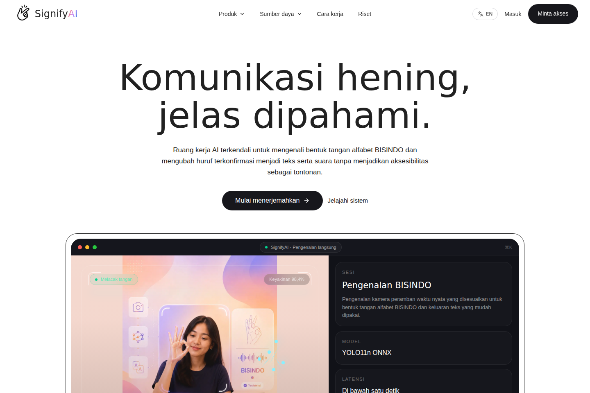

**Gambar 1.** Halaman awal Signify AI.

### c. Masuk ke Akun

1. Tekan **Masuk** atau **Mulai menerjemahkan**.
2. Dialog **Masuk untuk melanjutkan** akan tampil.
3. Tekan **Lanjutkan dengan Google**.
4. Pilih akun Google yang akan digunakan.
5. Ikuti proses persetujuan Google jika diminta.
6. Setelah berhasil, pengguna diarahkan ke ruang kerja Signify AI.

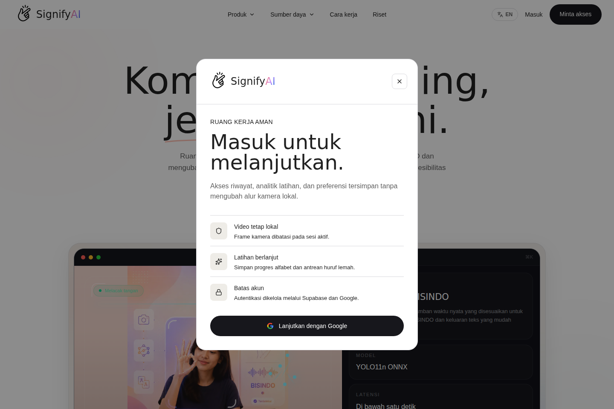

**Gambar 2.** Dialog masuk menggunakan akun Google.

Nama, email, dan foto profil mengikuti data yang diberikan akun Google. Jangan
masuk menggunakan akun milik orang lain.

---

## D. Petunjuk Penggunaan Aplikasi Signify AI

### A. Mengenal Menu Aplikasi

Setelah masuk, menu utama tampil pada bilah samping di komputer atau bilah
navigasi bawah di ponsel dan tablet.

#### 1. Menu Terjemahkan

Menu **Terjemahkan** digunakan untuk membuka kamera, mendeteksi gestur
BISINDO, melihat nilai keyakinan, menyusun kalimat, dan mengelola transkrip
sesi.

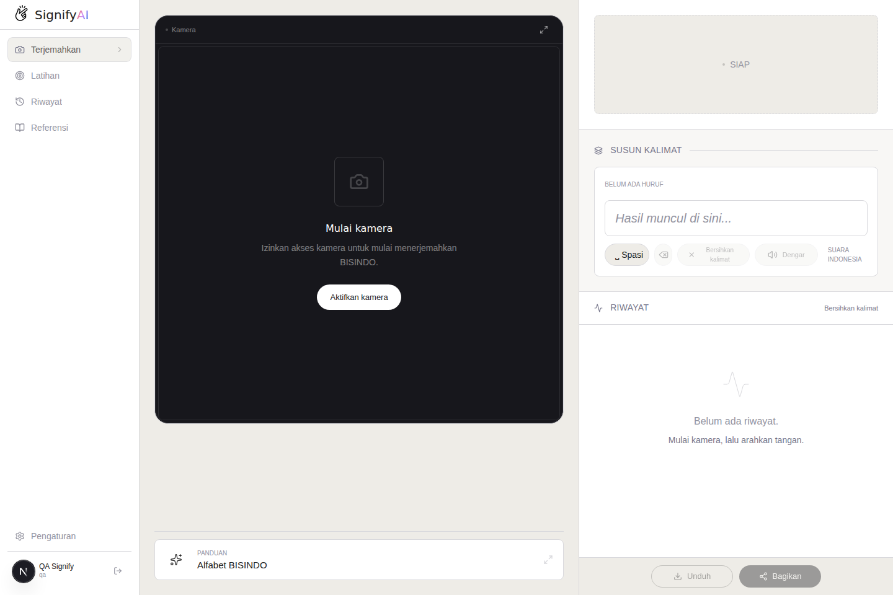

**Gambar 3.** Ruang kerja Terjemahkan sebelum kamera diaktifkan.

#### 2. Menu Latihan

Menu **Latihan** digunakan untuk memperagakan huruf target, melihat referensi
gestur, memantau progres tahan, dan mencatat statistik latihan.

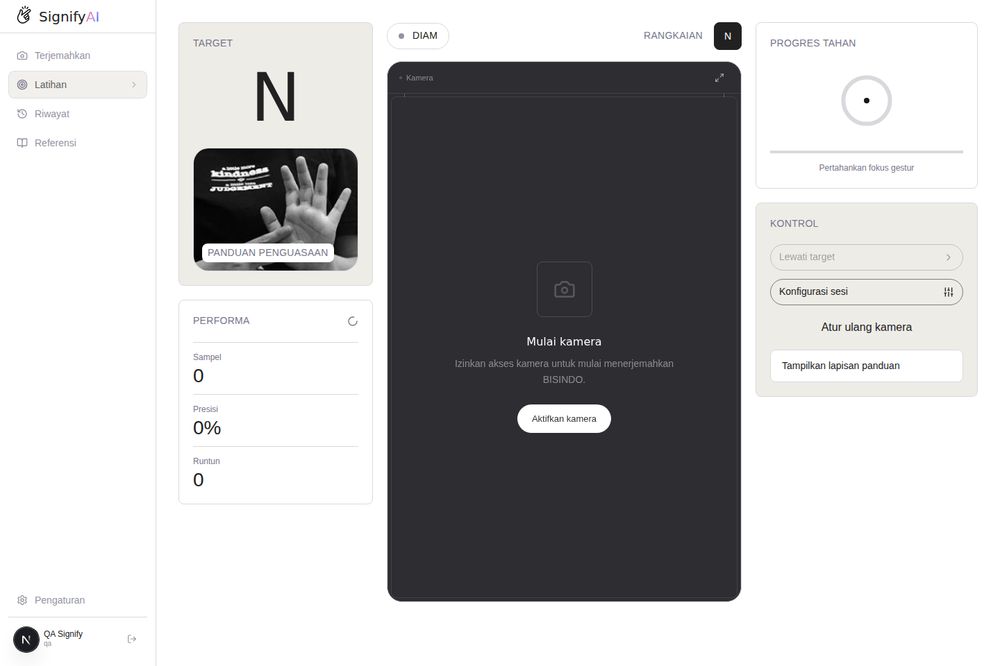

**Gambar 6.** Halaman Latihan dengan target, kamera, performa, dan kontrol.

#### 3. Menu Riwayat

Menu **Riwayat** menampilkan sesi terjemahan yang berhasil disinkronkan ke akun.
Pengguna dapat membuka detail, menyalin, atau menghapus sesi.

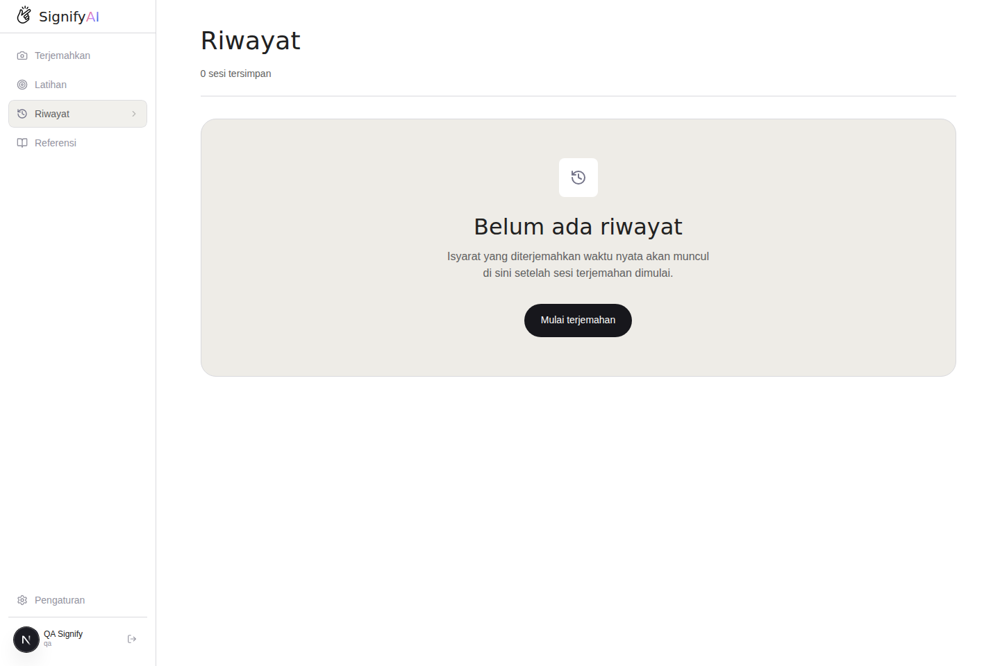

**Gambar 8.** Halaman Riwayat ketika belum ada sesi tersimpan.

#### 4. Menu Referensi

Menu **Referensi** menampilkan kartu alfabet BISINDO A sampai Z beserta
ringkasan progres latihan setiap huruf.

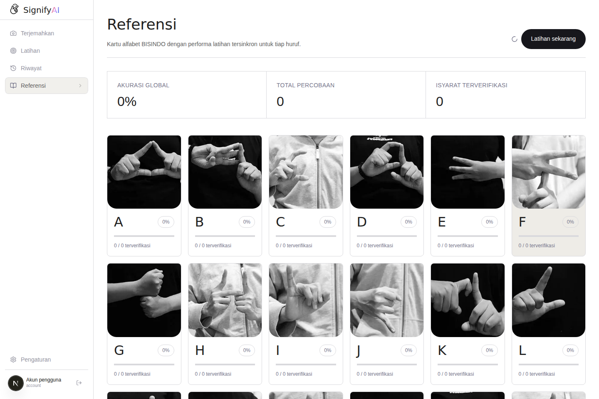

**Gambar 9.** Kartu referensi alfabet BISINDO.

#### 5. Menu Profil

Menu **Profil** menampilkan informasi akun, analitik latihan, aktivitas
terjemahan, akses cepat, dan preferensi pengguna.

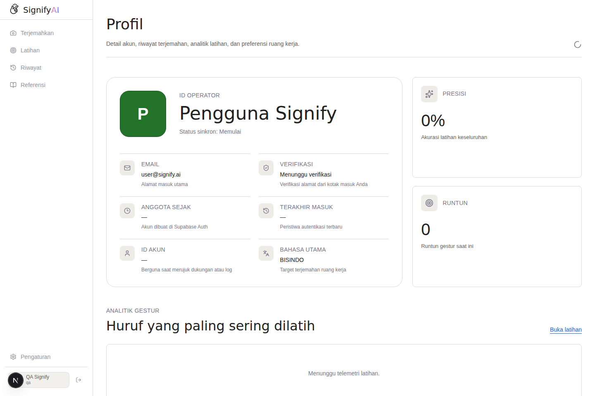

**Gambar 10.** Halaman Profil pengguna.

#### 6. Menu Pengaturan

Menu **Pengaturan** digunakan untuk mengatur kamera, tema, kontras, ukuran
teks, teks-ke-suara, bahasa, dan akun.

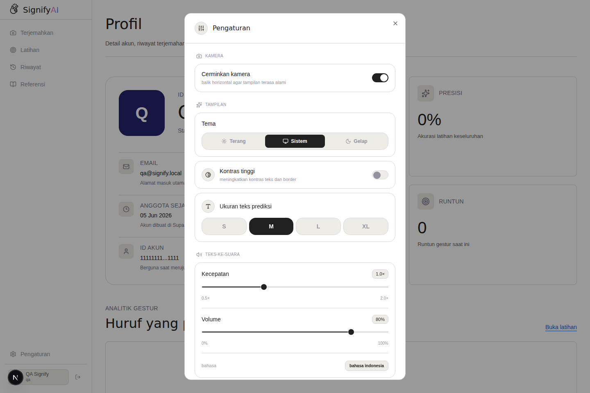

**Gambar 11.** Panel Pengaturan pada tampilan desktop.

### B. Menggunakan Fitur Terjemahkan

#### 1. Membuka Ruang Kerja Terjemahkan

1. Tekan menu **Terjemahkan**.
2. Area kamera tampil di sebelah kiri.
3. Area hasil, penyusun kalimat, dan riwayat sesi tampil di sebelah kanan.
4. Pada ponsel, gunakan tab **Hasil**, **Kalimat**, dan **Riwayat**.

Lihat **Gambar 3** untuk tampilan awal ruang kerja.

#### 2. Mengaktifkan Kamera

1. Tekan **Aktifkan kamera**.
2. Pilih **Izinkan** ketika browser meminta izin kamera.
3. Tunggu sampai kamera dan model selesai disiapkan.
4. Tekan **Mulai terjemah** jika deteksi belum berjalan.

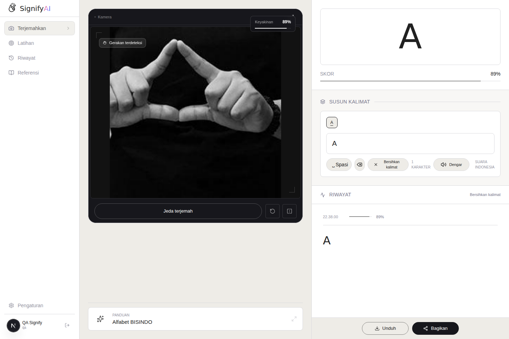

**Gambar 4.** Kamera aktif, hasil deteksi huruf A, nilai keyakinan, kalimat,
dan riwayat sesi.

#### 3. Melakukan Deteksi Gestur BISINDO

1. Posisikan tangan di tengah area kamera.
2. Bentuk salah satu gestur alfabet BISINDO.
3. Tahan gestur selama beberapa saat.
4. Pastikan status **Gerakan terdeteksi** tampil.
5. Tunggu sampai huruf dikonfirmasi dan masuk ke kalimat.

Jika kamera menampilkan tangan tetapi tidak menghasilkan huruf, perbaiki
pencahayaan, jarak, bentuk tangan, atau latar belakang.

#### 4. Memahami Hasil Deteksi dan Nilai Keyakinan

- Huruf besar pada panel hasil menunjukkan prediksi saat ini.
- Nilai **Keyakinan** menunjukkan tingkat keyakinan model.
- Huruf masuk ke kalimat setelah hasil dianggap cukup stabil.
- Nilai tinggi tetap perlu diperiksa karena hasil AI tidak selalu benar.
- Hasil terkonfirmasi tampil pada penyusun kalimat dan riwayat sesi.

Contoh nilai keyakinan dapat dilihat pada **Gambar 4**.

#### 5. Menyusun dan Mengedit Kalimat

Gunakan kontrol berikut:

| Kontrol | Fungsi |
| --- | --- |
| **Spasi** | Menambahkan spasi setelah huruf atau kata. |
| **Hapus huruf terakhir** | Menghapus satu karakter terakhir. |
| **Bersihkan kalimat** | Menghapus seluruh kalimat yang sedang disusun. |
| **Jeda terjemah** | Menghentikan deteksi sementara. |
| **Mulai ulang** | Mengembalikan kamera dan sesi ke kondisi awal. |
| **Ganti kamera** | Berpindah kamera jika perangkat memiliki lebih dari satu kamera. |

Penyusun kalimat dan kontrol penyuntingan terlihat pada **Gambar 4**.

#### 6. Menggunakan Fitur Dengar, Unduh, dan Bagikan

1. Pastikan kalimat atau transkrip tidak kosong.
2. Tekan **Dengar** untuk membacakan kalimat.
3. Tekan **Unduh** untuk menyimpan transkrip sebagai file.
4. Tekan **Bagikan** untuk memakai fitur berbagi dari browser atau perangkat.
5. Jika tombol masih nonaktif, lakukan deteksi sampai terdapat hasil.

### C. Menggunakan Panduan Gestur

#### 1. Membuka Panduan Alfabet BISINDO

1. Buka menu **Terjemahkan**.
2. Tekan **Panduan — Alfabet BISINDO** di bawah area kamera.
3. Panel panduan akan terbuka.

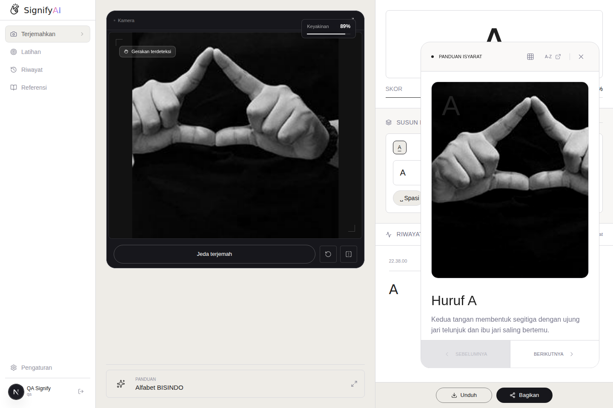

**Gambar 5.** Panduan visual dan deskripsi gestur huruf A.

#### 2. Melihat Contoh Gestur Huruf

1. Perhatikan gambar gestur.
2. Baca deskripsi bentuk tangan.
3. Baca bagian **Posisi tangan** dan **Tips**.
4. Tekan **Sebelumnya** atau **Berikutnya** untuk berpindah huruf.
5. Bandingkan contoh dengan tampilan tangan pada kamera.

#### 3. Berpindah ke Referensi A–Z

1. Tekan **Lihat grid A–Z** atau tautan **A–Z**.
2. Halaman Referensi akan terbuka.
3. Gulir untuk melihat seluruh huruf.
4. Tekan **Latihan sekarang** untuk berlatih.

### D. Menggunakan Fitur Latihan

#### 1. Membuka Halaman Latihan

1. Tekan menu **Latihan**.
2. Perhatikan target huruf, gambar referensi, kamera, performa, progres tahan,
   dan kontrol.


**Gambar 6.** Halaman Latihan sebelum kamera diaktifkan.

#### 2. Memulai Latihan Gestur

1. Perhatikan huruf pada bagian **Target**.
2. Gunakan gambar referensi sebagai contoh.
3. Tekan **Aktifkan kamera**.
4. Izinkan akses kamera jika diminta.
5. Bentuk gestur sesuai target.
6. Pertahankan gestur sampai progres tahan selesai.
7. Lanjutkan ke target berikutnya atau tekan **Lewati target**.

#### 3. Memahami Target, Performa, dan Progres Tahan

| Bagian | Keterangan |
| --- | --- |
| **Target** | Huruf yang harus diperagakan. |
| **Rangkaian** | Urutan huruf latihan. |
| **Sampel** | Jumlah percobaan yang tercatat. |
| **Presisi** | Persentase percobaan benar. |
| **Runtun** | Jumlah keberhasilan berurutan. |
| **Progres Tahan** | Kemajuan saat gestur yang benar dipertahankan. |

Bagian-bagian tersebut ditunjukkan pada **Gambar 6**.

#### 4. Mengatur Konfigurasi Sesi Latihan

1. Tekan **Konfigurasi sesi**.
2. Aktifkan atau nonaktifkan **Overlay panduan**.
3. Aktifkan atau nonaktifkan **Metrik insight**.
4. Tutup dialog setelah selesai.

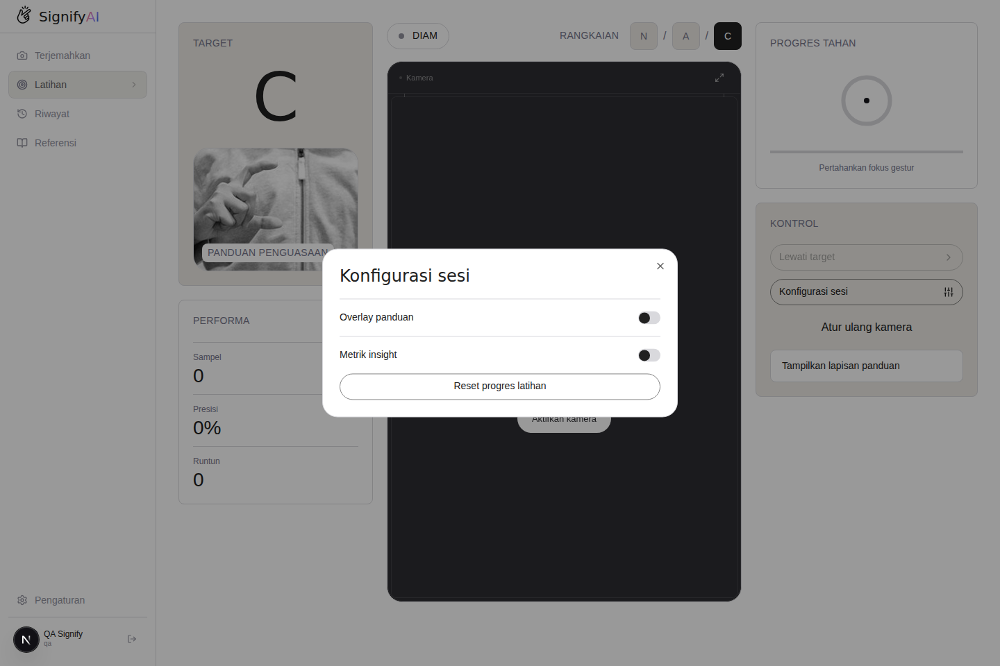

**Gambar 7.** Dialog Konfigurasi sesi.

#### 5. Melakukan Reset Progres Latihan

1. Buka **Konfigurasi sesi**.
2. Tekan **Reset progres latihan**.
3. Tunggu sampai aplikasi menampilkan pemberitahuan berhasil.
4. Periksa kembali nilai sampel, presisi, dan runtun.

> Reset progres menghapus statistik latihan tersimpan. Gunakan hanya jika
> pengguna benar-benar ingin memulai ulang.

### E. Mengelola Riwayat Terjemahan

#### 1. Membuka Halaman Riwayat

1. Tekan menu **Riwayat**.
2. Tunggu sampai daftar sesi dimuat.
3. Jika belum ada data, tekan **Mulai terjemahan**.


**Gambar 8.** Kondisi Riwayat ketika belum terdapat sesi tersimpan.

#### 2. Melihat Detail Sesi Terjemahan

1. Cari sesi berdasarkan tanggal.
2. Tekan tombol buka pada sesi.
3. Periksa teks, jumlah entri, waktu, dan nilai keyakinan.
4. Tekan tombol tutup untuk menyembunyikan detail.

#### 3. Menyalin atau Menghapus Riwayat

1. Tekan ikon salin untuk menyalin teks sesi.
2. Tekan ikon hapus untuk menghapus satu sesi.
3. Tekan **Bersihkan semua** untuk menghapus seluruh riwayat.
4. Tekan **Muat lagi** jika masih ada sesi berikutnya.

Jika penghapusan gagal, aplikasi berusaha memulihkan sesi dan menampilkan
pesan kesalahan.

### F. Melihat Referensi Alfabet BISINDO

#### 1. Membuka Halaman Referensi

1. Tekan menu **Referensi**.
2. Tunggu sampai kartu dan statistik selesai dimuat.


**Gambar 9.** Referensi visual alfabet BISINDO.

#### 2. Melihat Kartu Alfabet A sampai Z

1. Gulir halaman untuk melihat huruf A sampai Z.
2. Perhatikan gambar gestur pada setiap kartu.
3. Gunakan kartu sebagai acuan sebelum menerjemahkan atau berlatih.
4. Tekan **Latihan sekarang** untuk membuka halaman Latihan.

#### 3. Melihat Ringkasan Progres Latihan

Ringkasan bagian atas menampilkan:

- **Akurasi global:** ketepatan latihan keseluruhan.
- **Total percobaan:** jumlah seluruh percobaan.
- **Isyarat terverifikasi:** jumlah percobaan yang dinilai benar.
- Persentase pada kartu menunjukkan progres masing-masing huruf.

### G. Melihat Profil Pengguna

#### 1. Membuka Halaman Profil

1. Tekan avatar atau nama pengguna.
2. Halaman **Profil** akan terbuka.


**Gambar 10.** Profil dan ringkasan analitik pengguna.

#### 2. Melihat Informasi Akun

Informasi akun dapat mencakup:

- Nama pengguna.
- Email.
- Status verifikasi.
- Tanggal menjadi anggota.
- Waktu terakhir masuk.
- ID akun.
- Bahasa utama.

Jangan membagikan email atau ID akun melalui media publik tanpa alasan yang
jelas.

#### 3. Melihat Analitik Gestur dan Aktivitas

1. Periksa nilai presisi dan runtun.
2. Gulir ke bagian **Huruf yang paling sering dilatih**.
3. Periksa aktivitas dan riwayat sesi terbaru.
4. Gunakan bagian **Akses cepat** untuk membuka Terjemahkan, Riwayat, atau
   Referensi.
5. Periksa ringkasan preferensi yang sedang aktif.

### H. Mengatur Tampilan, Kamera, dan Audio

#### 1. Membuka Panel Pengaturan

1. Tekan menu **Pengaturan**.
2. Panel Pengaturan akan terbuka.
3. Gulir panel untuk melihat seluruh pilihan.
4. Tekan ikon **X** untuk menutup.


**Gambar 11.** Panel Pengaturan pada desktop.

#### 2. Mengatur Kamera

- Pilih perangkat kamera jika pilihan tersedia.
- Aktifkan **Cerminkan kamera** agar tampilan terbalik horizontal dan terasa
  seperti bercermin.
- Nonaktifkan pencerminan jika pengguna memerlukan orientasi kamera asli.

#### 3. Mengatur Tema, Kontras, dan Ukuran Teks

1. Pilih **Terang**, **Sistem**, atau **Gelap**.
2. Aktifkan **Kontras tinggi** untuk meningkatkan keterbacaan.
3. Pilih ukuran teks prediksi **S**, **M**, **L**, atau **XL**.
4. Periksa perubahan pada ruang kerja.

#### 4. Mengatur Teks-ke-Suara

1. Atur slider **Kecepatan**.
2. Atur slider **Volume**.
3. Pastikan volume perangkat tidak dalam keadaan diam.
4. Kembali ke Terjemahkan dan tekan **Dengar** untuk mencoba.

#### 5. Mengatur Bahasa Antarmuka

1. Gulir ke bagian **Bahasa**.
2. Pilih **ID** untuk Bahasa Indonesia.
3. Pilih **EN** untuk Bahasa Inggris.
4. Tunggu sampai antarmuka berpindah bahasa.

Perubahan bahasa hanya mengubah teks antarmuka. Target gestur utama aplikasi
tetap alfabet BISINDO.

### I. Menggunakan Aplikasi pada Ponsel atau Tablet

#### 1. Mengakses Signify AI dari Perangkat Mobile

1. Buka browser pada ponsel atau tablet.
2. Masukkan alamat Signify AI.
3. Masuk menggunakan Google.
4. Izinkan kamera ketika diminta.
5. Gunakan perangkat dalam posisi yang stabil.

#### 2. Menggunakan Navigasi Bawah

1. Gunakan bilah navigasi di bagian bawah layar.
2. Pilih **Terjemahkan**, **Latihan**, **Riwayat**, **Referensi**, **Profil**,
   atau **Pengaturan**.
3. Pada Terjemahkan, gunakan tab **Hasil**, **Kalimat**, dan **Riwayat**.

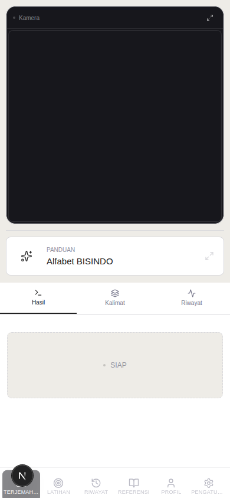

**Gambar 13.** Halaman Terjemahkan dan navigasi bawah pada ponsel.

#### 3. Membuka Pengaturan pada Ponsel

1. Tekan **Pengaturan** pada navigasi bawah.
2. Gulir panel untuk melihat seluruh opsi.
3. Ubah kamera, tema, kontras, ukuran teks, audio, bahasa, atau akun.
4. Tekan ikon **X** untuk menutup panel.

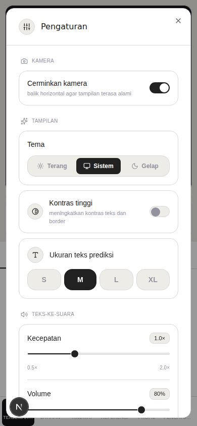

**Gambar 14.** Panel Pengaturan pada layar ponsel.

### J. Keluar dari Akun

#### 1. Membuka Bagian Akun

1. Buka **Pengaturan**.
2. Gulir ke bagian **Akun**.
3. Pastikan nama dan email yang tampil adalah akun yang ingin dikeluarkan.

#### 2. Melakukan Konfirmasi Keluar

1. Tekan **Keluar** satu kali.
2. Tombol berubah menjadi **Ketuk lagi untuk konfirmasi**.
3. Tekan tombol tersebut sekali lagi.
4. Pengguna akan kembali ke halaman awal.

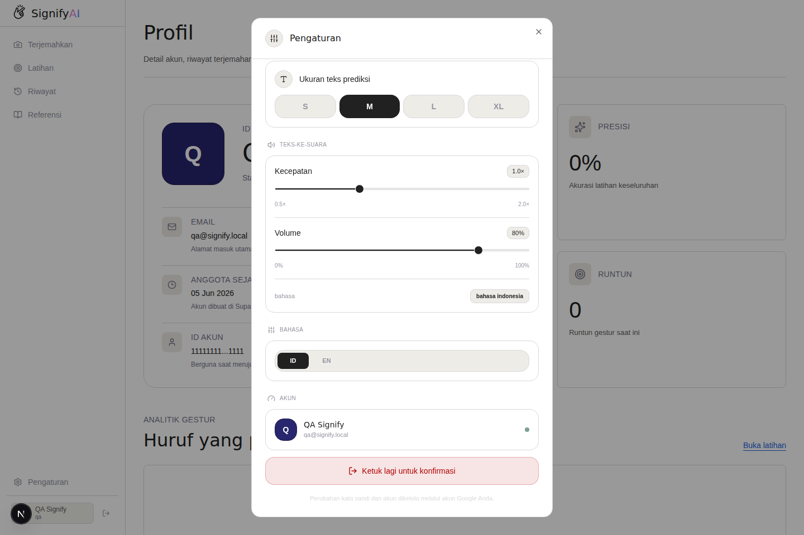

**Gambar 12.** Konfirmasi kedua sebelum sesi diakhiri.

Pada desktop juga tersedia ikon keluar di samping akun pada bilah samping.
Ikon tersebut dapat langsung mengakhiri sesi.

---

## E. Mengatasi Masalah Umum

### 1. Izin Kamera Ditolak

1. Tekan ikon gembok atau pengaturan situs di sebelah alamat website.
2. Cari izin **Kamera**.
3. Ubah menjadi **Izinkan**.
4. Muat ulang halaman.
5. Tekan **Coba lagi** atau **Aktifkan kamera**.

### 2. Kamera Tidak Ditemukan

1. Pastikan perangkat memiliki kamera.
2. Pastikan kamera eksternal terhubung.
3. Tutup aplikasi lain yang memakai kamera.
4. Muat ulang Signify AI.
5. Coba browser atau perangkat lain.

### 3. Kamera Aktif, tetapi Gestur Tidak Terdeteksi

1. Tambah pencahayaan.
2. Pastikan seluruh bentuk tangan terlihat.
3. Gunakan latar belakang yang berbeda dari warna tangan.
4. Hindari gerakan terlalu cepat.
5. Tahan gestur selama beberapa saat.
6. Periksa bentuk gestur melalui Panduan atau Referensi.
7. Bersihkan lensa kamera.

### 4. Hasil Deteksi Tidak Sesuai

1. Ulangi gestur dengan posisi lebih jelas.
2. Jauhkan tangan jika bentuknya terpotong.
3. Dekatkan tangan jika terlihat terlalu kecil.
4. Pastikan tidak ada objek lain yang mengganggu.
5. Periksa nilai keyakinan sebelum memakai hasil.

### 5. Proses Menyiapkan Model Terlalu Lama

1. Periksa koneksi internet saat pemuatan awal.
2. Tutup tab atau aplikasi berat.
3. Muat ulang halaman.
4. Gunakan Chrome atau Edge terbaru.
5. Coba perangkat dengan kemampuan pemrosesan lebih baik.

### 6. Riwayat atau Progres Tidak Tersimpan

1. Pastikan pengguna masih masuk.
2. Periksa koneksi internet.
3. Tunggu proses sinkronisasi.
4. Muat ulang halaman dan periksa kembali.
5. Catat waktu kejadian jika masalah perlu dilaporkan.

### 7. Suara Tidak Terdengar

1. Pastikan volume perangkat tidak diam.
2. Naikkan Volume pada Pengaturan.
3. Pastikan kalimat tidak kosong.
4. Izinkan pemutaran audio jika browser meminta.
5. Coba Chrome atau Edge.

### 8. Tidak Dapat Masuk Menggunakan Google

1. Periksa koneksi internet.
2. Pastikan pop-up dan cookie tidak diblokir.
3. Pilih akun Google yang benar.
4. Tutup dialog, lalu coba kembali.
5. Hubungi administrator jika akun tidak memperoleh akses.

---

## F. Tips Mendapatkan Hasil Deteksi yang Baik

- Gunakan cahaya dari arah depan.
- Hindari cahaya kuat dari belakang.
- Gunakan latar belakang polos.
- Letakkan tangan di tengah kamera.
- Pastikan tangan tidak terpotong.
- Lepaskan benda yang menutupi bentuk jari jika mengganggu.
- Bentuk gestur dengan jelas dan tahan beberapa saat.
- Gunakan Panduan atau Referensi sebelum latihan.
- Periksa nilai keyakinan.
- Gunakan tombol jeda saat ingin mengganti posisi.

---

## G. Pertanyaan yang Sering Diajukan

### Apakah video kamera dikirim ke server?

Tidak untuk proses deteksi produksi. Frame diproses langsung di browser
menggunakan ONNX Runtime Web. Data akun, hasil terkonfirmasi, progres, dan
preferensi dapat disinkronkan ke Supabase.

### Apakah Signify AI menerjemahkan seluruh bahasa isyarat?

Tidak. Versi ini berfokus pada gestur alfabet BISINDO A sampai Z dan belum
menerjemahkan seluruh percakapan atau tata bahasa isyarat.

### Mengapa hasil deteksi dapat berubah?

Model membaca frame kamera berulang kali. Posisi tangan, gerakan, cahaya,
latar belakang, dan kualitas kamera dapat memengaruhi hasil.

### Apakah aplikasi dapat digunakan tanpa akun?

Halaman informasi publik dapat dibuka tanpa akun. Ruang kerja dan penyimpanan
data memerlukan proses masuk.

### Apakah aplikasi dapat digunakan di ponsel?

Ya. Signify AI memiliki tampilan responsif dan navigasi bawah untuk ponsel
serta tablet.

### Apa yang terjadi jika progres latihan direset?

Statistik latihan tersimpan akan dikembalikan ke kondisi awal.

### Apakah FastAPI harus dijalankan oleh pengguna?

Tidak. Aplikasi produksi menggunakan Next.js dan ONNX Runtime Web. FastAPI
hanya digunakan untuk kebutuhan legacy, pengembangan lokal, atau pengujian
internal tertentu.

---

## H. Ringkasan Penggunaan Cepat

1. Buka alamat Signify AI.
2. Tekan **Masuk** dan lanjutkan dengan Google.
3. Buka **Terjemahkan**.
4. Tekan **Aktifkan kamera** dan izinkan akses.
5. Tekan **Mulai terjemah**.
6. Bentuk gestur BISINDO di depan kamera.
7. Periksa huruf dan nilai keyakinan.
8. Gunakan Spasi, Hapus, Bersihkan, atau Dengar untuk mengelola kalimat.
9. Gunakan **Latihan** untuk berlatih.
10. Gunakan **Riwayat**, **Referensi**, **Profil**, dan **Pengaturan** sesuai
    kebutuhan.
11. Setelah selesai, buka Pengaturan dan lakukan konfirmasi **Keluar**.

---

## I. Penutup

Manual Book ini menjelaskan alur penggunaan dan spesifikasi Signify AI
berdasarkan antarmuka aplikasi pada 25 Juni 2026. Posisi tombol atau tampilan
dapat berubah pada versi berikutnya.

Jika terjadi masalah yang tidak tercantum, catat:

- Langkah yang dilakukan.
- Pesan kesalahan yang muncul.
- Jenis perangkat dan sistem operasi.
- Nama serta versi browser.
- Waktu terjadinya masalah.

Informasi tersebut membantu pengelola aplikasi melakukan pemeriksaan dengan
lebih tepat.
